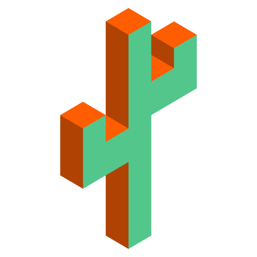

<div align="center">
  
</div>
<h1 align="center">
  Astro Theme Cactus
</h1>

Astro Theme Cactus is a simple opinionated starter built with the Astro framework. Use it to create an easy-to-use blog or website.

## Key Features

- Astro Fast 🚀
- TailwindCSS Utility classes
- Accessible, semantic HTML markup
- Responsive & SEO-friendly
- Dark / Light mode, using Tailwind and CSS variables
- [Astro Assets Integration](https://docs.astro.build/en/guides/assets/) for optimised images
- MD & [MDX](https://docs.astro.build/en/guides/markdown-content/#mdx-only-features) posts
- [Satori](https://github.com/vercel/satori) for creating open graph png images
- Pagination
- [Automatic RSS feed](https://docs.astro.build/en/guides/rss)
- Shiki code syntax styling
- Auto-generated [sitemap](https://docs.astro.build/en/guides/integrations-guide/sitemap/)
- [Pagefind](https://pagefind.app/) static search library integration
- [Astro Icon](https://github.com/natemoo-re/astro-icon) svg icon component

## Demo 💻

Check out the [Demo](https://astro-theme-cactus.netlify.app/), hosted on Netlify

## Quick start

[Create a new repo](https://github.com/chrismwilliams/astro-theme-cactus/generate) from this template.

[](https://app.netlify.com/start/deploy?repository=https://github.com/chrismwilliams/astro-theme-cactus) [](https://vercel.com/new/clone?repository-url=https%3A%2F%2Fgithub.com%2Fchrismwilliams%2Fastro-theme-cactus&project-name=astro-theme-cactus)

## Preview


## Commands

Replace pnpm with your choice of npm / yarn

| Command          | Action                                                         |
| :--------------- | :------------------------------------------------------------- |
| `pnpm install`   | Installs dependencies                                          |
| `pnpm dev`       | Starts local dev server at `localhost:3000`                    |
| `pnpm build`     | Build your production site to `./dist/`                        |
| `pnpm postbuild` | Pagefind script to build the static search of your blog posts  |
| `pnpm preview`   | Preview your build locally, before deploying                   |
| `pnpm sync`      | Generate types based on your config in `src/content/config.ts` |

## Configure

- Edit the config file `src/site.config.ts` for basic site meta data
- Update file `astro.config.ts` site property with your own domain
- Replace & update files within the `/public` folder:
  - favicon.ico & other social icons
  - robots.txt - update the Sitemap url to your own domain
  - manifest.webmanifest
- Modify file `src/styles/global.css` with your own light and dark styles
- Edit social links in `src/components/SocialList.astro` to add/replace your media profile. Icons can be found @ [icones.js.org](https://icones.js.org/)
- Create / edit posts for your blog within `src/content/post/` with .md/mdx file(s). See [below](#adding-posts) for more details.
- OG Image:
  - If you would like to change the style of the generated image the Satori library creates, open up `src/pages/og-image/[slug].png.ts` to the markup function where you can edit the html/tailwind-classes as necessary. You can also use this [satori playground](https://og-playground.vercel.app/) to aid your design.
  - If you would like to generate svg og images rather than the default .png ones, you will need to remove the @resvg/resvg-js library, and return the svg within the body of the get function from the file `src/pages/og-image/[slug].png.ts`.
  - You can also create your own og images and skip satori generating if for you by adding an ogImage property in the frontmatter with a link to the asset, an example can be found in `src/content/post/social-image.md`. More info on frontmatter can be found [here](#frontmatter)
- Optional:
  - Fonts: This theme sets the body element to the font family `font-mono`, located in the global css file `src/styles/global.css`. You can change fonts by removing the variant `font-mono`, after which TailwindCSS will default to the `font-sans` [font family stack](https://tailwindcss.com/docs/font-family).

## Adding posts

This theme utilises [Content Collections](https://docs.astro.build/en/guides/content-collections/) to organise Markdown and/or MDX files, as well as type-checking frontmatter with a schema -> `src/content/config.ts`.

Adding a post is as simple as adding your .md(x) files to the `src/content/post` folder, the filename of which will be used as the slug/url. The posts included with this template are there as an example of how to structure your frontmatter. Additionally, the [Astro docs](https://docs.astro.build/en/guides/markdown-content/) has a detailed section on markdown pages.

### Frontmatter

| Property (\* required) | Description                                                                                                                                                                                                                                                                                       |
| ---------------------- | ------------------------------------------------------------------------------------------------------------------------------------------------------------------------------------------------------------------------------------------------------------------------------------------------- |
| title \*               | Self explanatory. Used as the text link to the post, the h1 on the posts' page, and the pages title property. Has a max length of 60 chars, set in `src/content/config.ts`                                                                                                                        |
| description \*         | Similar to above, used as the seo description property. Has a min length of 50 and a max length of 160 chars, set in the post schema.                                                                                                                                                             |
| publishDate \*         | Again pretty simple. To change the date format/locale, currently **en-GB**, update the date option in `src/site.config.ts`. Note you can also pass additional options to the component `<FormattedDate>` if required.                                                                             |
| updatedDate            | This is an optional date representing when a post has been updated, in the same format as the publishDate. Note that by providing this field, the sorting function, found in `src/utils/post.ts`, `sortMDByDate` will order by this field rather than its published date.                         |
| tags                   | Tags are optional with any created post. Any new tag(s) will be shown in `yourdomain.com/posts` & `yourdomain.com/tags`, and generate the page(s) `yourdomain.com/tags/[yourTag]`                                                                                                                 |
| coverImage             | This is an optional object that will add a cover image to the top of a post. Include both a `src`: "_path-to-image_" and `alt`: "_image alt_". You can view an example in `src/content/post/cover-image.md`.                                                                                      |
| ogImage                | This is an optional property. An OG Image will be generated automatically for every post where this property **isn't** provided. If you would like to create your own for a specific post, include this property and a link to your image, the theme will then skip automatically generating one. |

## Pagefind search

This integration brings a static search feature for searching blog posts. In its current form, pagefind only works once the site has been built. This theme adds a postbuild script that should be run after Astro has built the site. You can preview locally by running both build && postbuild.

Search results only includes blog posts. If you would like to include other/all your pages, remove/re-locate the attribute `data-pagefind-body` to the article tag found in `src/layouts/BlogPost.astro`.

It also allows you to filter posts by tags added in the frontmatter of blog posts. If you would rather remove this, remove the data attribute `data-pagefind-filter="tag"` from the link in `src/components/blog/Hero.astro`.

Note the current build will display a warning in the console, you can follow this issue [here](https://github.com/CloudCannon/pagefind/issues/290)

If you would rather not include this integration, simply remove the component `src/components/Search.astro`, and uninstall both `@pagefind/default-ui` & `pagefind` from package.json. You will also need to remove the postbuild script from here as well.

## Analytics

You may want to track the number of visitors you receive to your blog/website in order to understand trends and popular posts/pages you've created. There are a number of providers out there one could use, including web hosts such as [vercel](https://vercel.com/analytics), [netlify](https://www.netlify.com/products/analytics/), and [cloudflare](https://www.cloudflare.com/web-analytics/).

This theme/template doesn't include a specific solution due to there being a number of use cases and/or options which some people may or may not use.

You may be asked to included a snippet inside the **HEAD** tag of your website when setting it up, which can be found in `src/layouts/Base.astro`. Alternatively, you could add the snippet in `src/components/BaseHead.astro`.

Another popular provider is google analytics which you could integrate via the above method, or, for example adding [astro-google-analytics](https://www.npmjs.com/package/astro-google-analytics)

```bash
pnpm install astro-google-analytics
```

Edit `src/layouts/Base.astro`, and add:

```astro
---
import { GoogleAnalytics } from "astro-google-analytics";
// ...other imports
---

<head>
	<!-- Replace id with your own Google Analytics ID -->
	<GoogleAnalytics id="G-XXXXXXXXXX" />
</head>
```

## Deploy

[Astro docs](https://docs.astro.build/en/guides/deploy/) has a great section and breakdown of how to deploy your own Astro site on various platforms and their idiosyncrasies.

By default, the site will be built (see [Commands](#commands) section above) to a `/dist` directory.

## Acknowledgment

This theme is inspired by [Hexo Theme Cactus](https://github.com/probberechts/hexo-theme-cactus)

## License

MIT

---

## Development

Once grant caddy access to 433 without sudo

```bash
sudo setcap CAP_NET_BIND_SERVICE=+eip $(which caddy)
```

Then start all languages by

```
npm run dev-all
```

GUSTAWDANIEL PUBLISHED

Analiza Prawa Zipfa w Node.js
Retry Policy - Jak obsługiwać losowe, nieprzewidywalne błędy
Publikacja aktualizacji paczki w repozytorium AUR
Najmniejsza wspólna wielokrotność - teoria liczb
Jak skonfigurować SSL w lokalnym developmencie
Jeszcze jedna instrukcja instalacji Arch Linux (i3)
Rozkład Benforda dla Ciągu Fibonacciego w Java, Rust i Node JS
Sterowanie procesami w Node JS
Broadcast Channel API
Analiza częstości nazw altcoinów w korpusie języka angielskiego
Wpływ indeksacji na wydajność wyszukiwania w bazie MySQL
Scraping najbardziej popularnych kont na twitterze
Bot Telegramowy w Typescript
Aplikacja z FOSUserBundle i API Google Maps
Instalacja odnawialnego certyfikatu TLS (certbot + apache na Ubuntu)
Scrapowanie danych w języku Perl
Kompilacja interpretera php 7 w BunsenLabs
Analiza logów Apache z GoAccess
Tesseract-OCR i testowanie selektów.
Wizualizacja dynamicznej sieci korelacyjnej.
Logowanie danych w MySql, Ajax i Behat
Scraping Facebooka w 2021 roku
W jaki sposób wojna o kompatybilność ukształtowała frontend?
Wyciskamy dane z PDF jak sok z cytryny
Ile rodzin zmieści się w samolocie - zadanie z algorytmiki
Scraping WordPress - 4300 wyroków sądów w sprawach frankowych bez linii kodu
Ruby on Rails - szybkie wprowadzenie
Infrastrukura defniowana przez kod (terraform + digital ocean)
Wyznaczenie różnicy plików JSON
Scraping Rejestru Aptek
Jak pobrać dane kontaktowe 20k adwokatów w godzinę
Scraping z money.pl w 30 liniach kodu.
Strukturyzacja danych na przykładzie kursu CHF NBP

GUSTAWDANIEL DRAFT

Jak przygotować się do apokalipsy zombie
How to install MongoDB 6 on Fedora 37
Rust
Konfiguracja wysyłki emaili w Strapi przez Emaillabs
Wprowadzenie do Deno
Analiza wpływu technologii na rozwój mediów.
Invoice
Cookie Ws
Wpływ zmian rezerwy na giełdach na cenę BTC
Apollo Server w Node JS + Mongo DB + Prisma
Konsolowy CRM z Prisma i MongoDB
mkcert
Jak przechowywać sekrety w gicie z blackbox
Rozesłanie kluczy na serwery
Continuous Delivery w Gitlab Ci (Docker in Docker)
Jak pobrałem dane o 4k firm w pół godziny
Fetch, Promise oraz Template String
Badanie wydajności insertów mysql
Snake game in JavaScript (part 3 - Vue)
Snake game in JavaScript (part 2 - events)
Snake game in JavaScript (part 1 - objects)
Pomiar ilości tekstu i kodu w moich wpisach
Analiza wydajności pustych pętli w 16 językach
Najlepsze metody web-scrapingu
Form Data w Node JS
Dotnet
Ugoda KNF, Odfrankowienie oraz Unieważnienie kredytu indeksowanego w CHF

PRECISELAB PUBLISHED

Rust implementation of RFC 7396 - JSON Merge Patch
Tutorial for ESM + CommonJS package creators
How to Install Yay on a Pure Arch Linux Docker Image
Simplifying Linux Command Line with GPT-CLI (rust, open source)
tRPC - super fast development cycle for fullstack typescript apps
How to install MongoDB 6 on Fedora 37
QuickSort implementation in Rust, Typescript and Go
ZeroMQ pull-push pattern for Node JS
New Google Identity in Nuxt 3
Selected syntax in JavaScript ES2020, ES2021 and ES2022
CodinGame: Best fit to data - Rust - Regression Analysis
CodinGame: Derivative Time - Part 1, Recursion (Typescript)
CodinGame: Quaternion Multiplication - Rust, NodeJS - Parsing, Algebra, Mathematics
CodinGame: ASCI Art - Rust, NodeJs - Strings, Arrays, Loops
Overload Signatures in Typescript
Login by Metamask - Rest Backend in Fastify (Node, Typescript, Prisma) Part 1/2
Login Component in Nuxt (Rest Strapi)
Maximum Inequality [Linear Search] rust and typescript
Pulumi - Infrastructure as a Code [ Digital Ocean ]
Last Occurrence [Linear Search] easy
Bolt (always) Lite - MITM, Proxy, Insomnia and Vue
Xss attack using script style and image
How to create a free email account with custom domain?
Fetch, Promise and Template String on example of To Do List in JavaScript
Communication between Vue components in Meteor
Git styled calendar with custom dates

PRECISELAB DRAFT

How to transform BTC blockchain to neo4j on Fedora Linux
Problem with standard Auth flow
Test Article
Managing processes in Node JS.
Calculating the difference between JSON files.
Creating an RPM Package for a Rust CLI Application on Fedora
How I created 24 videos in single day to promote my GPT-CLI
How did the compatibility war shape the frontend?
How I used GPT-3 to solve my issues with OBS and Davinci Resolve problems with MKV format
Performance of SQLite, Redis and Text search in Rust
Scrabble
The best web-scrapping methods
Measuring the amount of text and code in my blog posts
Fractional calclus on example of gaussian curve
How to optimize your code

Add terminal with vue
- [ ] https://www.reddit.com/r/vuejs/comments/zoa2qh/a_fully_working_most_featurerich_vuejs_terminal/
- [ ] Demo created with svg-term-cli: cat demo.json | svg-term -o demo.svg from https://github.com/marionebl/share-cli

GPT_SYSTEM_PROMPT="I am a translator from Polish to English. I need to translate this text." GPT_POST=out GPT_MODEL=gpt-3.5-turbo-16k p "$(cat index.md)" > en.md
