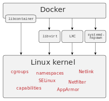
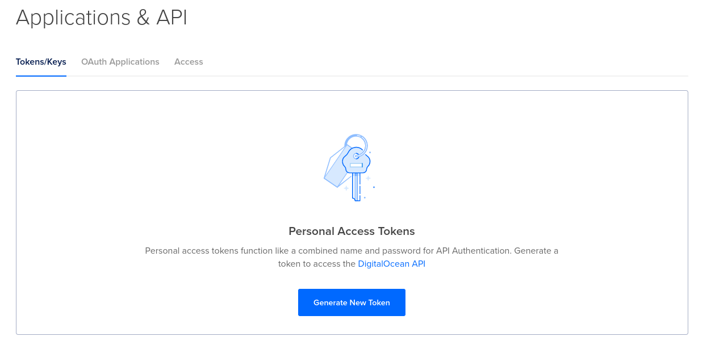
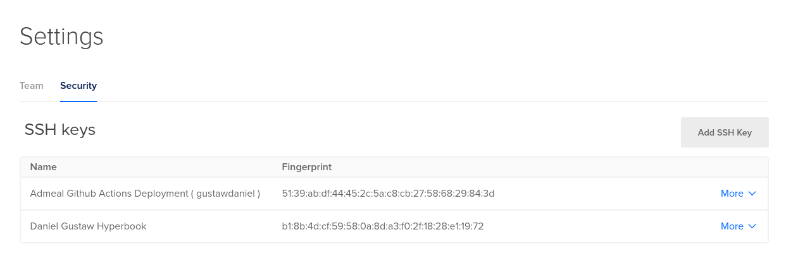

### How deployment evolved by years?

Initially (70 years ago) computers was programmed by manual change of cables connections. There was no personal desktop so programs was written on production. No deployment - no problem.


first digital computer programmers

About decade later IBM introduced punched cards so deployment or installation was performed by insert of card with program to a reader.


Next breakthrough - internet and ftp (1971) protocols changed everything. To move programs to other machines you stopped needing physical driver other than cables connecting with network.

Generally process was simple. You had to copy binaries to mainframe and start your program here.

There was only one problem. Cost of computers was huge, so to utilize them optimally and get return of investment there was introduced virtualisation - logical dividing resources of machine between processes.

Unfortunatelly on x86 machines there was problem with virtualisation some processor instructions and in decade 1980-1990 this method was abandoned with the end of supercomputers epoch.

We come back to virtualisation in 1990 not only because of increasing cost and inefectivness of infrastructure maintainance but also thanks to adaptive virtualisation technique introduced by VMware. They detected instructions that was problematic during virtualisation and convert them to these safe equivalents.

In my opinion, for deployment process this is revolution similar to internet. Internet digitalised a carrier of program during deployment, but virtualization allowed to change parameters of server without touching hardware.

These changes was important for cloud providers and IaaS branch, but developers was divided on these that putting on servers his own virtual machines or these that using ftp or scp to copy programs to vps delivered by his providers.

Next huge revolution was Docker written in Go in 2013, and using namespaces available from linux kernel 2.6.24 2008. His popularity exploded in 2017. Main problem of time before docker was configuration of server to use our application. When runtime environment was configured on server, then two different applications with different version or configuration of runtime couldn't be installed on the same host. If they was packed as virtual machines, then all operating system layer was duplicated. Docker solved these problems.



But it is not the end. When people learned how to use Docker and created CI/CD flows to automate deployment and testing processes they realised that server managements can be done also on code layer.

Infrastructure as a code has the same advantage on admin panel to manage servers as commanline over gui in managing personal desktop - is universal and can be easy managed by scripts written by end user.

Dominating possition among IaC products have Terraform developed by Hashicorp. It is easy to learn but require custom config language.

this is examplary config:

```tf
provider "aws" {
  region = "us-west-2"
}

provider "random" {}

resource "random_pet" "name" {}

resource "aws_instance" "web" {
  ami           = "ami-a0cfeed8"
  instance_type = "t2.micro"
  user_data     = file("init-script.sh")

  tags = {
    Name = random_pet.name.id
  }
}
```

We will not focus on any line of this code. If you are interesed in this and know polish language I wrote article about terraform here:

[Infrastrukura defniowana przez kod (terraform + digital ocean)

W scrapingu ważnym czynnikiem jest skala do jakiej możemy rozszerzyć tempopobierania i przetwarzania danych. Kiedy kilka lat temu pisałem swój pierwszysystem, który równolegle zbierał dane używając kilkunastu serwerów, każdy z tychserwerów był przeze mnie “wyklikany” w panelu dostawcy. Teraz pok…

Daniel GustawDaniel Gustaw

](https://gustawdaniel.com/infrastrukura-defniowana-jako-kod/)

Now we will focus on competitor of Terraform. Lets discuss pulumi.


# Pulumi

Pulumi is plafrom to define infrastructure by programs written in:

* typescript
* python
* go
* c#
* java
* yaml

It supports over 70 cloud providers. Key difference between terraform is simplicity of customization obtained by processing data used to define infrastructure parameters.

Instead of file with `init-script` to execute on new `vps` I can use template and render it with my env variables. Instead of copy config, I can loop over environments connecting subdomains to proper servers.

To install pulumi cli run command:

```
curl -sSL https://get.pulumi.com | sh
```

We can start from creation directory for our config:

```
mkdir pulumi && cd pulumi
```

Now we want to create new project using template. To list typescript templates we can type:

```
pulumi new -l | grep typescript
```

Lets create config for Digital Ocean

```
pulumi new digitalocean-typescript
```

Now we will install two packages:

* dotenv - to use values defined in .env file and append them to `process`
* jsrender - to render template of script to prepare server

```
npm i dotenv jsrender
```

Now we can create `.env` file with two values:

```
DOCKER_REGISTRY_DOMAIN=___
DOCKER_TOKEN=__
```

We need all servers with the same initial preparation. Below I lising our requirements:

* we need to be logged in to docker registry
* tmux have to be configured with proper key binding
* snap have to be disable and removed to avoid 100% cpu bug
* python with `docker` and `docker-compose` packages for ansible installed
* `nginx-proxy-automation` installed and started

To satisfy them lets create `userData.sh` with content:

```bash
#!/bin/bash

export DOCKER_REGISTRY_DOMAIN={{:DOCKER_REGISTRY_DOMAIN}}
export DOCKER_TOKEN={{:DOCKER_TOKEN}}

cat <<EOT >> ~/.bashrc
export DOCKER_REGISTRY_DOMAIN={{:DOCKER_REGISTRY_DOMAIN}}
export DOCKER_TOKEN={{:DOCKER_TOKEN}}
EOT

cat <<EOT >> ~/.tmux.conf
set -g terminal-overrides 'xterm*:smcup@:rmcup@'

# remap prefix from 'C-b' to 'C-a'
unbind C-b
set-option -g prefix C-a
bind-key C-a send-prefix

# switch panes using Alt-arrow without prefix
bind -n M-Left select-pane -L
bind -n M-Right select-pane -R
bind -n M-Up select-pane -U
bind -n M-Down select-pane -D

# Enable mouse control (clickable windows, panes, resizable panes)
#set -g mouse-select-window on
#set -g mouse-select-pane on
#set -g mouse-resize-pane on

# Enable mouse mode (tmux 2.1 and above)
set -g mouse on

set -g pane-border-format "#{pane_index}#{?@custom_pane_title,:#{@custom_pane_title},}:#{pane_title}"

bind e set-window-option synchronize-panes
EOT

sudo systemctl disable snapd.service
sudo systemctl disable snapd.socket
sudo systemctl disable snapd.seeded.service

sudo apt autoremove --purge snapd -y
sudo rm -rf /var/cache/snapd/
rm -rf ~/snap

echo "${DOCKER_TOKEN}" | docker login -u "${DOCKER_TOKEN}" "${DOCKER_REGISTRY_DOMAIN}" --password-stdin;

apt -y update
apt -y install python3 python3-pip
pip3 install docker docker-compose

git clone --recurse-submodules https://github.com/evertramos/nginx-proxy-automation.git ~/proxy && cd ~/proxy/bin && ./fresh-start.sh --yes -e gustaw.daniel@gmail.com --use-nginx-conf-files
```

### Digital Ocean Personal Token

Now we have to select ssh keys for server. To do it we need `doctl` - cli for digital ocean. In this platform you can have account that belong to different teams (contexts). To list contexts use

```
doctl auth ls
```

We can select context by:

```
doctl auth switch --context preciselab
```

Lets check if we have correct access:

```
doctl account get
```

if you will see error, we can login by token

```
doctl auth init
```

You will need token that can be generated on in `API` tab in Digital Ocean Panel



The same token should be used to connect pulumi with your digital ocean:

```
pulumi config set digitalocean:token TOKEN_VALUE --secret
```

### SSH Keys

In this team you have to store your ssh keys. To list them use:

```
doctl compute ssh-key list
```

in new project it will be empty list, so create keys. If you want to isolate keys in CI/CD from your personal as file name you can use your project.

```
ssh-keygen -t ed25519 -C "gustaw.daniel@gmail.com" -f ~/.ssh/id_ed25519
```

add public keys to security settings in digital ocean:



After adding you can again ask about keys because you will need these numbers returned by command:

```
doctl compute ssh-key list
```

### Pulumi index.ts config

To use import withou stars we need to add two `compilerOptions` to your `tsconfig.json`

```json
"allowSyntheticDefaultImports": true,
"esModuleInterop": true
```

And finally creme de la creme - `index.ts` file

```typescript
import 'dotenv/config'
import * as pulumi from "@pulumi/pulumi";
import * as digitalocean from "@pulumi/digitalocean";
import fs from 'fs';
import {templates} from 'jsrender';

// we reading template ( there are no secretes )
const userDataTemplate = fs.readFileSync('./userData.sh').toString();

// secretes are injected during render
const userData = templates(userDataTemplate).render(process.env)

// this is our default droplet config
const dropletConfig = {
    image: "docker-20-04",
    region: "fra1",
    size: "s-1vcpu-1gb-intel",
    monitoring: true,
    backups: false,
    userData, // there is rendered script to initiate server
    sshKeys: [
        // here are ids of keys saved on digital ocean
        '36403277', //    Github Actions
        '34336169', //    Daniel Laptop
    ]
};

// now we defining that we need two servers
const dropletApi = new digitalocean.Droplet("xue-api", dropletConfig);
const dropletUi = new digitalocean.Droplet("xue-ui", dropletConfig);

// and single main domain
const domain = new digitalocean.Domain("xue.academy", {
    name: "xue.academy",
}, {deleteBeforeReplace: true});

// two environments:
// a) production without subdomain
// b) staging with subdomain stag
const envs:Array<{name: 'stag' | 'prod', subdomain: string}> = [{
    subdomain: '',
    name: 'prod'
}, {
    subdomain: 'stag',
    name: 'stag'
}]

// there are helpers function to name resources correctly
function recordName(envName: 'prod' | 'stag', name: string) {
    return envName === 'prod' ? name : `${name}-${envName}`;
}

// and simplify subdomain selecton
function subdomainName(envName: 'prod' | 'stag', name: string) {
    return envName === 'prod' ? name : (name === '@' ? `${envName}` : `${name}.${envName}`);
}

// we can iterate over environments connecting domains with servers
for(let env of envs) {
    const dnsUi = new digitalocean.DnsRecord(recordName(env.name, `xue.academy`), {
        name: subdomainName(env.name, "@"),
        domain: domain.id,
        value: dropletUi.ipv4Address,
        type: 'A'
    }, {deleteBeforeReplace: true})

    const dnsApi = new digitalocean.DnsRecord(recordName(env.name, "api.xue.academy"), {
        name: subdomainName(env.name, "api"),
        domain: domain.id,
        value: dropletApi.ipv4Address,
        type: 'A'
    }, {deleteBeforeReplace: true})
}

// Export the name of the domain
export const ipUi = dropletUi.ipv4Address;
export const ipApi = dropletApi.ipv4Address;
```

This in super simple config but we can easy add mysql databse

```typescript
const mysql = new digitalocean.DatabaseCluster("mysql", {
  engine: "mysql",
  nodeCount: 1,
  region: "fra1",
  size: "db-s-1vcpu-1gb",
  version: "8",
}, {parent: playground});

const coreDatabase = new digitalocean.DatabaseDb("database-core", {clusterId: mysql.id});

export const mysqlId = mysql.id;
export const mysqlHost = mysql.host;
export const mysqlUser = mysql.user;
export const mysqlPassword = mysql.password;
export const mysqlPort = mysql.port;
export const mysqlUri = mysql.uri;
```

or redis instance

```typescript
const redis = new digitalocean.DatabaseCluster("redis", {
  engine: "redis",
  nodeCount: 1,
  region: "fra1",
  size: "db-s-1vcpu-1gb",
  version: "6",
}, {parent: playground});

export const redisHost = redis.host;
export const redisUser = redis.user;
export const redisPassword = redis.password;
export const redisPort = redis.port;
export const redisUri = redis.uri;
```

I hope this article will help you start with pulumi on Digital Ocean and follow primary devops rule:

> Better spend 10 hours failing to automate, than do task manually.


Lets sum up advantages of IaC approach.

* more reliable infrastructure management
* you can use the same approval / testing flow than for code to infrastructure
* you can easy multiply environments without clicking in admin panels of providers
* migrations of project to clients account indepenedent from infrastructure provider migration mechanism
