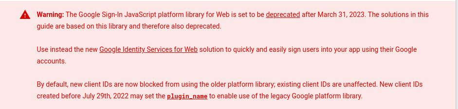
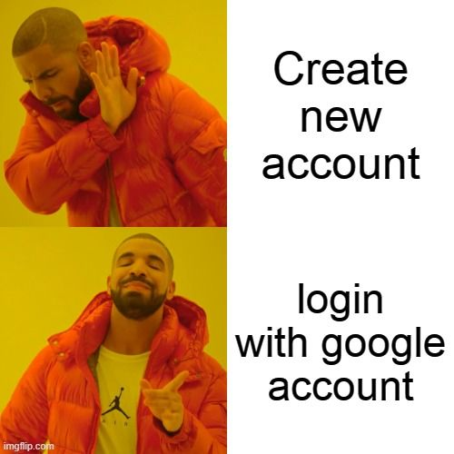
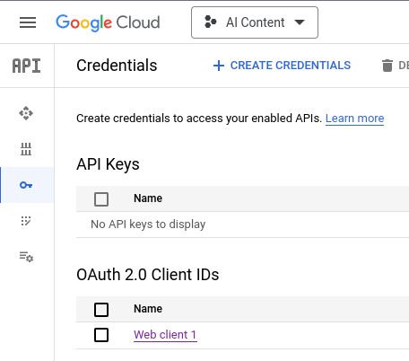
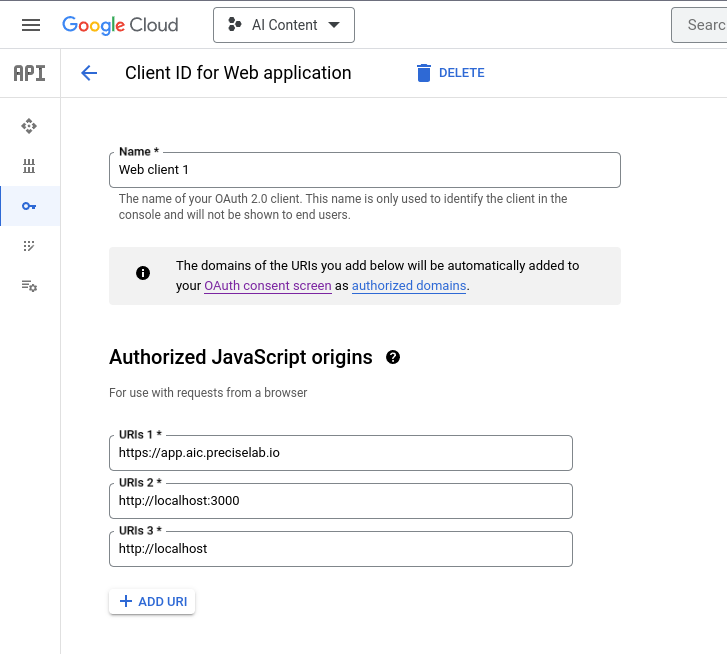
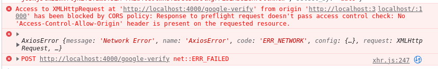
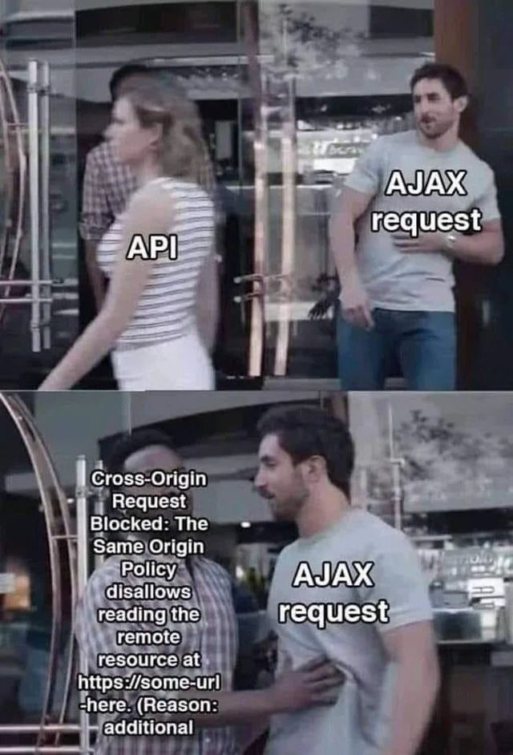
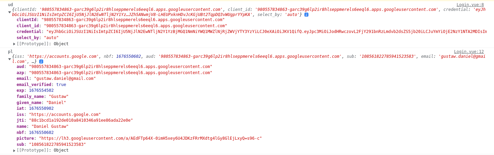

I was scared today because two great libraries did not work with Google Sign In for Nuxt 3. I mean `auth.nuxtjs` and `nuxt-vue3-google-signin`.

From stack overflow

[How to use nuxtjs/auth-next module with Nuxt3?

Just trying to add authentication to my NuxtJs 3 app folloging nuxt/auth configuration docs, but still get an error during app start: // nuxt.config.js export default defineNuxtConfig({ auth...

Stack Overflowfudo

](https://stackoverflow.com/questions/74559363/how-to-use-nuxtjs-auth-next-module-with-nuxt3)

I learned that first one is incompatible with nuxt 3, but it is planned on roadmap

[Roadmap · Nuxt

Nuxt is constantly evolving, with new features and modules being added all the time.


](https://nuxt.com/docs/community/roadmap#%EF%B8%8F-roadmap)

Second simply could not work giving error that was suggesting that something is wrong with my client id.

I checked official Google Docs and see this:



[Integrating Google Sign-In into your web app | Authentication | Google Developers

Google Developers

](https://developers.google.com/identity/sign-in/web/sign-in)

Looks terrible, but hepilly I integrated google sign in button quite fast without external libs. In this article I will show how to implement new Google Identity with Nuxt 3.



## Google Identity - how it is different

Because image is worth more than thousand of words, new login button contains avatar:

[Sign in with Google button UX | Authentication | Google Developers

Google Developers

](https://developers.google.com/identity/gsi/web/guides/personalized-button)


## Sign In button HTML

To add it to your component you will need paste below html

```
  <div id="g_id_onload"
       :data-client_id="config.public.googleClientId"
       data-context="signin"
       data-ux_mode="popup"
       data-callback="googleLoginCallback"
       data-auto_select="true"
       data-itp_support="true">
  </div>

  <div class="g_id_signin"
       data-type="standard"
       data-shape="pill"
       data-theme="outline"
       data-text="continue_with"
       data-size="large"
       data-logo_alignment="left">
  </div>
```

or prepare your own in configurator

[Generate HTML code | Authentication | Google Developers

Google Developers

](https://developers.google.com/identity/gsi/web/tools/configurator)


There are three elements that we have to connect:

1. `config.public.googleClientId` - google client ID
2. `googleLoginCallback` - globally defined function that will get results of login
3. google library that will make these buttons working

## Passing .env to Nuxt 3

To pass .env to nuxt 3 you can follow this answer

[How to pass env variables to nuxt in production?

nuxt.config.js modules: \[ ‘@nuxtjs/dotenv’ \], server/index.js const express &#x3D; require(‘express’)const consola &#x3D; require(‘consola’)const { Nuxt, Builder } &#x3D; require(‘nuxt’)const app &#x3D; ex...

Stack OverflowRounak Jain

](https://stackoverflow.com/questions/53993890/how-to-pass-env-variables-to-nuxt-in-production/74463160#74463160)

You create `.env` file with

```
GOOGLE_CLIENT_ID=xxx.apps.googleusercontent.com
```

to connect these values you can use `dotenv` library, but I prefere `Makefile` like this one

```
include .env
export

node_modules: package.json
	npm i

up: node_modules
	npm run dev
```

In nuxt config you should add

```
export default defineNuxtConfig({
    runtimeConfig: {
        public: {
            googleClientId: process.env.GOOGLE_CLIENT_ID ?? '',
        }
    },
})
```

and finally in component you can get access to `config` by

```
const config = useRuntimeConfig()
```

## Extending window by callback function

Window by default do not have `googleLoginCallback` so to add it you should create file `types/global.d.ts` with

```
declare global {
    interface Window {
        googleLoginCallback: () => void;
    }
}
```

and in component add

```
if(process.client) {
  window.googleLoginCallback = (...args) => {
    console.log(args);
  }
}
```

## Load the client library in Nuxt 3

Google mentions about this step on page

[Load the client library | Authentication | Google Developers

Google Developers

](https://developers.google.com/identity/gsi/web/guides/client-library)

But you should not add

```
<script src="https://accounts.google.com/gsi/client" async defer></script>
```

in nuxt3, Instead use this code in your component:

```
useHead({
  script: [{
    async: true,
    src: 'https://accounts.google.com/gsi/client',
    defer: true
  }]
})
```

Now you should see login button. You should be able to click on it, login and see credentials in console. Assuming that you correctly configured OAuth 2.0 Client



And added localhost to Authorized JavaScript origins



After login in console you will see array with single object like this

```
{
  clientId:"xxx.apps.googleusercontent.com"
  client_id:"xxx.apps.googleusercontent.com"
  credential: "token"
  select_by:"auto"
}
```

Credentail token is `JWT` with payload

```
{
  "iss": "https://accounts.google.com",
  "nbf": 1676544985,
  "aud": "xxx.apps.googleusercontent.com",
  "sub": "108561822785941523583",
  "email": "gustaw.daniel@gmail.com",
  "email_verified": true,
  "azp": "xxx.apps.googleusercontent.com",
  "name": "Daniel Gustaw",
  "picture": "https://lh3.googleusercontent.com/a/AEdFTp64X-0imH5xey6U4JDKzFRrMXdtg4lGy8GlEjLxyQ=s96-c",
  "given_name": "Daniel",
  "family_name": "Gustaw",
  "iat": 1676545285,
  "exp": 1676548885,
  "jti": "a7e1afd716925de385bf0069c7c370f8e64580d3"
}
```

To verify it you should send it to backend.


## Backend verification for Google credential

As backend we can use fastify. I described fastify config on this blog here

[Login by Metamask - Rest Backend in Fastify (Node, Typescript, Prisma)

We're building from scratch rest api in fastify using mongodb connected by prisma as a database,
jest as a test framework and etherjs to verify signatures signed by metamask.

](/login-by-metamask-rest-backend-in-fastify/)

so now I assume you have done step "Add Fastify with first endpoint" from this article.

In `fastify.ts` we can add line with path

```
app.post('/google-verify', Auth.googleVerify)
```

and in `routes/Auth.ts` define static function `googleVerify`.

So in `googleVerify` we will to check if credentials are correctly created by google.

## Checking credentials authenticity

To verify we need install `google` package on backend according to instruction

[Verify the Google ID token on your server side | Authentication | Google Developers

Google Developers

](https://developers.google.com/identity/gsi/web/guides/verify-google-id-token)

```
npm install google-auth-library --save
```

we need the same `GOOGLE_CLIENT_ID` in backend `.env`

```
GOOGLE_CLIENT_ID=xxx.apps.googleusercontent.com
```

in file with controller - `routes/Auth.ts` we can write our function as

```
import {FastifyRequest} from "fastify";
import {OAuth2Client} from 'google-auth-library';

export class Auth {
  static async googleVerify(req: FastifyRequest<{ Body: { credential: string } }>) {
    const client = new OAuth2Client(process.env.GOOGLE_CLIENT_ID);
    const ticket = await client.verifyIdToken({
      idToken: req.body.credential,
      audience: process.env.GOOGLE_CLIENT_ID,
    });
    const payload = ticket.getPayload();
    if(!payload) throw new Error(`No payload`);

    console.log(payload);
    return payload;
  }
}
```

and now update frontend part. First `global.d.ts`

```
interface GoogleAuthenticatedResponse {
    clientId: string
    client_id: string
    credential: string
    select_by: "auto"
}

declare global {
    interface Window {
        googleLoginCallback: (userData: GoogleAuthenticatedResponse) => void;
    }
}
```

next add `API_URL` to `.env`, then add `apiUrl` to `runtimeConfig` like `googleClientId`, finally we can write callback function in nuxt3 component in form:

```
if(process.client) {
  window.googleLoginCallback = (userData) => {
    console.log("ud", userData);
    axios.post(config.public.apiUrl + '/google-verify', {
      credential: userData.credential
    }).then((res) => {
      console.log("pl", res.data)
    }).catch(console.error)
  }
}
```

## Enable Cors in Fastify

we forgot about `cors`





so quick fix

```
npm i @fastify/cors
```

and in `src/fastify.ts`

```
import cors from '@fastify/cors'

//...

    app.register(cors)
```

and we can see in console all user's details



We do not want to call `await client.verifyIdToken(` on any request so we have to exchange google JWT for our own, so it is worth to create user in your database and generate jwt token for him, but I described this in mentione before article:

[Login by Metamask - Rest Backend in Fastify (Node, Typescript, Prisma)

We building from scratch rest api in fastify using mongodb connected by prisma as database, jest as test framework and etherjs to verify signatures signed by metamask.

](__GHOST_URL__/login-by-metamask-rest-backend-in-fastify/)
