Dane finansowe w dobrej jakości i wygodne do pobrania polecam pobierać ze Stooq.

Zanim jednak dowiedziałem się o tym serwisie, pobierałem je z innych źródeł. W tym artykule prezentuję taki właśnie przypadek, gdzie nieprzyjazny interfejs serwisu internetowego zmusił mnie do wykonania na nim scrapingu i pobrania danych, których potrzebowałem.

Z artykułu dowiesz się, jak robić to szybko. Zobaczysz jakich narzędzi używam i w jaki sposób organizuję kod projektów scrapingowych.

Jak gdyby nigdy nic wchodzę do internetu i chcę pobrać sobie `LIBORCHF3M` i `WIBOR3M`. Znajduję nawet stronę, która takie dane udostępnia:

[Archiwum notowań dla LIBOR frank szwajcarski 3M (LIBORCHF3M)](https://www.money.pl/pieniadze/depozyty/walutowearch/1921-02-05,2021-02-05,LIBORCHF3M,strona,1.html)

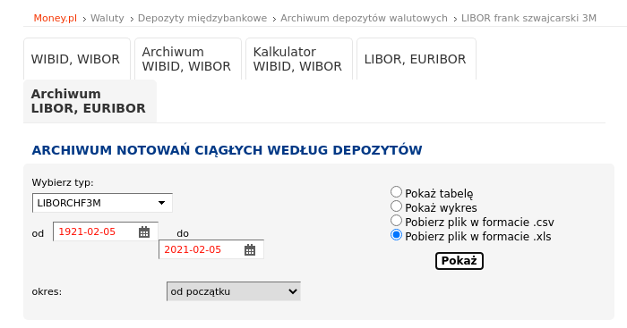

Klikam pobierz i nawet dostaję plik, ale po zaznaczeniu pełnego okresu, wybraniu poprawnych danych widzę:

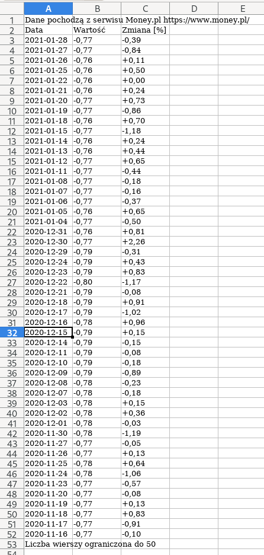

> Liczba wierszy ograniczona do 50

Kto to ograniczył? Po co ten formularz, jak nie można z niego skorzystać!? Wiadomo, że jak ktoś chce przetwarzać dane to najlepiej najszerszy możliwy zakres.

W tym wpisie pokażę jak minimalną liczbą linii kodu ominąć problem i wykonać szybki scraping. Poniżej plan działań jakie zaprezentuję:

1. Sprawdzenie jak dostać się do tych danych.
2. Pobranie danych na maszynę lokalną.
3. Opisanie docelowej struktury.
4. Przetworzenie pobranych stron.

Główne cele:

* minimalizacja czasu i linii kodu na to zadanie

# Jak dostać się do danych

Okazuje się, że jak wyświetlimy tabelę to dane można z niej odczytać i będzie ona paginowana.

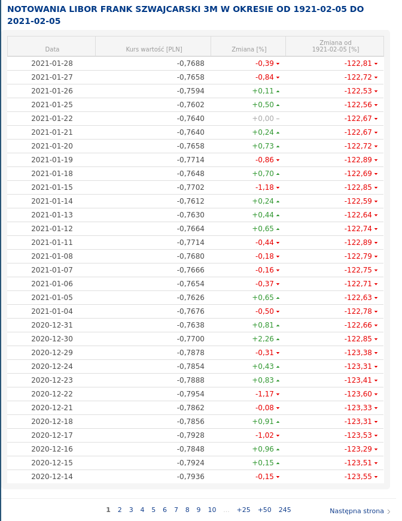

Linki mają kształt:

```
BASE_PREFIX${index}BASE_POSTFIX
```

Na przykład

```
https://www.money.pl/pieniadze/depozyty/walutowearch/1921-02-05,2021-02-05,LIBORCHF3M,strona,1.html
```

Renderowane są po stronie backendu co widzimy sprawdzając źródło strony:

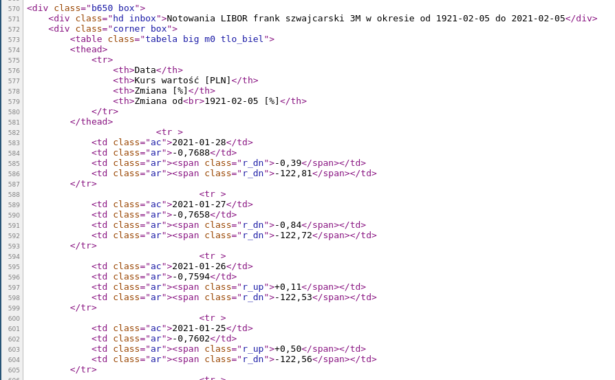

Potencjalnie plan 1:

* pobrać wszystkie pętlą w bashu na wget - jedna linia
* przetworzyć wszystkie pobrane pliki w `node` z `jsdom` 30 linii

Potencjalnie plan 2

* pobrać pliki CSV co 50 dni z zakresie dat - około 40 linii `node`
* przetworzyć je około 1 linii w sed / awk / perl / bash

Opcja z CSV była by prostsza gdyby nie problematyczne paginowanie po datach. Operowanie na datach w `js` jest raczej nieprzyjemne, mimo to obie strategie są racjonalne. Jeśli oszczędzał bym transfer sieciowy czy moc obliczeniową to plan 2 bije na głowę plan 1. Jednak celujemy w minimalizację ilości kodu więc zrobimy to pierwszym sposobem.

# Pobranie danych

Linki:

```
LIBOR:

https://www.money.pl/pieniadze/depozyty/walutowearch/1921-02-05,2021-02-05,LIBORCHF3M,strona,1.html

Stron: 245

WIBOR:

https://www.money.pl/pieniadze/depozyty/zlotowearch/1921-02-05,2021-02-05,WIBOR3M,strona,1.html

Stron: 178
```

Będziemy potrzebować pętli `for` oraz `wget`. Testowo sprawdzimy `i=1`

```
for i in {1..1}; do wget "https://www.money.pl/pieniadze/depozyty/walutowearch/1921-02-05,2021-02-05,LIBORCHF3M,strona,$i.html" -O raw; done
```

Okazuje się jednak, że odpowiedź do `403`

```
--2021-02-05 16:59:56--  https://www.money.pl/pieniadze/depozyty/walutowearch/1921-02-05,2021-02-05,LIBORCHF3M,strona,1.html
Loaded CA certificate '/etc/ssl/certs/ca-certificates.crt'
Resolving www.money.pl (www.money.pl)... 212.77.101.20
Connecting to www.money.pl (www.money.pl)|212.77.101.20|:443... connected.
HTTP request sent, awaiting response... 403 Forbidden
2021-02-05 16:59:56 ERROR 403: Forbidden.
```

Czyżby ta strona była tak często czesana `wgetem`, że admini zablokowali żądania dla domyślnego user agent wgeta?

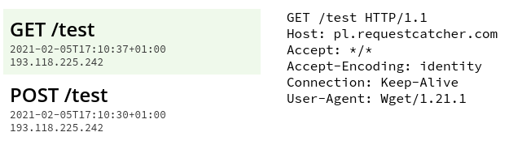

Nie zdziwił bym się, biorąc po uwagę fakt, że Wget wcale się nie kryje ze swoją tożsamością. Httpie nie jest lepszy

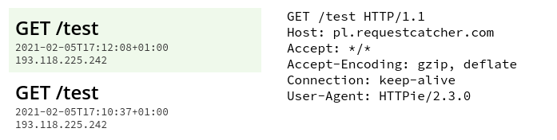

ale jest mniej znany, dlatego działa

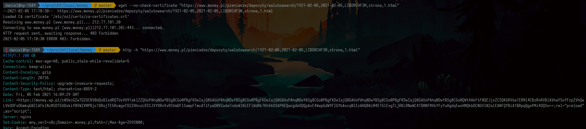

Do pobrania plików jak obiecałem wystarczy po 1 linii dla każdego rodzaju:

Dla `LIBORCHF3M`

```
mkdir -p raw && for i in {1..245}; do http -b "https://www.money.pl/pieniadze/depozyty/walutowearch/1921-02-05,2021-02-05,LIBORCHF3M,strona,$i.html" > "raw/l${i}.html";echo $i; done
```

Dla `WIBOR3M`

```
mkdir -p raw && for i in {1..178}; do http -b "https://www.money.pl/pieniadze/depozyty/zlotowearch/1921-02-05,2021-02-05,WIBOR3M,strona,$i.html" > "raw/w${i}.html";echo $i; done
```

W katalogu `raw` mamy już wszystkie pliki wymagane do przetworzenia

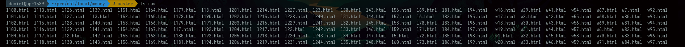

# Opisanie docelowej struktury

Na wyjściu chcę mieć plik `json` o następującej strukturze

```
{
   "WIBOR3M": { 'YYYY-MM-DD': value, ... },
   "LIBORCHF3M": { 'YYYY-MM-DD': value, ... }
}
```

# Przetworzenie pobranych stron

Startujemy projekt

```
npm init -y && tsc --init && touch app.ts
```

Instalujemy `jsdom` do parsowania drzewa dom po stronie node js.

```
npm i jsdom @types/jsdom @types/node
```

Na koniec porównamy `jsdom` z `cheerio`. Lecz teraz załóżmy, że wykonamy zadanie używając tej pierwszej biblioteki.

Bazowy szkielet jest dość przewidywalny.

```
import fs from 'fs';
import {JSDOM} from 'jsdom';

const main = () => {
   // get all files
   // process any of them
   // using file names and data compose final strucutre
   // save it
}

console.dir(main())
```

Chcemy teraz odczytać wszystkie pliki. Piszemy do tego funkcję:

```
const getFiles = (): { type: string, content: string }[] => fs
  .readdirSync(process.cwd() + `/raw`)
  .map(name => ({
    type: name[0] === 'l' ? 'LIBORCHF3M' : 'WIBOR3M',
    content: fs.readFileSync(process.cwd() + '/raw/' + name).toString()
  }))
```

Teraz je przetworzymy pojedynczą tabelę:

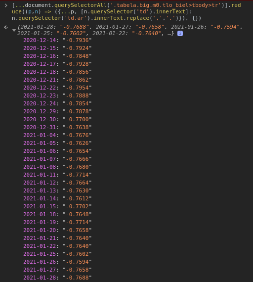

Ta linia wykonana w kosoli przeglądarki jest sercem całego programu. Należy ją przenieść do `node js`. Abyśmy bez problemu wykonali dynamiczną destrukturyzację potrzebujemy zmienić `target` w `tsconfig.json` na wyższy niż `es5` na przykład `ES2020`.

Definiujemy interfejsy

```
interface FileInput {
  type: string,
  content: string
}

interface Output {
  [key: string]: { [date: string]: number }
}
```

Funkcja przetwarzająca pliki przyjmie kształt:

```
const processFile = ({ type, content }: FileInput): Output => ({
  [type]: [...new JSDOM(content).window.document.querySelectorAll('.tabela.big.m0.tlo_biel>tbody>tr')].reduce((p, n) => ({
    ...p,
    [n.querySelector('td')?.textContent || '']: (n.querySelector('td.ar')?.textContent || '').replace(',', '.')
  }), {})
})
```

jej użycie mogło by wyglądać tak

```
const main = () => {
  return getFiles().map(processFile)
}

console.dir(main())
```

Wykonanie zwraca dane, które musimy jeszcze zredukować do tylko pary kluczy - `LIBORCHF3M` oraz `WIBOR3M`

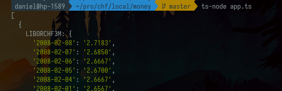

Redukcja wymaga mergowania objektów na kluczach, dlatego dopiszemy do niej funkcję

```
const reducer = (p: Output, n: Output): Output => {
  Object.keys(n).forEach(k => {
    Object.keys(p).includes(k) ?  p[k] = { ...p[k], ...n[k] } : p[k] = n[k];
  })
  return p
}
```

Całość kodu może finalnie wygląda tak

```ts
import fs from 'fs'
import { JSDOM } from 'jsdom'

interface FileInput {
    type: string,
    content: string
}

interface Output {
    [key: string]: { [date: string]: number }
}

const getFiles = (): FileInput[] => fs.readdirSync(process.cwd() + `/raw`).map(name => ({
    type: name[0] === 'l' ? 'LIBORCHF3M' : 'WIBOR3M',
    content: fs.readFileSync(process.cwd() + '/raw/' + name).toString()
}))

const processFile = ({ type, content }: FileInput): Output => ({
    [type]: [...new JSDOM(content).window.document.querySelectorAll('.tabela.big.m0.tlo_biel>tbody>tr')].reduce((p, n) => ({
        ...p,
        [n.querySelector('td')?.textContent || '']: parseFloat((n.querySelector('td.ar')?.textContent || '').replace(',', '.'))
    }), {})
})

const reducer = (p: Output, n: Output): Output => {
    Object.keys(n).forEach(k => {
        Object.keys(p).includes(k) ?  p[k] = { ...p[k], ...n[k] } : p[k] = n[k];
    })
    return p
}

const main = () => {
    return getFiles().map(processFile).reduce(reducer)
}

!fs.existsSync(process.cwd() + '/out') && fs.mkdirSync(process.cwd() + '/out', {recursive: true})
fs.writeFileSync(process.cwd() + '/out/rates.json', JSON.stringify(main()))
```

Ilość linii prawdziwego kodu: 30

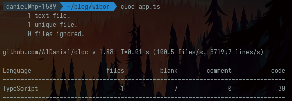

Czas wykonania: 1min 15sec

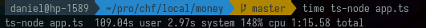

Waga pobranych plików html 43MB. Waga wydobytych danych 244KB w formacie json. Gdybyśmy chcieli je trzymać w CSV, oszczędność wyniosła by jedynie 2 cudzysłowy na linię. Przy około 13 tys linii daje to 26KB zbędnych znaków przy konwersji do CSV czyli 10%. Jest to bardzo mało.

Jednak pamiętajmy, że kolejne 4 znaki można zaoszczędzić na zmiane konwencji zapisu dat z `YYYY-MM-DD` na `YYMMDD`, a pewnie jeszcze więcej kodując daty w formacie o wyższej entropii niż używany przez ludzi na codzień.

Znacznie więcej, bo 15 znaków na linię oszczędziliśmy na decyzji, że daty będą tu kluczami.

```
15 znaków = date (4) + value (5) + cudzysłowy do nich (4), dwókropek (1), przecinek (1)
```

Dane są dostępne do pobrania pod linkiem:

[https://preciselab.fra1.digitaloceanspaces.com/blog/scraping/bank-rates.json](https://preciselab.fra1.digitaloceanspaces.com/blog/scraping/bank-rates.json)

Kod programu w tej wersji znajdziecie w repozytorium

[app.ts · 0e96ff56b983c86d0b2bb50dcd7760063a16681c · gustawdaniel / money-pl-scraper

GitLab.com

GitLab

](https://gitlab.com/gustawdaniel/money-pl-scraper/-/blob/0e96ff56b983c86d0b2bb50dcd7760063a16681c/app.ts)

## Cheerio vs JSDOM

Jakiś czas po napisaniu tego artykułu spotkałem się z problemem wysokiego zużycia pamięci w JSDOM. Potwierdziłem to eksperymentalnie w issue:

[Is cheerio still 8x faster than jsdom? · Issue #700 · cheeriojs/cheerio

This part of the readme has been written 3,5 years ago. ba80a89 Is it still the case (especially regarding the 4.x serie of jsdom)?

GitHub cheeriojs

](https://github.com/cheeriojs/cheerio/issues/700)

Teraz pokażę jak przepisać ten kod na `cheerio` oraz jak podniesie się jego wydajność

1. Instalujemy Cheerio

```
npm i cheerio
```

2\. Podmieniamy import na

```ts
import cheerio from 'cheerio';
```

3\. Podmieniamy funkcję przetwarzającą plik na

```ts
const processFile = ({type, content}: FileInput): Output => ({
    [type]: cheerio.load(content)('.tabela.big.m0.tlo_biel>tbody>tr').toArray().reduce((p, n) => ({
        ...p,
        ...((el) => ({[el.find('td').text()]: parseFloat(el.find('td.ar').text().replace(',', '.'))}))(cheerio(n))
    }), {})
})
```

Wynik poprawił się `3.4` krotnie

```
time ts-node app.ts
ts-node app.ts  29.53s user 1.21s system 141% cpu 21.729 total
```

Pełny DIFF jest dostępny pod linkiem:

[JSDOM replaced by Cheerio (3.4) times faster (4cff4a83) · Commits · gustawdaniel / money-pl-scraper

GitLab.com

GitLab

](https://gitlab.com/gustawdaniel/money-pl-scraper/-/commit/4cff4a835589976ca26a7852f67dd42f2c4f2525)

Jeśli chcesz porozmawiać o scrapingu w ramach bezpłatnej, nie zobowiązującej konsultacji, zapraszam Cię na mój Calendy.

[Daniel Gustaw

Welcome to my scheduling page. Please follow the instructions to add an event to my calendar.

Calendly

](https://calendly.com/gustaw-daniel)

Warto przeczytać też

[Downlevel Iteration for ES3/ES5 in TypeScript

TypeScript 2.3 introduced a new `--downlevelIteration` flag that adds full support for the ES2015 iteration protocol and `for...of`-loops for ES3 and ES5 targets.

Marius SchulzMarius Schulz

](https://mariusschulz.com/blog/downlevel-iteration-for-es3-es5-in-typescript)
