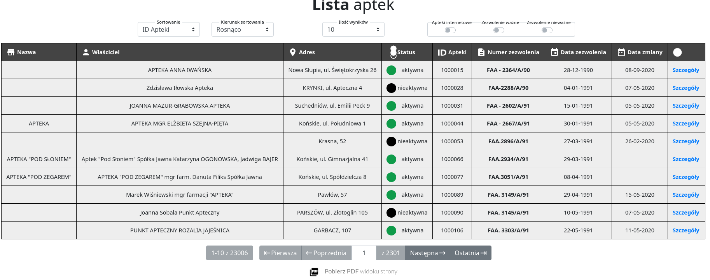
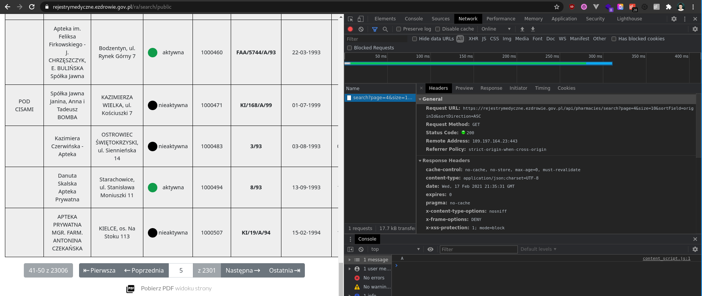
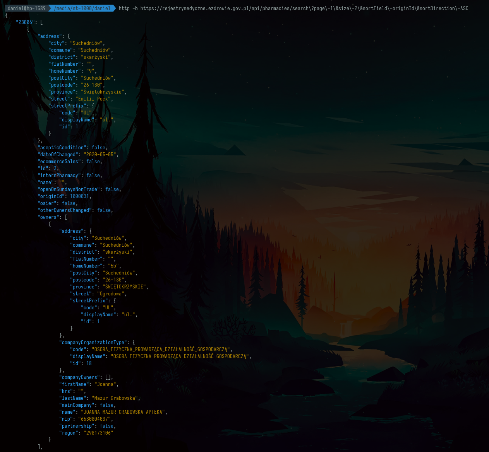
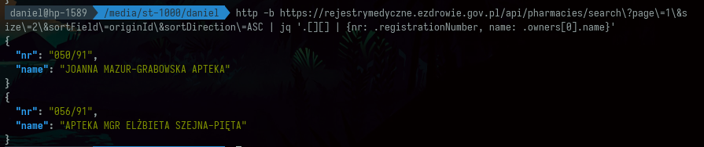
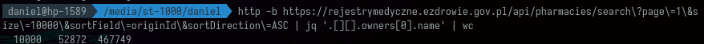

Są strony lepiej lub gorzej zabezpieczone przed scrapingiem. Teraz przyjrzymy się stronie wcale nie zabezpieczonej - Rejestrowi Medycznemu zawierającemu dane o aptekach.

Z artykułu dowiesz się jak badać strony internetowe i na co zwracać uwagę przy scrapowaniu danych. Okazuje się, że w niektórych przypadkach wystarczają naprawdę znikome ilości kodu aby pobrać dane w wygodnym do dalszej obróbki formacie.

Artykuł oparty jest o analizę scrapingu na konkretnym przypadku. Tutaj jest to strona:

> [https://rejestrymedyczne.ezdrowie.gov.pl/main](https://rejestrymedyczne.ezdrowie.gov.pl/main)

Zawiera ona kilka rejestrów danych powiązanych z medycyną


Załóżmy, że chcemy pobrać wszystkie dane o aptekach z tej strony. Klikamy na rejestr aptek i widzimy:

> [https://rejestrymedyczne.ezdrowie.gov.pl/ra/search/public](https://rejestrymedyczne.ezdrowie.gov.pl/ra/search/public)



Co ciekawe paginacja nie powoduje tu zmiany adresu url tylko przeładowanie strony i wyświetlenie kolejnego widoku w tabeli.

Po przejściu do zakładki "Network" w konsoli przeglądarki widzimy, że w tle wysyłany jest request



Okazuje się, że bez żadnego tokena, klucza czy ciasteczka można pobrać dane, które ładowane są do tabeli bezpośrednio z api poleceniem

```bash
http -b https://rejestrymedyczne.ezdrowie.gov.pl/api/pharmacies/search\?page\=1\&size\=2\&sortField\=originId\&sortDirection\=ASC
```



Nie ma problemu, żeby pobrać **dwie** apteki:

```bash
http -b https://rejestrymedyczne.ezdrowie.gov.pl/api/pharmacies/search\?page\=1\&size\=2\&sortField\=originId\&sortDirection\=ASC | jq '.[][] | {nr: .registrationNumber, name: .owners[0].name}'
```



Nie ma problemu, żeby pobrać **dziesięć tysięcy** aptek.

```bash
http -b https://rejestrymedyczne.ezdrowie.gov.pl/api/pharmacies/search\?page\=1\&size\=10000\&sortField\=originId\&sortDirection\=ASC | jq '.[][].owners[0].name' | wc
```



Z paginacji strony widzimy, że rejestr zawiera `23006` apteki. Zatem jeśli możemy pobrać 10k na raz potrzebujemy 3 requestów. Niestety wpisanie `size=23006` rzuca błąd, ale warto sprawdzić `size=15000`. Dwa requesty to zawsze lepiej niż trzy.

Do pobrania 15 tys aptek służy komenda

```bash
http -b https://rejestrymedyczne.ezdrowie.gov.pl/api/pharmacies/search\?page\=1\&size\=15000\&sortField\=originId\&sortDirection\=ASC | jq '.[][]' > ra.json
```

Do włożenia danych do bazy

```bash
mongoimport --db test --collection ra --drop --file ./ra.json
```

Okazuje się, że niestety mamy tylko `8006` dokumentów, a nie spodziewane `15000`.

```bash
2021-02-17T22:59:19.216+0100	connected to: mongodb://localhost/
2021-02-17T22:59:19.217+0100	dropping: test.ra
2021-02-17T22:59:20.234+0100	8006 document(s) imported successfully. 0 document(s) failed to import.
```

Dla `10,000` mamy poprawny wynik zarówno pobierania

```bash
http -b https://rejestrymedyczne.ezdrowie.gov.pl/api/pharmacies/search\?page\=1\&size\=10000\&sortField\=originId\&sortDirection\=ASC | jq '.[][]' > ra.json
```

jak i importu

```bash
mongoimport --db test --collection ra --drop --file ./ra.json

2021-02-17T23:02:11.893+0100	connected to: mongodb://localhost/
2021-02-17T23:02:11.894+0100	dropping: test.ra
2021-02-17T23:02:13.143+0100	10000 document(s) imported successfully. 0 document(s) failed to import.
```

Ważne, że przy pobieraniu drugiej strony dopisujemy do pliku `>>` a nie nadpisujemy jego zawartość `>`.

```bash
http -b https://rejestrymedyczne.ezdrowie.gov.pl/api/pharmacies/search\?page\=2\&size\=10000\&sortField\=originId\&sortDirection\=ASC | jq '.[][]' >> ra.json
```

Tym razem zapis daje `13006` plików i wszystko wyjaśnia się.

```bash
mongoimport --db test --collection ra --drop --file ./ra.json

2021-02-17T23:03:43.592+0100	connected to: mongodb://localhost/
2021-02-17T23:03:43.592+0100	dropping: test.ra
2021-02-17T23:03:45.173+0100	13006 document(s) imported successfully. 0 document(s) failed to import.
```

Wynik `8006` przy `size=15000` wynikał z tego, że strony numerują się od `0` w tym `api` i `8006` = `23006 - 15000`, co było poprawnym wynikiem.

Tak czy siak nie ważne czy pobieramy po 10 czy po 15 tysięcy został nam jeden request z `page=0` np.:

```bash
http -b https://rejestrymedyczne.ezdrowie.gov.pl/api/pharmacies/search\?page\=0\&size\=10000\&sortField\=originId\&sortDirection\=ASC | jq '.[][]' >> ra.json
```

Ostatni import pozwala nam wgrać wszystkie apteki.

```
mongoimport --db test --collection ra --drop --file ./ra.json

2021-02-17T23:08:02.038+0100	connected to: mongodb://localhost/
2021-02-17T23:08:02.038+0100	dropping: test.ra
2021-02-17T23:08:04.808+0100	23006 document(s) imported successfully. 0 document(s) failed to import.
```

W `compass` możemy zaprojektować agregację z dwoma etapami:

1. Zdjęcie tablicy z `owners`

```
{
    '$unwind': {
      'path': '$owners'
    }
}
```

2\. Projekcja najbardziej interesujących pól

```
{
    '$project': {
      'name': '$owners.name',
      'firstName': '$owners.firstName',
      'lastName': '$owners.lastName',
      'krs': '$owners.krs',
      'nip': '$owners.nip',
      'regon': '$owners.regon',
      'address': {
        '$concat': [
          '$address.street', ' ', '$address.homeNumber', ', ', '$address.postcode', ' ', '$address.city'
        ]
      }
    }
}
```

Pozwoli nam to na wygenerowanie kodu programu

```js
const MongoClient = require('mongodb').MongoClient;
const assert = require('assert');

/*
 * Requires the MongoDB Node.js Driver
 * https://mongodb.github.io/node-mongodb-native
 */

const agg = [
  {
    '$unwind': {
      'path': '$owners'
    }
  }, {
    '$project': {
      'name': '$owners.name',
      'firstName': '$owners.firstName',
      'lastName': '$owners.lastName',
      'krs': '$owners.krs',
      'nip': '$owners.nip',
      'regon': '$owners.regon',
      'address': {
        '$concat': [
          '$address.street', ' ', '$address.homeNumber', ', ', '$address.postcode', ' ', '$address.city'
        ]
      }
    }
  }
];

MongoClient.connect(
  'mongodb://localhost:27017/?readPreference=primary&appname=MongoDB%20Compass&ssl=false',
  { useNewUrlParser: true, useUnifiedTopology: true },
  function(connectErr, client) {
    assert.equal(null, connectErr);
    const coll = client.db('test').collection('ra');
    coll.aggregate(agg, (cmdErr, result) => {
      assert.equal(null, cmdErr);
    });
    client.close();
  });
```

Aby go włączyć musimy zainstalować sterowniki do `mongo` oraz `assert`.

```
 npm init -y && npm i mongodb@3.6.3 assert
```

Wersja `@3.6.3` wynika z występowania błędu z brakującym `MongoError` w wersji `3.6.4`.

[Warning: Accessing non-existent property ‘MongoError’ of module exports inside circular dependency

Hi, I am getting a warning consistently each time our webserver or another process connects to the DB. (node:24990) Warning: Accessing non-existent property ‘MongoError’ of module exports inside circular dependency at emitCircularRequireWarning (internal/modules/cjs/loader.js:650:11) at Ob…

MongoDB Developer Community ForumsLaurens

](https://developer.mongodb.com/community/forums/t/warning-accessing-non-existent-property-mongoerror-of-module-exports-inside-circular-dependency/15411)

Ten zaprezentowany kod poza wykonaniem agregacji nic nie robi. Jeśli wynik agregacji chcieli byśmy zapisać do pliku należy go delikatnie zmodyfikować dodając na początku niezbędny import

```
const fs = require('fs')
```

i zmieniając callback na taki, który faktycznie zapisuje wynik.

```
MongoClient.connect(
    'mongodb://localhost:27017/?readPreference=primary&appname=MongoDB%20Compass&ssl=false',
    { useNewUrlParser: true, useUnifiedTopology: true },
    function(connectErr, client) {
      assert.strictEqual(null, connectErr);
      const coll = client.db('test').collection('ra');
      coll.aggregate(agg, async (cmdErr, result) => {
        assert.strictEqual(null, cmdErr);
          const out = await result.toArray();
          fs.writeFileSync('ra-project.json', JSON.stringify(out));
          return client.close();
      });
    });
```

Okazuje się, że najciekawsze dane to około 10% tych które pobraliśmy.

```
du -h ra*json
50M	ra.json
4.8M	ra-project.json
```

Ten wpis pokazuje jak bardzo łatwo jest wykonywać scraping wykorzystując api przygotowane przez twórców stron.

Niestety nie wszystkie rejestry z tego serwisu są tak łatwe w pobraniu. Jednym z trudniejszych jest rejestr diagnostów medycznych. Tutaj jednak trudność polega na tym, że nawet człowiek nie może dostać się do części danych prezentowanych w tym rejestrze z powodu błędów w kodzie strony.

## Podsumowanie

Pokazaliśmy jak korzystając z konsoli przeglądarki wykryć żądania do `api` oraz jak wykorzystać je do scrapingu danych. Następnie włożyliśmy dane do `mongodb` i dzięki agregacji wygenerowaliśmy 10 razy lżejszy zbiór danych zawierający jedynie najciekawsze informacje.

W tym projekcie kodu jest tak mało, że nie powstało do niego repozytorium. Dane można pobrać z linków

Wszystkie dane:

> [https://preciselab.fra1.digitaloceanspaces.com/blog/scraping/ra.json](https://preciselab.fra1.digitaloceanspaces.com/blog/scraping/ra.json)

Tylko KRS, NIP, REGON, ADRES, IMIĘ, NAZWISKO, NAZWA

> [https://preciselab.fra1.digitaloceanspaces.com/blog/scraping/ra-project.json](https://preciselab.fra1.digitaloceanspaces.com/blog/scraping/ra-project.json)

Jeśli chesz rzucić mi wyzwanie i zaproponować stronę, którą warto zescrapować, nie miej oporów przed umówieniem niezobowiązującej bezpłatnej konsultacji

[Daniel Gustaw

Welcome to my scheduling page. Please follow the instructions to add an event to my calendar.

Calendly

](https://calendly.com/gustaw-daniel)
