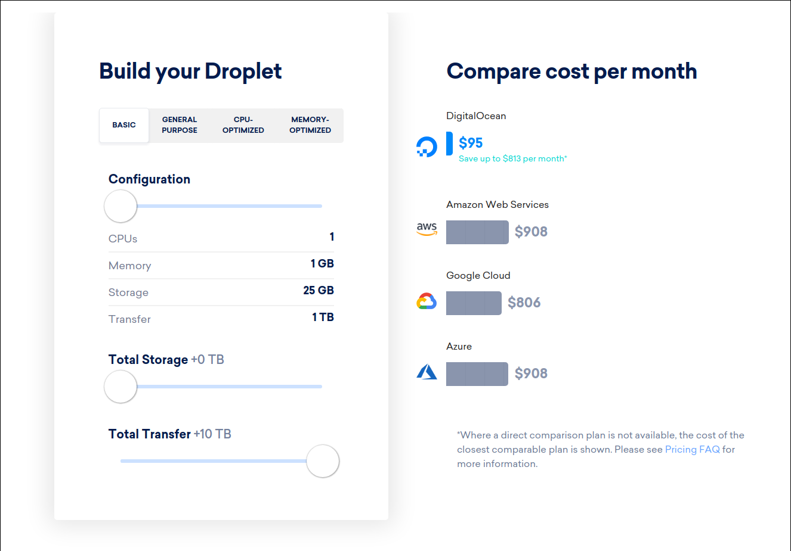
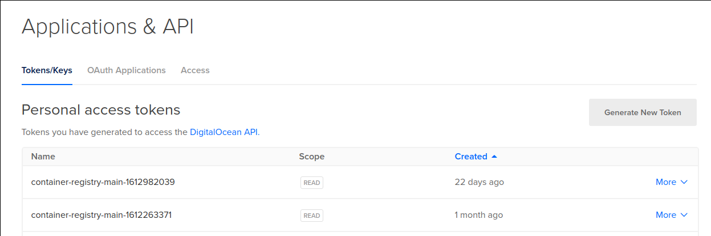
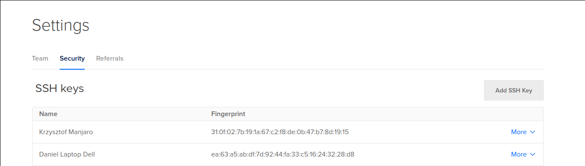
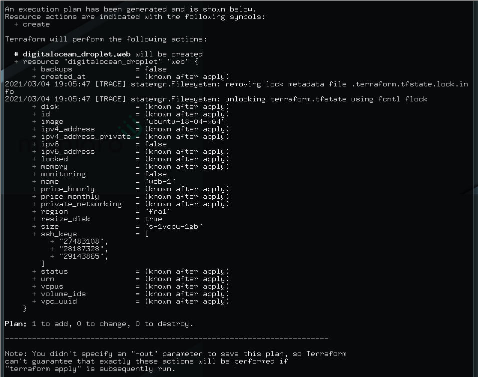
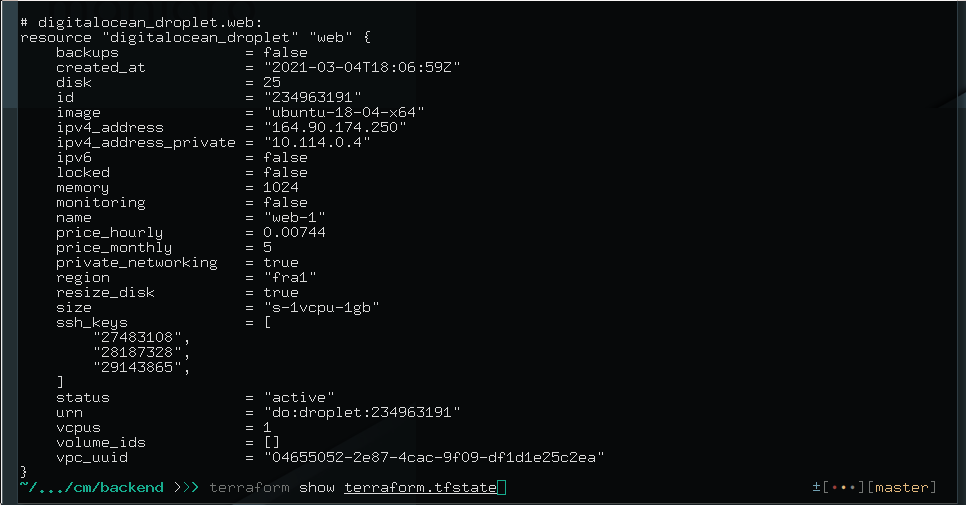
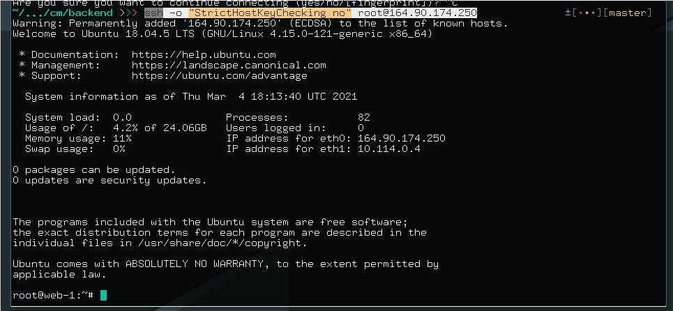

W scrapingu ważnym czynnikiem jest skala do jakiej możemy rozszerzyć tempo pobierania i przetwarzania danych. Kiedy kilka lat temu pisałem swój pierwszy system, który równolegle zbierał dane używając kilkunastu serwerów, każdy z tych serwerów był przeze mnie "wyklikany" w panelu dostawcy.

Teraz pokażę w jaki sposób rozstawić serwery z linii poleceń `terraform`. Dostawcą będzie Digital Ocean, ponieważ w porównaniu ze swoją największą konkurencją ma bardzo korzystne (8-10 razy niższe) ceny transferu sieciowego.



https://www.digitalocean.com/pricing/calculator/

Prezentację przeprowadzimy z systemu `arch`.

# Instalacja Terraform

Nie ma nic bardzej przyjemnego niż instlacja oprogramowania w arch. Aby cieszyć się gotowym do pracy terraformem wystarczy komenda

```
yay -S terraform
```

# Podłączenie dostawcy

Aby połączyć się z Digital Ocean potrzebujemy tokenu. Jeśli go nie posiadamy, znajdziemy w zakładce API w panelu przycisk "Generate New Token"



Token warto zapisać w `~/.zshrc` lub `~/.bashrc`

```
export DIGITALOCEAN_TOKEN=xxxxxxxxxxxxxxxxxxxxxx
```

po ponownym wykonaniu tego plik będzie on dostępny we wszystkich tworzonych przez nas projektach.

Oficjalna dokumentacja pokazuje jak zrobić to przez zmienną `do_token`

[https://registry.terraform.io/providers/digitalocean/digitalocean/latest/docs](https://registry.terraform.io/providers/digitalocean/digitalocean/latest/docs)

ale nie polecam tego sposobu, ponieważ wymusza on na nas dopisywanie argumentów `-var` do poleceń `terraform` a podejście prezentowane tutaj oszczędza nam ilość wpisywanych znaków.

Aby skonfigurować połączenie do Digital Ocean mając token w zmiennych środowiskowych tworzymy plik `provider.tf` i wpisujemy do niego:

```
terraform {
  required_providers {
    digitalocean = {
      source = "digitalocean/digitalocean"
      version = "2.5.1"
    }
  }
}

provider "digitalocean" {}
```

A następnie wykonujemy komendę inicjalizacyjną

```
terraform init
```

# Rozstawianie serwerów

Kolejnym krokiem jest zaplanowanie i rozstawienie infrastruktury. W naszym przypadku bedzie ona bardzo prosta. Powinna zawierać dokładnie jeden droplet z kluczami do wszystkich inoyterów, którymi chcę się na niego logować.

Tworzymy kolejny plik. Nazwałem go `master.tf`

```
data "digitalocean_ssh_key" "dell" {
  name = "Daniel Laptop Dell"
}
data "digitalocean_ssh_key" "yoga" {
  name = "Daniel Lenovo Yoga"
}
data "digitalocean_ssh_key" "hp" {
  name = "Daniel Stacjonarny"
}
# Create a web server
resource "digitalocean_droplet" "web" {
  image  = "ubuntu-18-04-x64"
  name   = "web-1"
  region = "fra1"
  size   = "s-1vcpu-1gb"
  ssh_keys = [
    data.digitalocean_ssh_key.dell.id,
    data.digitalocean_ssh_key.yoga.id,
    data.digitalocean_ssh_key.hp.id
  ]
}
```

Są to klucze, które znajdziemy w zakładce "Settings -> Security" w panelu Digital Ocean



Wykonanie

```
 terraform plan
```

Sprawdzi, czy nasza konfiguracja jest ok i pozwoli zobaczyć jak zmieni się architektura po wdrożeniu. W tym przypadku będzie to dodanie jednego serwera - dokładnie tak jak napisaliśmy w konfiguracji



Wdrożenie wykonamy wpisując

```
terraform apply -auto-approve
```

Wykonanie tej komendy trwało u mnie `47s`.

# Przegląd wyników

Aby zobaczyć co postawiliśmy wykonujemy polecenie:

```
 terraform show terraform.tfstate
```

Zwraca ono dane na temat zasobów zarządzanych przez `terraform`



Najbardziej interesujące jest dla nas `ip`. W tym przypadku `164.90.174.250`.

Na serwer loguję się komendą

```
ssh -o "StrictHostKeyChecking no" root@164.90.174.250
```

Jak widać działa, bo komenda zalogowała nas na serwer `web-1` jako `root`.



Po powrocie do `localhost` poleceniem

```
exit
```

możemy usunąć wszystkie utworzone droplety komendą

```
 terraform destroy -auto-approve
```

Należy o niej pamiętać po zakończonej pracy, szczególnie jeśli operujemy na dużej skali mocy obliczeniowej!
