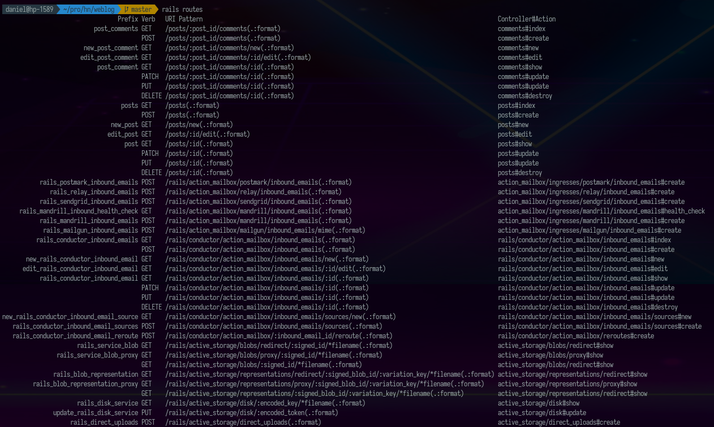

W roku 2019 przepisywałem pewien system medyczny z Rails na PHP, w 2021 z Rails na NodeJS. Być może ty też spotykasz się z systemami opartymi na Rails, które tracą utrzymanie. To wprowadzenie pomoże Ci szybko zapoznać się z podstawami tego frameworka.

Napiszemy w nim bloga całkowicie od zera. Zaznaczę, że nie znam dobrze ani Ruby ani Rails, więc zamiast obszernego wprowadzenia mamy tu odtworzenie mojego procesu uczenia się.

Założenia:

* używamy linuxa (arch)

## Postawienie aplikacji - CRUD

Zaczniemy od instalacji odpowiedniej wersji ruby.

```bash
curl -sSL https://get.rvm.io | bash -s stable --rails
```

`rvm` jest narzędziem analogicznym do `nvm` - pozwala zarządzać wersją interpretera co jest wyjątkowo przydatne przy pracy z systemami, które używają różnych wersji interpreterów. Możesz o nim poczytać tu:

[RVM: Ruby Version Manager - Installing RVM

Fastly

](https://rvm.io/rvm/install)

Tworzymy aplikację poleceniem

```bash
rails new weblog && cd weblog
```

Ta komenda zajmuje dużo czasu, ponieważ wymaga instalacji wszystkich paczek `gem` i kompilacji `node-sass` .

Następnym krokiem jest wygenerowanie automatycznie kodu do wykonywania operacji CRUD na poście. Posty będą miały tytuł i zawartość.

```bash
rails generate scaffold post title:string body:text
```

Ta komenda powoduje wygenerowanie się sporej ilości plików:


Jednym z nich jest migracja na bazie danych, która zapisana w `db/migrate/20210418121400_create_posts.rb` wygląda tak:

```ruby
class CreatePosts < ActiveRecord::Migration[6.1]
  def change
    create_table :posts do |t|
      t.string :title
      t.text :body

      t.timestamps
    end
  end
end
```

Aby zsynchronizować bazę danych z wynikiem tej migracji wpisujemy

```bash
rails db:migrate
```

Tu może się pojawić pytanie: "Jaką bazę danych?". W pliku `config/database.yml` możemy zobaczyć konfigurację z której wynika, że domyślnie jest to `sqlite`. W pliku `db/schema.rb` jest schemat bazy.

---

To jest dobre miejsce na dygresję. Migrując systemy oparte na Ruby on Rails zastanawiałem się dlaczego środowisko produkcyjne ma "sqlite", myślałem, że ktoś celowo tak to skonfigurował. Okazuje się, że wystarczyło nie zmienić konfiguracji w tym pliku. Innym problemem, który zaprzątał mi głowę dwa lata temu, było pole "updated\_at" w tabelach, które nie obsługiwały edycji. Widząc "updated\_at" i nie mając dokumentacji myślałem, że istnieje proces edycji tych tabel, jednak to również jest wynik domyślnej konfiguracji "rails", który wszędzie wrzuca te kolumny.

---

Żeby wystartować server używamy komendy

```
rails server
```

Ogromną zaletą rails jest, że już teraz możemy korzystać z działającego CRUD pod linkiem

[http://127.0.0.1:3000/posts](http://127.0.0.1:3000/posts)

Po wytworzeniu posta ręcznie dostajemy:


Co jeszcze przyjemniejsze mamy też od razu "api" pod adresem `/posts.json`


Niestety próba utworzenia posta przez API

```
http POST localhost:3000/posts.json title="Hej" body="Ok"
```

kończy się błędem

```
Can't verify CSRF token authenticity.
```

Żeby wyłączyć protekcję "CSRF" w pliku `app/controllers/application_controller.rb` konfigurujemy opcję `protect_from_forgery`

```ruby
class ApplicationController < ActionController::Base
  protect_from_forgery with: :null_session
end
```

Teraz zapis postów przez API działa. Zarówno

```
http POST localhost:3000/posts.json title=ok
```

jak i

```
http POST localhost:3000/posts.json body=ok
```

zapiszą swoje posty bez walidacji ich poprawności.


Aby wymusić obecność parametru `title` w poście, w pliku `app/models/post.rb` dodajemy flagę `validates_presence_of`

```
class Post < ApplicationRecord
  validates_presence_of :title
end
```

Dzięki niej niemożliwe będzie dodawanie postów bez tytułu zarówno na stronie


jak i przez API


## Debugowanie - Rails Console

Bardzo przydatnym narzędziem w pracy z Ruby on Rails jest konsola dostępna po wpisaniu polecenia:

```
rails console
```

Pozwala ona na interaktywny dostęp do danych za pomocą języka Ruby i zdefiniowanych w Rails obiektów. Na przykład pierwszy post zobaczymy wpisując

```
Post.first
```

Żeby dostać wszystkie posty piszemy

```
Post.all
```

Posty utworzone od wczoraj do jutra dostaniemy pisząc

```
Post.where(created_at: Date.yesterday..Date.tomorrow)
```

Łatwo można przekształcić to do formy zapytania SQL dodając własność `to_sql` na końcu

```
Post.where(created_at: Date.yesterday..Date.tomorrow).to_sql
```

Aby utworzyć nowy post piszemy

```
Post.create! title: 'Hello', body: 'World'
```

## Relacje między tabelami

Typowym przykładem relacji względem postów są komentarze. Nie potrzebujemy dla nich takich samych kontrolerów i widoków jak dla postów, dlatego do generowania zamiast `scaffold` użyjemy flagi `resource`.

```
rails generate resource comment post:references body:text
```

Pełną listę dostępnych generatorów zobaczymy wpisując polecenie:

```
rails generate
```

lub czytając dokumentację

[The Rails Command Line — Ruby on Rails Guides

The Rails Command LineAfter reading this guide, you will know: How to create a Rails application. How to generate models, controllers, database migrations, and unit tests. How to start a development server. How to experiment with objects through an interactive shell.

Ruby on Rails Guides

](https://guides.rubyonrails.org/command_line.html#bin-rails-generate)

Tym czasem wrócimy do plików wygenerowanych dzięki opcji `resource`.


Ponownie powstała tutaj migracja tym razem o zawartości:

```ruby
class CreateComments < ActiveRecord::Migration[6.1]
  def change
    create_table :comments do |t|
      t.references :post, null: false, foreign_key: true
      t.text :body

      t.timestamps
    end
  end
end
```

Aby ją wykonać wpisujemy

```
rails db:migrate
```

Zajmijmy się teraz routingiem. Nie ma sensu nigdy pytać o wszystkie komentarze. Zawsze są one powiązane z postem, którego dotyczą. Zatem w pliku `config/routes.yml` zastępujemy występujące obok siebie

```ruby
Rails.application.routes.draw do
  resources :posts
  resources :comments
end
```

na konfigurację mówiącą, żeby komentarze były zagnieżdżone w poście

```ruby
Rails.application.routes.draw do
  resources :posts do
    resources :comments
  end
end
```

Wyświetlenie routingu jest możliwe dzięki poleceniu:

```
rails routes
```



Co do kierunku relacji, to w tym momencie komentarze należą do postów co opisano w pliku `app/models/comment.rb`

```
class Comment < ApplicationRecord
  belongs_to :post
end
```

Ale posty nie mają oznaczonej relacji z komentarzami, co naprawimy dodając `has_many` do `app/models/post.rb`

```
class Post < ApplicationRecord
  has_many :comments
  validates_presence_of :title
end
```

W konsoli możemy utworzyć teraz przykładowy komentarz

```
Post.second.comments.create! body: "My first comment to second post"
```

Żeby wyświetlić komentarze i móc je dodawać napiszemy pomocnicze fragmenty widoków (partials). `app/views/comments/_comment.html.erb` posłuży nam do wyświetlania jednego komentarza

```
<p><%= comment.body %> -- <%= comment.created_at.to_s(:long) %></p>
```

Natomiast `app/views/comments/_new.html.erb` będzie formularzem do tworzenia komentarza

```
<%= form_for([ @post, Comment.new], remote: true) do |form| %>
  Your comment: <br/>
  <%= form.text_area :body, size: '50x2' %><br/>
  <%= form.submit %>
<% end %>
```

Załączymy je w widoku pojedynczego postu dołączając do pliku `app/views/posts/shwo.html.erb` kod

```
<hr>

<h2>Comments (<span id="count"><%= @post.comments.count %></span>)</h2>

<div id="comments">
   <%= render @post.comments %>
</div>

<%= render 'comments/new', post: @post %>
```

Teraz nasz widok postu będzie wyglądała następująco


Mimo, że wygląda jak gotowy do działania, to funkcja dodawania komentarzy wciąż nie jest dostępna. Przygotowaliśmy jedynie widok, ale brakuje logiki, która obsłużyła by zapisywanie komentarzy do bazy i łączenie ich z postami.

Aby ją dołączyć musimy obsłużyć tworzenie komentarzy w kontrolerze `app/controllers/comments_controller.rb`

```
class CommentsController < ApplicationController
  before_action :set_post

  def create
    @post.comments.create! comments_params
    redirect_to @post
  end

  private

  def set_post
    @post = Post.find(params[:post_id])
  end

  def comments_params
    params.required(:comment).permit(:body)
  end

end
```

Przyjrzyjmy mu się uważnie. Zaczyna się od opcji `before_action`, która ustawia post na podstawie parametru z adresu `url`. Następnie w `create` używamy tego posta aby do niego utworzyć komentarz, jego parametry pochodzą z `comments_params`, które pobiera je z ciała żądania.

Następnie następuje przekierowanie do strony z postami. Na stronie działa to bardzo dobrze.


Ale jeśli chcemy tworzyć posty z poziomu API. to za każdym razem będąc przekierowani do postu zobaczymy go bez komentarzy. Jeśli zastąpimy

```
redirect_to @post
```

w kontrolerze przez instrukcje analogiczne jak dla posta

```
    respond_to do |format|
      if @post.save
        format.html { redirect_to @post, notice: "Comment was successfully created." }
        format.json { render :show, status: :created, location: @post }
      else
        format.html { render :new, status: :unprocessable_entity }
        format.json { render json: @post.errors, status: :unprocessable_entity }
      end
    end
```

dostaniemy błąd


Jest tak dlatego, że teraz komentarze wymagają aby nadać im strukturę przy układaniu ich w plik JSON. Jest to rozwiązane dzięki fantastycznej bibliotece `jbuilder`.

[rails/jbuilder

Jbuilder: generate JSON objects with a Builder-style DSL - rails/jbuilder

GitHub rails

](https://github.com/rails/jbuilder)

Tworząc plik `app/views/comments/show.json.jbuilder` o treści

```
json.partial! "posts/post", post: @post
json.comments @post.comments, :id, :body, :created_at
```

skonfigurujemy serwer, aby po utworzeniu komentarza odpowiadał widokiem posta z listą wszystkich odpowiadających mu komentarzy. Jest to widok odpowiadający temu co widzimy w wersji HTML, choć nie zgodny z zasadami REST.


Jeśli chcieli byśmy wyświetlić ten konkretny komentarz i możemy użyć składni

```
  def create
    comment = @post.comments.create! comments_params

    respond_to do |format|
      if @post.save
        format.html { redirect_to @post, notice: "Comment was successfully created." }
        format.json { render json: comment.to_json(include: [:post]) }
      else
        format.html { render :new, status: :unprocessable_entity }
        format.json { render json: @post.errors, status: :unprocessable_entity }
      end
    end

  end
```

w kontrolerze. Wtedy w widoku odpowiedzi zobaczymy komentarz wraz z postem.


Więcej o formatowaniu można przeczytać tutaj:

[Rendering JSON in a Rails API

To go over rendering JSON in a Rails API, I will use an example. Example: Models: doctor,...

DEV CommunityCindy

](https://dev.to/caicindy87/rendering-json-in-a-rails-api-25fd)

## Wysyłka e-maili

Bardzo częstą funkcją w serwisach internetowych jest wysyłanie e-maili w reakcji na jakieś zdarzenia. Zamiast pisać kod ponownie skorzystamy z generatora:

```
rails generate mailer comments submitted
```

Jest to e-mailer wysyłający powitanie. Pierwszą rzeczą, jaką zrobimy, będzie konfiguracja danych, jakie będzie wstrzykiwał do szablonów. W pliku `comments_mailer.rb` piszemy kod:

```
class CommentsMailer < ApplicationMailer
  def submitted(comment)
    @comment = comment

    mail to: "gustaw.daniel@gmail.com", subject: 'New comment'
  end
end
```

W `app/views/comments_mailer` mamy dwa pliki z szablonami. Dla widoku HTML jest to plik `submitted.html.erb`. Zmodyfikujemy go tak, żeby używając wcześniej zdefiniowanego partiala pokazywał nowy komentarz:

```
<h1>New comment on post: <%= @comment.post.title %></h1>

<%= render @comment %>
```

W pliku `submitted.text.erb` nie możemy użyć już `render` dlatego uprościmy widok tekstowy do formy:

```
New comment on post: <%= @comment.post.title %>: <%= @comment.body %>
```

Niesamowite w Rails jest to, że mamy gotowy widok do podglądu tych e-maili bez konieczności ich wysyłania. Aby z niego skorzystać musimy tylko wskazać komentarz, który wyświetlimy. W tym celu w pliku `test/mailers/previews/comments_mailer_preview.rb` linię

```
CommentsMailer.submitted
```

zmieniamy na

```
CommentsMailer.submitted Comment.first
```

Pod adresem

[http://localhost:3000/rails/mailers/comments\_mailer/submitted](http://localhost:3000/rails/mailers/comments_mailer/submitted)

Możemy zobaczyć podgląd tego e-maila


Nie możemy jednak oczekiwać, że ten e-mail będzie od razu wysyłany. Aby dołączyć jego wysyłanie musimy dodać linię

```
CommentsMailer.submitted(comment).deliver_later
```

w kontrolerze komentarzy. Cały kontroler powinien wyglądać teraz tak:

```
class CommentsController < ApplicationController
  before_action :set_post

  def create
    comment = @post.comments.create! comments_params
    CommentsMailer.submitted(comment).deliver_later

    respond_to do |format|
      if @post.save
        format.html { redirect_to @post, notice: "Comment was successfully created." }
        format.json { render json: comment.to_json(include: [:post]) }
      else
        format.html { render :new, status: :unprocessable_entity }
        format.json { render json: @post.errors, status: :unprocessable_entity }
      end
    end

  end

  private

  def set_post
    @post = Post.find(params[:post_id])
  end

  def comments_params
    params.required(:comment).permit(:body)
  end

end
```

Flaga "deliver\_later" pozwala na załączenie wysyłki e-maila do wewnętrznej pętli Ruby on Rails, która wyśle go najszybciej jak to możliwe nie blokując jednocześnie wykonania reszty kodu. Utworzenie komentarza nadal nie wyśle e-maila na prawdziwą pocztę, ale w konsoli zobaczymy, że taka akcja była by podjęta gdyby wysyłka faktycznie była do końca skonfigurowana.


Nie będziemy iść w tą stronę, ale jeśli chcesz dokończyć konfigurację to poczytaj o `smtp_settings` i `delivery_method` w dokumentacji:

[Action Mailer Basics — Ruby on Rails Guides

Action Mailer BasicsThis guide provides you with all you need to get started in sending emails from and to your application, and many internals of Action Mailer. It also covers how to test your mailers.After reading this guide, you will know: How to send email within a Rails application. How to gene…

Ruby on Rails Guides

](https://guides.rubyonrails.org/action_mailer_basics.html)

Teraz przejdziemy do komunikacji z serwerem w czasie rzeczywistym.

## Cable - komunikacja przez web socket

Aby używać komunikacji w czasie rzeczywistym, potrzebujemy kanału. Wygenerujemy go poleceniem:

```
rails generate channel comments
```


W pliku `app/channels/comments_channel.rb` o zawartości:

```ruby
class CommentsChannel < ApplicationCable::Channel
  def subscribed
    # stream_from "some_channel"
  end

  def unsubscribed
    # Any cleanup needed when channel is unsubscribed
  end
end
```

dodajemy metodę `broadcast`

```
  def self.broadcast(comment)
    broadcast_to comment.post, comment:
      CommentsController.render(partial: 'comments/comment', locals: { comment: comment })
  end
```

zrobimy tu też uproszczenie polegające na tym, że subskrypcja będzie dotyczyła tylko ostatniego postu. Naszym celem jest pokazanie podstaw Rails, więc skupimy się na doprowadzenie do prezentacji mechanizmu kanałów, pomijając ten aspekt. W ramach tego uproszczenia piszemy

```
  def subscribed
    stream_for Post.last
  end
```

Aby włączyć wysyłanie wiadomości do przeglądarki dodajemy linię

```
CommentsChannel.broadcast(comment)
```

za załączeniem e-mailera w kontrolerze komentarzy.

Do przeglądarki zostanie załączony plik z konfiguracją kanału `app/javascript/channels/comments_channel.js`. Ustawiamy w nim, że w reakcji na załączenie komentarza do publikacji (kanału) powinien być on dołączany na końcu wątku, a licznik komentarzy powinien podnosić się o 1:

```
    received(data) {
        const commentsElement = document.querySelector('#comments');
        const countElement = document.querySelector('#count');

        if (commentsElement) {
            commentsElement.innerHTML += data.comment
        }
        if (countElement) {
            countElement.innerHTML = String(1 + parseInt(countElement.innerHTML))
        }
    }
```

Efekt jest następujący:

Do dalszej nauki polecam Ci materiały:

[Ruby on Rails Tutorial - Tutorialspoint

Ruby on Rails Tutorial - Ruby on Rails is an extremely productive web application framework written in Ruby by David Heinemeier Hansson. This tutorial gives you a complete understanding

Ruby on Rails Tutorial

](https://www.tutorialspoint.com/ruby-on-rails/index.htm)

[Ruby on Rails

A web-application framework that includes everything needed to create database-backed web applications according to the Model-View-Controller (MVC) pattern.

Ruby on Rails

](https://rubyonrails.org/)
