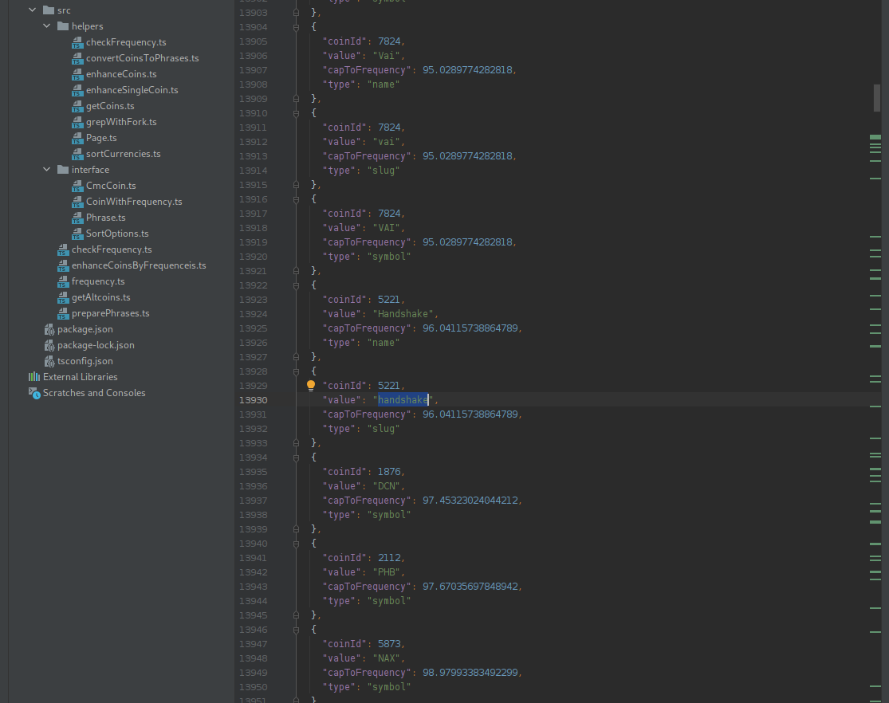

Celem artykułu jest pokazanie jak odfiltrować spośród wszystkich nazw altcoinów, te nie występujące w języku naturalnym. Zastosowanie tej techniki pozwoliło nam na skuteczny monitoring wzmianek na temat tysięcy kryptowalut na Twitterze w projekcie `MaxData` .

Plan działania:

1. Musimy mieć nazwy kryptowalut. Pokażę jak je pobrać i uporządkować.
2. Musimy mieć korpus języka. Pokażę jak się do niego dostać.
3. Musimy połączyć oba zbiory danych i wyznaczyć kryterium odcięcia kryptowaluty z monitoringu.

Jeśli bardzo zależało by nam na obserwacji frazy występującej w języku naturalnym wymagało by to analizy kontekstu. Jest to oczywiście możliwe, ale w naszym przypadku prościej jest nam odciąć kilka altcoinów o nazwach występujących w korpusie niż analizować kontekst. Głównie dlatego, że te odcięte altcoiny stanowią niewielki ułamek całości rynku, a ich uwzględnienie podniosło by poziom skomplikowania wielokrotnie.

## Nazwy altcoinów

Nazwy kryptowalut pobraliśmy z `Coin Market Cap` za pomocą końcówki

```
https://api.coinmarketcap.com/data-api/v3/cryptocurrency/listing
```

z parametrem `start` iterowanym po `1+100*n` dla `n` od `0` do momentu gdzie odpowiedź nie będzie zawierała klucza `data`.

Przykładowa dobra odpowiedź to:

```
{
    "data": {
        "cryptoCurrencyList": [
            {
                "id": 8138,
                "name": "LinkBased",
                "symbol": "LBD",
                "slug": "linkbased",
                "tags": [],
                "cmcRank": 4601,
                "marketPairCount": 1,
                "circulatingSupply": 0E-8,
                "totalSupply": 813923.00000000,
                "isActive": 1,
                "lastUpdated": "2021-06-26T09:08:12.000Z",
                "dateAdded": "2020-12-30T00:00:00.000Z",
                "quotes": [
                    {
                        "name": "USD",
                        "price": 1.59351133162663,
                        "volume24h": 514.07425485,
                        "marketCap": 0E-22,
                        "percentChange1h": -0.13208528,
                        "percentChange24h": -26.50872672,
                        "percentChange7d": -34.07116202,
                        "lastUpdated": "2021-06-26T09:08:12.000Z",
                        "percentChange30d": -56.37728930,
                        "percentChange60d": -57.50444478,
                        "percentChange90d": -46.98725744,
                        "fullyDilluttedMarketCap": 1296995.52,
                        "dominance": 0.0,
                        "ytdPriceChangePercentage": 41.3223
                    }
                ],
                "isAudited": false
            },
            ...
        ],
        "totalCount": "5465"
    },
    "status": {
        "timestamp": "2021-06-26T09:10:02.180Z",
        "error_code": "0",
        "error_message": "SUCCESS",
        "elapsed": "134",
        "credit_count": 0
    }
}
```

A kiedy wyjdziemy poza zakres dostaniemy:

```
{
    "status": {
        "credit_count": 0,
        "elapsed": "4",
        "error_code": "500",
        "error_message": "The system is busy, please try again later!",
        "timestamp": "2021-06-26T09:07:58.780Z"
    }
}
```

Najbardziej interesują nas parametry:

* name
* symbol
* quotes\[0\].marketCap albo jego znormalizowana wersja quotes\[0\].dominance

[Dominance | CoinMarketCap

A measure of Bitcoin’s value in the context of the larger cryptocurrency market.

CoinMarketCap

](https://coinmarketcap.com/alexandria/glossary/dominance)

Pobierzemy wszystkie dane o kryptowalutach i zapiszemy je w pliku. Przygotowujemy projekt:

```
npm init -y && tsc --init && npm i axios && npm i -D @types/node && mkdir -p src raw out && touch src/getAltcoins.ts
```

Rdzeń programu `getAltcoins.ts` możemy przenieść z naszego niedawnego wpisu:

[Scraping najbardziej popularnych kont na twitterze

Dzięki obserwacji wpisów z twittera możemy śledzić różne trendy. W tym wpisie pokażę jak pobrać dane o kontach w tym serwisie i wybrać te, które mają największy współczynnik wpływu.

](./scraping-najbardziej-popularnych-kont-na-twitterze/)

Czyli mniej więcej tak:

```
import * as fs from "fs";

interface CmcCoin {
    // todo implement
}

class Page {
    i: number;

    constructor(i: number) {
        this.i = i;
    }

    url() {
        return `https://api.coinmarketcap.com/data-api/v3/cryptocurrency/listing?start=${1 + 100 * this.i}`
    }

    file() {
        return `${process.cwd()}/raw/${this.i}.json`
    }

    sync() {
        // TODO implement
        return false;
    }

    parse(): CmcCoin[] {
        // todo implement
        return []
    }
}

const main = async ():Promise<CmcCoin[]> => {
    let i = 0;
    const allItems:CmcCoin[] = [];
    while (await new Page(i).sync()) {
        const items = new Page(i).parse()
        if (items.length === 0) break;
        allItems.push(...items);
        i++;
    }
    return allItems;
}

main().then((coins) => {
    fs.writeFileSync(process.cwd() + '/out/coins.json', JSON.stringify(coins));
    console.log(coins);
}).catch(console.error)
```

### Implementacja interfejsu CmcCoin

Najprostszą metodą jest przyjrzenie się temu co zwraca API dla Bitcoina:

```
{
  "id": 1,
  "name": "Bitcoin",
  "symbol": "BTC",
  "slug": "bitcoin",
  "tags": [
    "mineable",
    "pow",
    "sha-256",
    "store-of-value",
    "state-channels",
    "coinbase-ventures-portfolio",
    "three-arrows-capital-portfolio",
    "polychain-capital-portfolio",
    "binance-labs-portfolio",
    "arrington-xrp-capital",
    "blockchain-capital-portfolio",
    "boostvc-portfolio",
    "cms-holdings-portfolio",
    "dcg-portfolio",
    "dragonfly-capital-portfolio",
    "electric-capital-portfolio",
    "fabric-ventures-portfolio",
    "framework-ventures",
    "galaxy-digital-portfolio",
    "huobi-capital",
    "alameda-research-portfolio",
    "a16z-portfolio",
    "1confirmation-portfolio",
    "winklevoss-capital",
    "usv-portfolio",
    "placeholder-ventures-portfolio",
    "pantera-capital-portfolio",
    "multicoin-capital-portfolio",
    "paradigm-xzy-screener"
  ],
  "cmcRank": 1,
  "marketPairCount": 9193,
  "circulatingSupply": 18742968,
  "totalSupply": 18742968,
  "maxSupply": 21000000,
  "isActive": 1,
  "lastUpdated": "2021-06-26T09:20:02.000Z",
  "dateAdded": "2013-04-28T00:00:00.000Z",
  "quotes": [
    {
      "name": "USD",
      "price": 30407.151465830357,
      "volume24h": 41711690274.967766,
      "marketCap": 569920266895.2114,
      "percentChange1h": 0.67834797,
      "percentChange24h": -11.72063275,
      "percentChange7d": -15.05133094,
      "lastUpdated": "2021-06-26T09:20:02.000Z",
      "percentChange30d": -22.4475165,
      "percentChange60d": -44.25026974,
      "percentChange90d": -46.26175604,
      "fullyDilluttedMarketCap": 638550180782.44,
      "dominance": 48.2033,
      "turnover": 0.07318864,
      "ytdPriceChangePercentage": 3.5167
    }
  ],
  "isAudited": false
}
```

i przerobienie tego na interfejs:

```
interface CmcCoin {
    "id": number,
    "name": string,
    "symbol": string,
    "slug": string,
    "tags": string[],
    "cmcRank": number,
    "marketPairCount": number,
    "circulatingSupply": number,
    "totalSupply": number,
    "maxSupply": number,
    "isActive": number,
    "lastUpdated": string,
    "dateAdded": string,
    "quotes": {
        "name": string,
        "price": number,
        "volume24h": number,
        "marketCap": number,
        "percentChange1h": number,
        "percentChange24h": number,
        "percentChange7d": number,
        "lastUpdated": string,
        "percentChange30d": number,
        "percentChange60d": number,
        "percentChange90d": number,
        "fullyDilluttedMarketCap": number,
        "dominance": number,
        "turnover": number,
        "ytdPriceChangePercentage": number
    }[],
    "isAudited": boolean
}
```

### Synchronizacja

Po dodaniu paczki `debug` poleceniem

```
npm i debug && npm i -D @types/debug
```

i kilku importów

```
import axios from "axios";
import * as fs from "fs";
import Debug from 'debug';

const debug = Debug('app');
```

analogicznie jak w poprzednio wspomnianym artykule implementujemy `sync`

```
    async sync() {
        try {
            const fileExists = fs.existsSync(this.file())

            if (fileExists) return true;

            const {data, status} = await axios.get(this.url());

            if (status !== 200) return false;

            fs.writeFileSync(this.file(), JSON.stringify(data));
            debug(`Saved ${this.file()}`)

            return true;
        } catch (e) {
            console.error(e)
            return false;
        }
    }
```

Jedyną różnicą jest tu `JSON.stringify` ponieważ chcemy zapisać do pliku ciąg znaków a nie obiekt. Tym razem korzystamy z `api` a nie pobieramy `html`.

Możemy napisać to nawet uniwersalniej

```
typeof data === 'string' ? data : JSON.stringify(data)
```

co pozwoli nam na używanie wielokrotnie tego raz napisanego kodu.

### Parsowanie

Metoda do parsowania jest wyjątkowo prosta:

```
    parse(): CmcCoin[] {
        try {
            const content = JSON.parse(fs.readFileSync(this.file()).toString());
            return content.data.cryptoCurrencyList
        } catch (e) {
            return []
        }
    }
```

polega na próbie wydobycia listy pod określonym kluczem, a jeśli to niemożliwe zwraca pustą tablicę powodując zakończenie głównej pętli programu.

Finalnie po włączeniu programu:

```
DEBUG=app ts-node src/getAltcoins.ts
```

w katalogu `out/coins.json` dostajemy plik, który zamieściłem pod linkiem:

[https://preciselab.fra1.digitaloceanspaces.com/blog/scraping/coins.json](https://preciselab.fra1.digitaloceanspaces.com/blog/scraping/coins.json)

## Pobranie i obsługa korpusu językowego

Po wpisaniu frazy "english corpus" bardzo szybko trafiamy na stronę

[English Corpora: most widely used online corpora. Billions of words of data: free online access

Compare genres, dialects, time periods. Search by PoS, collocates, synonyms, and much more.


](https://www.english-corpora.org/)

Jest to scam. Zawiera informację, że jest darmowa i wystarczy zarejestrować konto


ale posiada ograniczenia przez które możemy skanować dziennie jedynie 50 słów. Straciłem czas próbując automatyzować pobieranie danych z tego serwisu.

Pobranie z niego próbek prowadzi do tego, że mamy poszatkowane dane nie zdatne do żadnego zastosowania i dopiero wejście w cennik wyjaśnia, że można u nich kupić korpus za kilkaset dolarów.

Na szczęście udało mi się pobrać wymagane dane ze strony o znacznie gorszym pozycjonowaniu, ale za to dużo bardziej wartościowej:

[English Word Frequency

\### Context: How frequently a word occurs in a language is an important piece of information for natural language processing and linguists. In natural language processing, very frequent words tend to be less informative than less frequent one and are often removed during preprocessing. Human langu…

Kaggle

](https://www.kaggle.com/rtatman/english-word-frequency)

Tam też rejestracja jest wymagana, ale w zamian dostajemy dostęp do ciekawych danych, interesujących treści i fantastycznego kursu. Nawet jak tego nie potrzebujemy to po prostu dane mamy za darmo. Jest to 5MB plik csv z kolumnami zawierającymi słowo oraz ilość zliczeń.

Umieściłem ten plik pod ścieżką `dict/unigram_freq.csv`. Aby zapytać o ilość zliczeń słowa `credit` wystarczy wpisać:

```
grep -E '^credit,' dict/unigram_freq.csv
```

dostajemy:

```
credit,175916536
```

Analogicznie dla frazy:

```
grep -E '^theta,' dict/unigram_freq.csv
```

mamy:

```
theta,5070673
```

Za pomocą typescriptu mogli byśmy zapisać to tak:

```
import child_process from 'child_process';

const grepWithFork = (filename: string, word: string): Buffer => {
    const cmd = `egrep '^${word},' ${filename}`;
    return child_process.execSync(cmd, {maxBuffer: 200000000})
}

export const checkFrequency = async (word: string): Promise<number> => {
    return parseInt(grepWithFork(
        process.cwd() + '/dict/unigram_freq.csv',
        word
    ).toString().replace(`${word},`, '')) || 0;
}

checkFrequency('credit').then(console.log).catch(console.error)
checkFrequency('theta').then(console.log).catch(console.error)
```

wykonanie tego pliku zwróci nam częstości:

```
175916536
5070673
```

z tego co wiem, to wykorzystanie systemowego grepa jest jedną z najbardziej wydajnych metod w tym konkretnym przypadku, ponieważ nie wymaga ładowania całego pliku do pamięci, pisania logiki wyszukiwania a jednocześnie pozwala zrzucić odpowiedzialność za optymalizację wyszukiwania na twórców `grep`. Sam nie robiłem takich eksperymentów, ale czytałem, że do 2-3 tysięcy linii można w node js wyszukać szybciej, bo nie tracimy czasu na włączanie osobnego procesu, ale przy większych plikach okazuje się, że optymalizacja grepa nadrabia opóźnienia związane z wykonywaniem komend przez `child_process`.

[From node.js, which is faster, shell grep or fs.readFile?

I have a long running node.js process and I need to scan a log file for a pattern. I have at least two obvious choices: spawn a grep process or read the file using fs.read\* and parse the buffer/str...

Stack OverflowMatt Simerson

](https://stackoverflow.com/questions/28400727/from-node-js-which-is-faster-shell-grep-or-fs-readfile)

## Połączenie częstości z nazwami coinów

Wykonałem drobny refactoring. W `src` utworzyłem katalogi `interface` oraz `helpers`. Do `interface` przeniosłem `CmcCoin`, oraz utworzyłem `CoinWithFrequency.ts` zawierający

```
import {CmcCoin} from "./CmcCoin";

export interface CoinWithFrequency extends CmcCoin {
    frequency: {
        name: number,
        symbol: number,
        slug: number
    }
}
```

jest to struktura danych pozwalająca nam ująć możliwie dokładne dane dotyczące częstotliwości występowania nie tylko nazw ale też symboli i potencjalnie `slug` coinów.

Do `helpers` przeniosłem klasę `Page`, oraz funkcje `grepWithFork` i `checkFrequency` z tym, że ta druga dostała obsługę wyjątków:

```
import {grepWithFork} from "./grepWithFork";

export const checkFrequency = (word: string): number => {
    try {
        return parseInt(grepWithFork(
            process.cwd() + '/dict/unigram_freq.csv',
            word
        ).toString().replace(`${word},`, '')) || 0;
    } catch (e) {
        return 0
    }
}
```

Ostatnią zmianą jest wyrzucenie z `getAltcoins` funkcji `main` i nazwanie jej `getCoins`. W pliku o tej samej nazwie w `helpers` znalazł się teraz kod

```
import {CmcCoin} from "../interface/CmcCoin";
import {Page} from "./Page";

export const getCoins = async ():Promise<CmcCoin[]> => {
    let i = 0;
    const allItems:CmcCoin[] = [];
    while (await new Page(i).sync()) {
        const items = new Page(i).parse()
        if (items.length === 0) break;
        allItems.push(...items);
        i++;
    }
    return allItems;
}
```

Nową funkcją jest bardzo prosta funkcja `enhanceSingleCoin` umieszczona też w `helpers` w pliku z tą nazwą o treści:

```
import {CmcCoin} from "../interface/CmcCoin";
import {CoinWithFrequency} from "../interface/CoinWithFrequency";
import {checkFrequency} from "./checkFrequency";

export const enhanceSingleCoin = (coin: CmcCoin): CoinWithFrequency => {
    return {
        ...coin,
        frequency: {
            name: checkFrequency(coin.name.toLowerCase()),
            slug: checkFrequency(coin.slug.toLowerCase()),
            symbol: checkFrequency(coin.symbol.toLowerCase())
        }
    }
}
```

Iterując za jej pomocą po tablicy walut przetwarzamy je kolejno

```
import {CoinWithFrequency} from "../interface/CoinWithFrequency";
import {getCoins} from "./getCoins";
import {enhanceSingleCoin} from "./enhanceSingleCoin";

export const enhanceCoins = async (): Promise<CoinWithFrequency[]> => {
    const coins = await getCoins();
    const res: CoinWithFrequency[] = []
    let i = 0, s = new Date().getTime(), n = () => new Date().getTime() - s;
    for (const coin of coins) {
        res.push(enhanceSingleCoin(coin));
        console.log(`${i++}\t${i/coins.length}\t${n()}`);
    }
    return res;
}
```

Ponieważ trwa to chwilę do funkcji dodałem proste wyświetlanie postępu oraz czasu wykonywania.

Nasz ostatni skrypt: `enhanceCoinsByFrequenceis.ts` zawiera jedynie zapisanie wyników tej funkcji do pliku:

```
import fs from "fs";
import {enhanceCoins} from "./helpers/enhanceCoins";

enhanceCoins().then((coins) => {
    fs.writeFileSync(process.cwd() + '/out/coins-with-freq.json', JSON.stringify(coins));
    console.log(coins)
}).catch(console.error)
```

Po jego wykonaniu poleceniem

```
DEBUG=app ts-node src/enhanceCoinsByFrequenceis.ts
```

dostajemy plik z walutami wzbogaconymi o częstości `/out/coins-with-freq.json`.

### Sortowanie fraz

Przyjrzyjmy się teraz posortowanej względem stosunku `quotes[0].marketCap` do parametrów określonych pod kluczem `frequency`. Zaczniemy od ustalenia struktury danych wyjściowych:

```
import {CoinWithFrequency} from "./CoinWithFrequency";

export enum PhraseType {
    slug = 'slug',
    name = 'name',
    symbol = 'symbol',
}

export interface Phrase {
    coinId: number,
    value: string,
    capToFrequency: number,
    type: PhraseType
    coin?: CoinWithFrequency
}
```

Parametr `coin` nie jest wymagany, bo zakładam, że dla celów analizy może się przydać, ale ilość danych w tym parametrze jest na tyle duża, że może się okazać, że warto oczyścić z niego ostateczny wynik.

Podstawową cegiełkę ostatniej fazy stanowi zamiana coinów na frazy

```
import {CoinWithFrequency} from "../interface/CoinWithFrequency";
import {Phrase, PhraseType} from "../interface/Phrase";
import {SortOptions} from "../interface/SortOptions";

export const convertCoinsToPhrases = (
    coins: CoinWithFrequency[],
    options: SortOptions = {withCoin: true}
): Phrase[] => {
    const phrases: Phrase[] = [];
    for (const coin of coins) {
        const newPhrases = [PhraseType.name, PhraseType.slug, PhraseType.symbol]
            .map((type: PhraseType): Phrase => {
                return {
                    coinId: coin.id,
                    value: coin[type as keyof CoinWithFrequency] as string,
                    capToFrequency: coin.quotes[0].marketCap / coin.frequency[type],
                    type,
                    ... options.withCoin ? {coin} : {}
                }
            })
        phrases.push(...newPhrases)
    }
    return phrases
}
```

importowane tu opcje sortowania:

```
export interface SortOptions {
    withCoin: boolean
}
```

sprowadzają się jedynie do określenia, czy chcemy widzieć wyniki z innymi danymi o coinie.

Do sortowania użyjemy funkcji:

```
import {SortOptions} from "../interface/SortOptions";
import fs from "fs";
import {convertCoinsToPhrases} from "./convertCoinsToPhrases";

export const sortCurrencies = async (options: SortOptions) => {
    const coins = JSON.parse(fs.readFileSync(process.cwd() + '/out/coins-with-freq.json').toString());
    const phrases = convertCoinsToPhrases(coins, options)
    phrases.sort((a, b) => a.capToFrequency - b.capToFrequency)
    return phrases;
}
```

stąd już prosta droga do zapisania wyników do pliku skryptem `src/preparePhrases.ts`

```
import fs from 'fs';
import {sortCurrencies} from "./helpers/sortCurrencies";

sortCurrencies({withCoin: false}).then((coins) => {
    fs.writeFileSync(process.cwd() + '/out/phrases.json', JSON.stringify(coins));
    console.log(coins);
}).catch(console.error)
```

Po jego włączeniu poleceniem:

```
ts-node src/preparePhrases.ts
```

Możemy zobaczyć, że dla bardzo mało znanych coinów, ale za to popularnych słów nasz współczynnik jest bardzo niski.


możemy się spodziewać wielu tweetów ze słowami takimi jak `you`, `giant`, `spectrum`, `pop`, `cyl`, `vote`, `get`, `real` czy `kind` w których autor nie miał na myśli kryptowalut. Z drugiej strony nie istnieje obiektywne kryterium odcięcia.



Gdybym ustawił je na 100, wycięte zostało by 2328/16395 = 14% fraz. Przy wartości `5` mamy odcięcie 1560/16395 = 9.5%.

## Podsumowanie

Obiektywne wyznaczenie kryterium odcięcia altcoinów z monitoringu okazało się niemożliwe, ale konieczność podjęcia kilku tysięcy decyzji typu "włączyć/wyłączyć" z obserwacji została zastąpiony jedną decyzją o granicznym stosunku wartości coina względem częstości użycia jego nazwy w języku angielskim.

Widzimy, że ogromna większość szumu jest wycinana jeśli zrezygnujemy z obserwacji około 10% altcoinów o nazwach lub skrótach będących popularnymi zwrotami.

Całość zamknęła się w około 211 liniach typescriptu, z czego 57 to interfejsy.
