Był rok 1992. W miasteczku Wayne (Arizona USA) zapadał wyrok na Jamesa Nelsona - głównego księgowego i zarządzającego Arizona State Treasurer. Jego fałszywe czeki, dzięki którym zdefraudował prawie 2 miliony dolarów zostały wykryte ponieważ rozkład częstości pierwszych cyfr w wyłudzonych kwotach odbiegał od rozkładu Benforta.

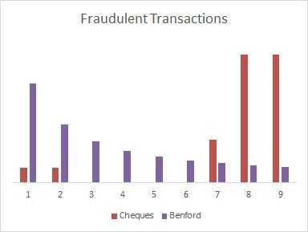

Na pierwszych pozycjach zmyślonych przez księgowego wartości zbyt często znajdowały się 7, 8 i 9 - typowe wartości postrzegane przez nas jako "bardziej" losowe niż 1, 2 lub 3.

---

Ze wpisu dowiesz się, czym jest Rozkład Benforta i dlaczego jest obserwowany w wielu zbiorach danych. Później omówimy ciąg Fibonacciego i jego podstawowe własności. Na końcu napiszemy program sprawdzający czy Rozkład Benforta obowiązuje dla ciągu Fibonacciego. Program zostanie napisany w trzech językach:

* Java
* Rust
* Node JS

Porównamy wyniki jego wydajności.

## Rozkład Benforda

Rozkład Benforda jest rozkładem prawdopodobieństwa występowania określonych liczb na pierwszych pozycjach w wielu obserwowanych zbiorach danych liczbowych. Aby występował muszą zachodzić następujące warunki:

* zbiór wartości powinien rozciągać się na wiele rzędów wielkości
* prawdopodobieństwo powinno być niezmiennicze względem skali oraz bazy

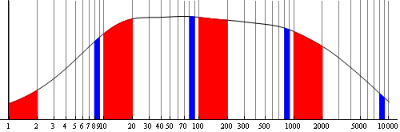

Przykład rozkładu wielkości gdzie pierwsza cyfra spełnia w przybliżeniu prawo Benforda. Wykładniczy spadek rozkładu widzimy po zagęszczaniu się osi wartości.

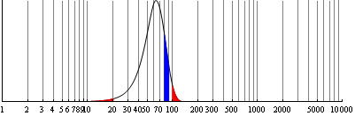

Rozkład wielkości obejmujący jedne rząd wielkości. Zwykle pierwsze cyfry nie spełniają rozkładu Benforda, jeśli początkowy rozkład nie jest wystarczająco szeroki.

Świetne formalne wyprowadzenie rozkładu Benforda przestawili Arno Berger i Theodore P. Hill w publikacji: ["A basic theory of Benford’s Law"](https://digitalcommons.calpoly.edu/cgi/viewcontent.cgi?referer=https://www.google.com/&httpsredir=1&article=1083&context=rgp_rsr)

Jest to ponad 100 stronnicowa publikacja bardzo obszernie omawiająca temat i polecam ją wszystkim, którzy kochają matematykę. Krótsze i prostsze wyprowadzanie warte uwagi napisał [Victor Romero-Rochin](https://www.researchgate.net/publication/45873771_A_derivation_of_Benford's_Law_and_a_vindication_of_Newcomb)

Przykłady rozkładów spełniających prawo Benforda mamy w przejrzysty sposób pokazane pod linkiem:

[Testing Benford’s Law

An experiment to test Benford’s Law against large, publicly available datasets.

Jason Long (jasonlong) and Bryce Thornton (@brycethornton)](https://testingbenfordslaw.com/)

Intuicyjnym powodem wyższej reprezentacji niższych cyfr jest wyższe prawdopodobieństwo wystąpienia wielu mniejszych wartości, które nakładając się na skokowo zmienną gęstość cyfr wraz ze wzrostem rzędu wielkości powoduje przesunięcie w stronę wyższej reprezentacji niższych cyfr na pierwszych pozycjach.

Ponieważ w tym artykule rozkład Benforda jest jedynie pretekstem do porównania wydajności programów pisanych w różnych językach a nie głównym tematem, pozwolę sobie ograniczyć jego opis do pokazania najlepszych publikacji, wyprowadzonej formuły i kilku przykładów.

Wzór na prawdopodobieństwo wystąpienia cyfry `d` na pierwszej pozycji to:

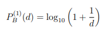

Przykłady, które pokażę pochodzą z serwisu `[deltami.edu.pl](http://www.deltami.edu.pl/temat/matematyka/zastosowania/2016/03/21/Fenomen_rozkladu_Benforda/)`

* Rozkład równomierny rozkładu równomiernego

Ze zbioru liczb naturalnych z zakresu od 1 do 9999 losujemy liczbę p, wykorzystując generator liczb losowych o rozkładzie równomiernym. Następnie z zakresu liczb naturalnych od 1 do p losujemy, również wykorzystując rozkład równomierny, liczbę r.


* Masa atomowa pierwiastków z układu okresowego

Zobaczmy na układ okresowy pierwiastków chemicznych, a dokładniej, jeden z parametrów każdego pierwiastka - masą atomową.


* Powierzchnia państw świata w km²

Ostatni przykład jest powiązany z geografią - przyjrzyjmy się powierzchni wszystkich państw świata w km2.


* Prawo Benforda

Dyskretny rozkład Benforda dla układu dziesiętnego zwany również prawem pierwszych (znaczących) cyfr.

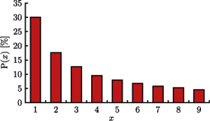

Jak widzimy, wszystkie te zbiory liczb mają tą samą własność - niezmienniczość względem skali, bazy i rozciągnięcie na kilka rzędów wielkości.

## Ciąg Fibonacciego

Ciąg Fibonacciego jest ciągiem liczb naturalnych o rekurencyjnej definicji:

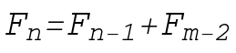

gdzie

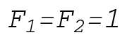

Jego własności opisane są w Math World.

[Fibonacci Number -- from Wolfram MathWorld

from Wolfram MathWorldEric Weisstein

](https://mathworld.wolfram.com/FibonacciNumber.html)

Jego początkowe wartości to:

```
1,1,2,3,5,8,13,21,34,55,89
```

Jest to ciąg, którego występowanie możemy często obserwować w przyrodzie: w wirach wodnych, w kształcie tornad, w układzie kwiatów, rozgałęzieniach roślin, podziale ciała owadów. Jego powszechność zachwyca badaczy tego zjawiska. Podobnie jak powszechność funkcji wykładniczej czy kwadratowej wynika ona z prostoty wzoru i bycia dobrym przybliżeniem dla znacznie bardziej złożonych układów obserwowanych w rzeczywistości.


Stosunki kolejnych wartości ciągu dążą do złotej proporcji. Dowód wynika wprost z definicji.

[Golden Ratio -- from Wolfram MathWorld

from Wolfram MathWorldEric Weisstein

](https://mathworld.wolfram.com/GoldenRatio.html)

Pierwiastki ciągu Fibonacciego również zbiegają do stałego stosunku ze wzrostem `n`, a sam ciąg bardzo szybko zaczyna rosnąć tak szybko, rozciąga się na wiele rzędów wielkości.

Podobnie jak liczby pierwsze, tak i ciąg Fibonacciego powinien spełniać rozkład Benforda. Sprawdźmy to pisząc programy w Java, Rust i Node JS.

## Java

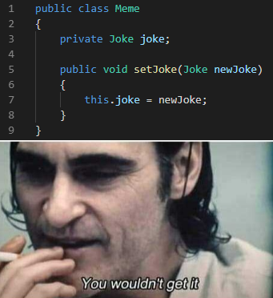

Aby zrobić to w Javie wymagany jest import modułu `java.math.BigInteger`.

```
import java.math.BigInteger;
```

W pliku `Benford.java` w klasie `Benford` utworzymy funkcję `generateFibonacci`, która pozwoli nam przygotować ciąg

```
public class Benford {
    private static BigInteger[] generateFibonacci(int n) {
        BigInteger[] fib = new BigInteger[n];
        fib[0] = BigInteger.ONE;
        if(n == 1) return fib;
        fib[1] = BigInteger.ONE;
        for (int i = 2; i < n; i++)
            fib[i] = fib[i - 1].add(fib[i - 2]);
        return fib;
    }
```

Warto zwrócić uwagę, że zamiast `1` stosujemy tu `BigInteger.ONE` aby zachować zgodność typów. Podobnie zamiast klasycznego dodawania przez `+` stosujemy metodę `add` określoną na obiektach `BigInteger`.

W metodzie `main` przygotowujemy ciąg Fibbonaciego.

```java
    public static void main(String[] args) {
        BigInteger[] numbers = generateFibonacci(
            args.length > 0 ? Integer.parseInt(args[0]) : 1000
        );
```

Dzięki `args` możemy użyć argumentu wpisanego przez użytkownika. Jeśli nie zostanie on podany domyślną wartością jest `1000`.

Następnie tablica `digits` zostaje wypełniona zliczeniami cyfr

```
        int[] digits = new int[10];

        for (BigInteger number : numbers)
            digits[Integer.valueOf(number.toString().substring(0, 1))]++;
```

Na końcu wyświetlamy tablicę porównującą wyniki z przewidywaniami teoretycznymi.

```
        System.out.print("N   Ben        Fib\n");
        for (int i = 1; i < digits.length; i++)
            System.out.printf("%d %10.6f %10.6f\n",
                    i,
                    (double) digits[i] / numbers.length,
                    Math.log10(1.0 + 1.0 / i)
            );
    }
}
```

Kod wykonujemy wpisując `java Benford.java` i dostajemy wynik potwierdzający naszą teorię:


## Rust

Projekty w `Rust` rozpoczynamy poleceniem

```
cargo new benford
```

[First Steps with Cargo - The Cargo Book

The Cargo Book](https://doc.rust-lang.org/cargo/getting-started/first-steps.html)

w katalogu `benford` powstaje plik `Cargo.toml` o zawartości

```
[package]
name = "b"
version = "0.1.0"
edition = "2018"

[dependencies]
```

oraz plik `src/main.rs` o treści

```
fn main() {
    println!("Hello, world!");
}
```

To bardzo miłe, że Rust wita nas w tak przyjemny sposób ułatwiając rozpoczęcie pracy z tym językiem.


Aby skompilować program wykonujemy poleceniem

```
cargo build
```

Jego uruchomienie jest wówczas możliwe dzięki komendzie

```
./target/debug/benford
```

Aby skompilować i wykonać program jednocześnie użyjemy polecenia

```
cargo run
```

O ile w Javie do obsługi dużych liczb całkowitych używaliśmy jednej paczki, to w Rust potrzebujemy dwóch: `num-bigint` oraz `num-traits`. Dodamy je do projektu dopisując linie

```
num-bigint = "0.4.0"
num-traits = "0.2.14"
```

pod kluczem `[dependencies]` w pliku `Cargo.toml`. Wersje paczek automatycznie podpowie nam nasze `IDE`. Ich użycie w pliku `src/main.rs` wymaga napisania

```
use num_bigint::BigUint;
use num_traits::{Zero, One};
use std::env;
```

Gdzie `Uint` pochodzi od `unsigned integer` czyli liczb całkowitych, które nie poświęcają jednego bitu na znak, bo są zawsze dodatnie. Funckja generująca ciąg Fibonacciego będzie podobna do tej z `Javy`

```
fn generate_fibonacci(n: usize) -> Vec<BigUint> {
    let mut fib = vec![Zero::zero(); n];
    fib[0] = One::one();
    if n == 1 { return fib; }
    fib[1] = One::one();
    for i in 2..n {
        fib[i] = &fib[i - 1] + &fib[i - 2];
    }
    return fib;
}
```

Widzimy, że główna różnica leży w nazwaniu typów. W funkcji `main` tak samo generujemy ciąg zapisując go do tablicy

```
fn main() {
    let args: Vec<String> = env::args().collect();

    let numbers = generate_fibonacci(
        if args.len() > 1 { (&args[1]).trim().parse().unwrap() }
        else { 100 }
    );
```

Tym razem tablica argumentów zaczyna się od nazwy programu a przekazana wartość z linii poleceń ma indeks równy 1.

przygotowujemy tablicę ze zliczeniem ilości cyfr na pierwszych pozycjach

```
    let mut digits = vec![0; 10];
```

Zapis analogiczny do tego z Javy pozwala nam na zliczenie cyfr i zapisanie ilości ich wystąpień do tablicy

```
    for n in numbers.iter() {
        digits[n.to_string()[..1].parse::<usize>().unwrap()] += 1;
    }
```

Na końcu pokazujemy wyniki w konsoli dzięki następującej pętli

```
    println!("N   Fib        Ben");
    for i in 1..digits.len() {
        println!("{:} {:10.6} {:10.6}",
                 i,
                 digits[i] as f64 / numbers.len() as f64,
                 (1.0 + 1.0 / i as f64).log10()
        );
    }
}
```

## Node JS

Wyjątkową cechą prezentowanego programu jest to, że jak mało który projekt w `node js` nie zawiera on listy wymaganych paczek. Nie musimy tu importować żadnych modułów odpowiedzialnych z obsługę dużych liczb. Stałe o typie `BigInt` tworzymy dodając literę `n` po liczbie. Przez to funkcja do generowania ciągu Fibonacciego przybiera formę:

```
const generate_fibonacci = (n) => {
    let fib = [];
    fib[0] = 1n;
    if(n === 1) return fib;
    fib[1] = 1n;
    for (let i = 2; i < n; i++)
        fib[i] = fib[i - 1] + fib[i - 2];
    return fib;
};
```

Łatwo możemy sobie jednak wyobrazić, że ktoś piszący kod tego nie zna różnicy między `1n` a `1` lub po prostu zapomniał, że pracuje z dużymi liczbami i napisał by go tak:

```
const generate_fibonacci = (n) => {
    let fib = [];
    fib[0] = 1;
    if(n === 1) return fib;
    fib[1] = 1;
    for (let i = 2; i < n; i++)
        fib[i] = fib[i - 1] + fib[i - 2];
    return fib;
};
```

Aby symulować oba przypadki napiszmy uniwersalną funkcję sterowaną flagą `--cheat`.

```
const generate_fibonacci = (n) => {
    let fib = [];
    fib[0] = process.argv[3] === '--cheat' ? 1 : 1n;
    if(n === 1) return fib;
    fib[1] = process.argv[3] === '--cheat' ? 1 : 1n;
    for (let i = 2; i < n; i++)
        fib[i] = fib[i - 1] + fib[i - 2];
    return fib;
};
```

W dalszej części okaże się jak kolosalne różnice w wydajności i poprawności programu robi ten jeden znaczek `n`. Przy pisaniu oprogramowania ważne jest aby rozumieć na jakich zakresach wartości pracuje program i poprawnie obsługiwać ich krańce.


> Pod tym względem `node` wymaga od programisty szczególnej odpowiedzialności, bo próbując ratować program przez rzuceniem błędu idzie na kompromisy, które jak się okaże czasami są genialne, ale bywają bardzo zwodnicze.

Funkcji `generate_fibonacci` użyjemy w funkcji `main` w następujący sposób

```
const main = () => {
    const numbers = generate_fibonacci(
       parseInt(process.argv[2]) || 1000
    );
```

Oczywiście w `node` nie mamy obowiązku definiowania funkcji `main` ale uważam to za dobrą praktykę, aby program miał wyraźnie określony punkt startu i dobrze zarysowane granice między deklarowaniem funkcji oraz procedur a ich używaniem.

Przy okazji twoją uwagę zwróciło zapewne to, że ponownie zupełnie inaczej indeksowany jest `argv`. Jak widać każdy język ma tu własną konwencję i tym razem dwa pierwsze argumenty to katalog i nazwa programu.

Tablica dziesięciu zer, w których znajdą się ilości zliczonych pierwszych cyfr może być zadeklarowana następująco

```
const digits = [...new Array(10)].map(() => 0);
```

Samo zliczanie jest równie proste co w innych językach

```
numbers.forEach(n =>
    digits[n.toString().substr(0, 1)]++
)
```

Natomiast drukowanie wyników zamiast używać szablonu do którego wkładamy wartości jako argumenty korzysta bezpośrednio z template string

```
    process.stdout.write("N   Ben        Fib\n");
    for (let i = 1; i < digits.length; i++) {
        const ben = digits[i] / numbers.length;
        const fib = Math.log10(1 + 1 / i);
        process.stdout.write(
            `${i}   ${ben.toFixed(6)}   ${fib.toFixed(6)}\n`
        )
    }
}
```

Na końcu za pomocą wywołania funkcji `main` włączamy nasz program.

```
main();
```

## Porównanie wydajności programów

Przez wydajność programów mam na myśli wydajność skompilowanych programów bez liczenia czasu kompilacji. Dlatego w przypadku Javy musimy wykonać kompilację poleceniem

```
javac Benford.java
```

w wyniku tego polecenia powstanie plik `Benford.class`.

Dla rust kompilacja wykonana przez `cargo build` tworzy deweloperską nie zoptymalizowaną wersję. W celu utworzenia zoptymalizowanej należy dodać flagę `release`.

```
cargo build --release
```

Na przykład dla `n=1000` każdy program wyświetla to samo, ale różne są czasy obliczeń.

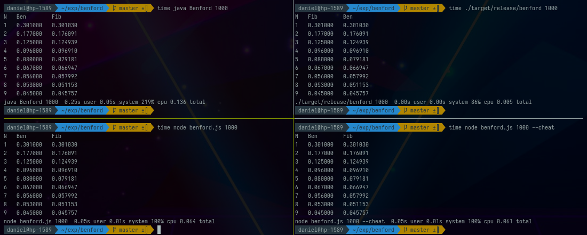

Rust miażdży konkurencję. Node js niezależnie od tego czy operujemy zaczynaliśmy od `1` czy od `1n` pokazuje te same wyniki i bardzo zbliżony nawet niezły czas. Java mimo znacznego zużycia `cpu` włącza się tak długo, że w tym teście wypada najgorzej.

Dla `n=10000` wynik Javy rośnie jedynie 10 razy, mimo, że Rust wykonuje obliczenia o dwa rzędy wielkości dłużej, a node 24 razy dłużej.

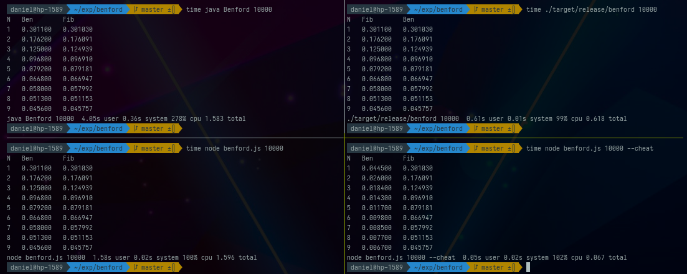

Niech nie będzie mylącym dla Was, że `n` zwiększyło się "tylko" 10 razy. Wartości przetwarzane przez program mają geometryczne tępo wzrostu osiągając szybko gigantyczne wartości. Na przykład dla `n=10000` wartość ciągu to:

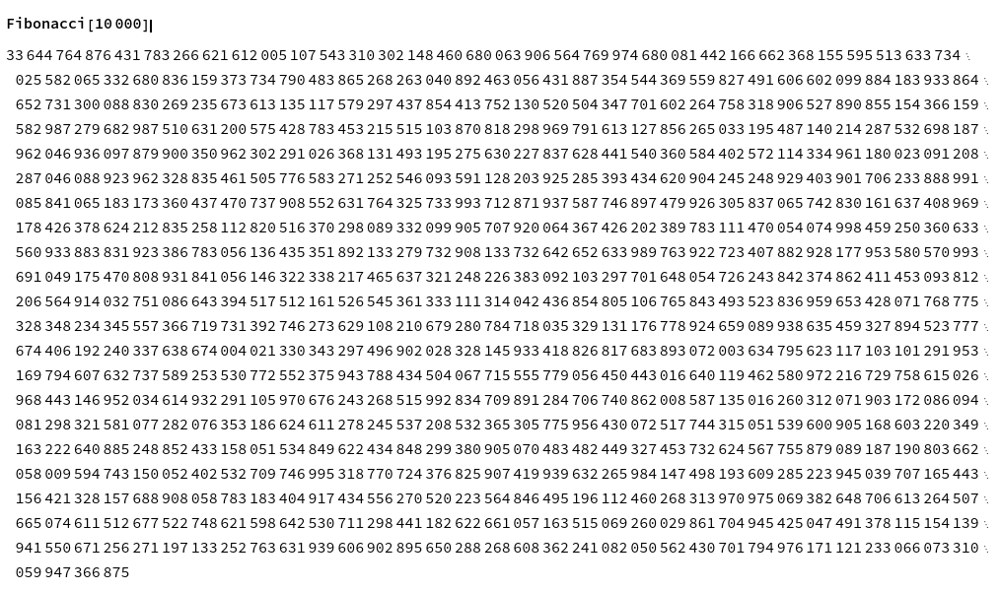

Różnica we wzroście wydajności wynika z tego, że Java ma najcięższy proces uruchamiania się. Node mimo, że całkiem lekki nadal wymaga załadowania całego interpretera przez co Rust mając najszybszy start pokazał o ile faktycznie wzrosła złożoność obliczeniowa.

Ponieważ głównym ciężarem jest tu dodawanie coraz większych liczb, których długość rośnie liniowo możemy spodziewać się złożoności O(n^2), którą prezentuje Rust.

Ostatnim wnioskiem jest, że program napisany w `Node JS` z flagą `--cheat` "nie zauważył", że działa źle. Jego wyniki pokazują, że mimo szybkiego wykonania nie zliczył on poprawie pierwszych cyfr. Znając ograniczenia typu `Number` w node wiemy, że nie może on przekroczyć wartości `Number.MAX_VALUE` równej `1.7976931348623157e+308`, tym czasem `Log10[Fibonacci[1000]]` wynosi `208.638` ale `Log10[Fibonacci[10000]]` to już `2089.53`. Zatem liczby które program w Node dodaje to `Infinity`.

Oczywiście `Infninity` + `Infnity` = `Infinity` co znacznie skraca czas obliczeń, ale pierwsza "cyfra" nieskończoności dla Node do `I` ponieważ wyliczamy ją poleceniem

```
n.toString().substr(0, 1)
```

Gdybym zatrzymał się na zestawieniu pary wyników dla trzech programów nie był bym sobą. Ciekawość karze mi zajrzeć głębiej i przygotować wykres pokazujący jak czas obliczeń rósł wraz z długością ciągu.

Pokaże jeszcze punkt pomiarowy `50.000`.

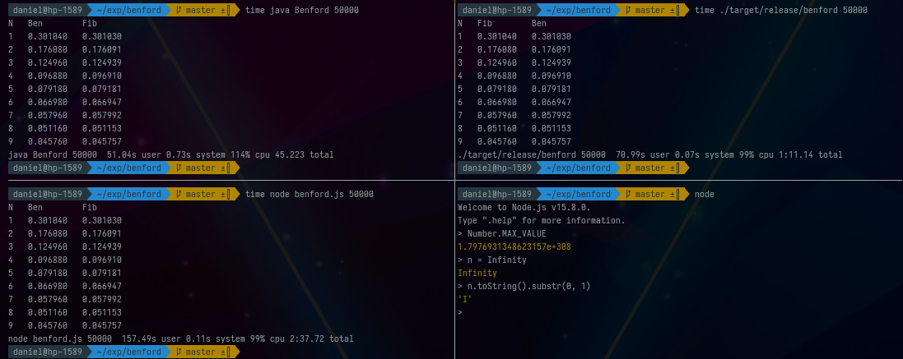

Jednak omawianie każdego z osobna nie jest tak wartościowe, jak zrobienie całej serii pomiarów i nałożenie ich na wspólny wykres.

### Pomiar wydajności programów w zależności od argumentu

Aby skutecznie zmierzyć wydajność programów musimy rozwiązać kilka problemów

* rozdzielić strumienie z wynikiem programu od pomiaru wydajności
* wybrać zestaw wartości dla których dokonamy pomiaru
* narysować wykresy

#### Rozdzielenie strumienia programu od strumienia pomiaru czasu

W bashu programy komunikują się za pomocą przekierowywania strumieni danych. Wyjście jednego programu może stać się wejściem innego, który po przetworzeniu podanych mu informacji może chcieć je zapisać do pliku.

Dla prostego wykonania:

```
java Benford 10
```

wynik w postaci:

```
N   Ben        Fib
1   0.300000   0.301030
2   0.200000   0.176091
3   0.200000   0.124939
4   0.000000   0.096910
5   0.200000   0.079181
6   0.000000   0.066947
7   0.000000   0.057992
8   0.100000   0.051153
9   0.000000   0.045757
```

zostanie wyświetlony w terminalu ponieważ terminal jest domyślnym wyjściem dla strumienia danych produkowanych przez ten program. Dane produkowane przez program domyślnie wychodzą z niego przez wyjście standardowe. Możemy je przekierować w inne miejsce za pomocą `1>` lub po prostu `>` i pominąć `1`, która jest domyślna.

Wykonanie `java Benford 10 > out` nic nie pokaże ale spowoduje utworzenie pliku z danymi z wyjścia standardowego.

Jednak kiedy program poprzedzimy poleceniem `time` czyli napiszemy

```
time java Benford 10
```

okaże się, że dostaniemy w terminalu

```
N   Ben        Fib
1   0.300000   0.301030
2   0.200000   0.176091
3   0.200000   0.124939
4   0.000000   0.096910
5   0.200000   0.079181
6   0.000000   0.066947
7   0.000000   0.057992
8   0.100000   0.051153
9   0.000000   0.045757
java Benford 10  0.12s user 0.02s system 153% cpu 0.091 total
```

jednak próba przechwycenia czasu wykonania do pliku jak poprzednio przez `>` zakończy się wyświetleniem linii

```
java Benford 10  0.12s user 0.02s system 153% cpu 0.091 total
```

w terminalu, a do pliku zostanie przekierowana cała reszta. Jest tak dlatego, że time nie miesza swoich danych z danymi ze strumienia standardowego. Zamiast tego używa strumienia błędów `2>`.

Naszym celem jest schowanie danych ze strumienia standardowego. Możemy to zrobić przekierowując go do `/dev/null`. To znaczy

```
time java Benford 10 > /dev/null
```

Jednak strumień błędów jest dla nas niemożliwy do przetwarzania jeśli nie przekierujemy go na strumień główny. Osiągniemy to poleceniem

```
(time java Benford 10 > /dev/null) 2>&1
```

Wynik tych dwóch wygląda tak samo, ale kluczową różnicą jest to, że w drugim przypadku możemy przetworzyć strumień za pomocą przekierowania go do `awk`.

Na przykład polecenie zawierające przetwarzanie danych:

```
(time java Benford 10 > /dev/null) 2>&1 | awk '{print $1,10,$6,$10,$12}'
```

zwróci na wyjściu standardowym jedynie

```
java 10 0.11s 154% 0.090
```

aby oczyścić te wyniki ze znaku `s` i `%` możemy dodać

```
| tr -d "s%"
```

Jeśli chcemy oglądać ten wynik jednocześnie zachowując go do pliku, z pomocą przychodzi nam `tee` - trzecie z moich ulubionych narzędzi obok kafki i expressa.

Wystarczy na końcu dopisać:

```
| tee -a logs
```

a pokazana linia zostanie załączona na końcu pliku `logs`. Teraz załóżmy, że chcemy wytworzone właśnie polecenie otoczyć pętlą przechodzącą po sekwencji:

```
for i in $(seq 5 5 25); do echo $i; done;
```

Sekwencja wyświetli nam

```
5
10
15
20
25
```

Lecz jeśli wkleili byśmy naiwnie `$i` do `print` w `awk` w następujący sposób:

```
for i in $(seq 5 5 25); do (time java Benford $i > /dev/null) 2>&1 | awk '{print $1,$i,$6,$10,$12}' | tr -d "s%" | tee -a logs; done;
```

dostali byśmy kilka razy powtórzoną linię

```
java java Benford $i > /dev/null  0.12s user 0.02s system 152% cpu 0.091 total 0.12 152 0.091
...
```

Jest tak dlatego, że `i` nie istnieje wewnątrz `print` jeśli go tam nie włożymy. Zatem `$i` wynosi tyle samo co `$0` co odpowiada całej linii, a nie wybranej kolumnie. Aby używać zmiennych wewnątrz kontekstu `print` w `awk` możemy użyć flagi `-v`. Poprawna składnia polecenia to:

```
for i in $(seq 5 5 25); do (time java Benford $i > /dev/null) 2>&1 | awk -v i=$i '{print $1,i,$6,$10,$12}' | tr -d "s%" | tee -a logs; done;
```

a jego wynikiem jest jednoczesne zapisanie do pliku `logs` i pokazanie na ekranie linii:

```
java 5 0.11 150 0.090
java 10 0.12 153 0.089
java 15 0.11 152 0.088
java 20 0.10 154 0.087
java 25 0.11 153 0.089
```

Jeśli temat strumieni w `bash` cię zainteresował polecam wprowadzenie [Justina Albano](https://www.baeldung.com/linux/author/justin-albano).

#### Przygotowanie serii wartości `n` do analizy wydajności

Dzieląc zakres pomiarowy na części należy zagęszczać pomiary tam gdzie ich koszt jest niski (krótki czas działania programu) a zmienność i ciekawe zachowania są spodziewane. U nas jest to zmiana stosunku czasu obliczeń do czasu uruchamiania (typowe dla niewielkich wartości `n`). Mamy więc dwa powody, aby nie dzielić zakresu pomiaru na równe kawałki i nie używać `seq`. Zamiast tego możemy wygenerować serię, której gęstość spada wraz ze wzrostem `n`. Na przykład moduł w `Mathematica`:

```mathematica
Module[{steps = 100, minY = 1, maxY = 50000, pow = 3},
   Table[maxY (minY + maxY (n)^pow)/(minY + maxY), {n, 0, 1,
     1/(steps - 1)}]] // Ceiling // DeleteDuplicates
```

spowoduje powstanie serii o następującej dystrybucji

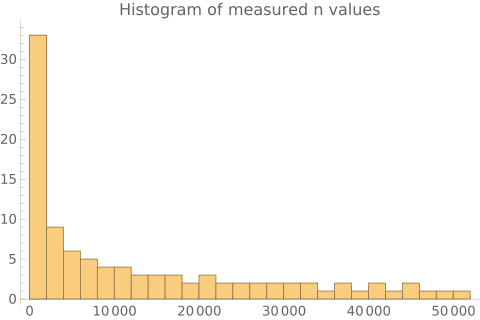

Zapisujemy ją do pliku `n_values` poleceniem

```
Export["~/exp/benford/n_values.csv", %]
```

#### Przygotowanie wykresów porównujących wydajność programów

Kod mierzący wydajność zapiszemy w pliku `measure.sh`

```
#!/usr/bin/zsh

while IFS= read -r i
do
 (time node benford.js "$i" > /dev/null) 2>&1 | awk -v i="$i" '{print $1,i,$6,$10,$12}' | tee -a logs;
 (time ./target/release/benford "$i" > /dev/null) 2>&1 | awk -v i="$i" '{print "rust",i,$5,$9,$11}' | tee -a logs;
 (time java Benford "$i" > /dev/null) 2>&1 | awk -v i="$i" '{print $1,i,$6,$10,$12}' | tee -a logs;
done;
```

Zamieniliśmy tu pętlę `for` na `while`. For z `cat n_values.csv` jest dopuszczalne, ale nie zalecane

[SC2013 · koalaman/shellcheck Wiki

ShellCheck, a static analysis tool for shell scripts - SC2013 · koalaman/shellcheck Wiki

GitHub koalaman

](https://github.com/koalaman/shellcheck/wiki/SC2013)

Warto też otoczyć `$i` cudzysłowami. Kiedy braliśmy dane z sekwencji to nie miało znaczenia i teraz też nie wpłynie na program, ale dobrą praktyką jest używanie cudzysłowów ponieważ jeśli w zmiennych znajdują się wartości zawierające spacje, to słowa oddzielone spacjami mogą być traktowane jako argumenty na kolejnych pozycjach zamiast jedna wartość.

[SC2086 · koalaman/shellcheck Wiki

ShellCheck, a static analysis tool for shell scripts - SC2086 · koalaman/shellcheck Wiki

GitHub koalaman

](https://github.com/koalaman/shellcheck/wiki/SC2086)

Pomiar wykonujemy wpisując

```
time zsh measure.sh
```

Ładujemy utworzony plik

```
logs = Import["/home/daniel/exp/benford/logs", "Data"];
```

i rysujemy wykres

```
ListLogPlot[
 Table[{#[[1]],
     PadLeft[ToExpression /@ StringSplit[ToString[#[[2]]], ":"],
        2]*{60, 1} // Total} & /@
   GroupBy[logs, First][i][[All, {2, 5}]], {i, {"java", "rut",
    "node"}}],
 PlotLegends -> {"Java", "Rust", "Node"}, ImageSize -> Full,
 Frame -> True,
 FrameLabel -> {"Fibonaccin sequence length", "Total time"},
 LabelStyle -> Directive[FontSize -> 16]]
```

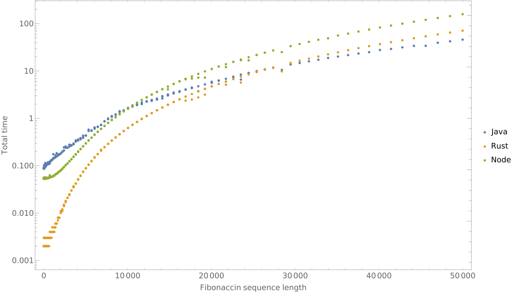

Podsumowanie:

* długi czas startowania maszyny wirtualnej Javy nie pozwolił jej rozwinąć skrzydeł w początkowej fazie przez co wypadła ona najgorzej dla małych wartości `n`.
* zaskakująco dobrze poradził sobie `Node`, który mimo, że nie zalecany do zadań obciążających procesor, to ma naprawdę nieźle zoptymalizowaną implementację [BigInt](https://v8.dev/blog/bigint)
* bezkonkurencyjny dla niskich `n` okazał się `Rust`, który ponieważ nie jest obciążony żadnym środowiskiem uruchomieniowym ani interpreterem, dla dużych `n` uległ jednak Javie, której zespół od [lat poprawiał](https://en.wikipedia.org/wiki/Java_performance)wydajność Javy w kolejnych wersjach.

Zdaję sobie sprawę, że te programy można zoptymalizować, choćby pod względem zużycia pamięci - nie trzymając całych tablic z ciągami. Starałem się je napisać tak, aby we wszystkich językach były możliwie podobne i możliwie proste. Jeśli zauważyłeś w nich błąd będę bardzo wdzięczny za zwrócenie uwagi w komentarzu.

### Aktualizacja: Implementacje dużych liczb w Rust

DK13 - użytkownik serwisu wykop zwrócił uwagę na to, że w Rust mamy różne implementacje dużych liczb i ta którą z nich wybierzemy bardzo istotnie wpływa na wynik końcowy.

[DK13 - profil w Wykop.pl

Write once, debug everywhere.

Wykop.plDK13 12 godz. temu via Wykop Mobilny (Android) +1

](https://www.wykop.pl/ludzie/DK13/)

[https://github.com/tczajka/bigint-benchmark-rs#results](https://github.com/tczajka/bigint-benchmark-rs#results)

Sprawdzę to niedługo i zaktualizuję treść tego wpisu.
