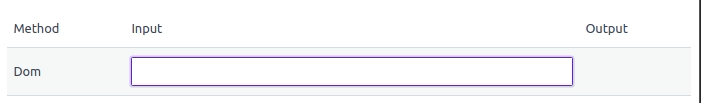

## What we have and what we want?

Lets consider the following situation.

1. We have Meteor project with Vue
2. We have two components that use the same data
3. We want to observe changes made in one component in another

## How to do this?

There are some very different approaches to gain this result:

a) Do no use Vue or Meteor and operate directly on DOM

b) Use EventBus known from Vue to emit and listen event

c) Use Vuex that allow many components to operate on global state

d) Use Meteor Tracker to recalculate property in second component

e) Use Minimongo and [vue-meteor-tracker](https://github.com/meteor-vue/vue-meteor-tracker) package

Below we show examples of application any of these methods and describe their pros and cons.

Full repository with all these method can be found there: [https://github.com/gustawdaniel/vue-meteor-components-communication-tutorial](https://github.com/gustawdaniel/vue-meteor-components-communication-tutorial)

## How to integrate Vue with Meteor?

We assume that you can create meteor project with Vue. If not then after on standard meteor project created by

```
meteor create .
```

you should use commands:

```
meteor remove autopublish insecure blaze-html-templates
meteor add akryum:vue-component static-html
meteor npm install --save vue-meteor-tracker vue
```

Replace `/client/main.html` by

```
<head>
   <title>Components communication</title>
</head>
<body>
   <div id="app"></div>
</body>
```

and `/client/main.js` by

```
import Vue from 'vue';

import VueMeteorTracker from 'vue-meteor-tracker';   // here!
Vue.use(VueMeteorTracker);                           // here!

import App from './App.vue';

Meteor.startup(() => {
  new Vue({
    el: '#app',
    render: h => h(App)
  });
});
```

Now in `/client/App.vue` we can use standard Vue syntax like

```
<template>
    <h1>App</h1>
</template>

<script>
    export default {
        name: "App"
    }
</script>
```

In following sections we can see results in table with applied spectre.css, but we will not discuss this. You can see how to use it following by commits in attached repository.

# Operation directly on DOM

In simplest cases when we do not want to operate on submitted data we can use old school direct dom modification. Listen on changes in first component, then select and directly modify `innerHTML` of elements in other.



To obtain this result we can write the following code in first component

```
<template>

    <input class="form-input" type="text" ref="input" @keyup="update">

</template>

<script>
    export default {
        methods: {
            update() {
                document.querySelector('#dom-target').innerHTML = this.$refs.input.value; // result of selector could be cached
            }
        }
    }
</script>
```

As you can see we listen on `keyup` on input element and execute method `update` that looking for `#dom-target` and directly modify their content.

In second we do not want even JavaScript

```
<template>

    <p class="m-2" id="dom-target"></p>

</template>
```

This method is

* very simple
* easy to use and understand
* require small amount of code

but have also drawbacks:

* can cause hard to detect bugs
* wreck idea of independent components
* introduce global namespace of id or other constraining selectors
* we should avoid in bigger projects where many people collaborate

# Use Event Bus

Concept of Event Bus relays on creation one (or many) independent globally available empty component that has only one task: emit and listen on events. This component can be injected to other components from our application and be used to signalize and invoke actions.

```
import Vue from 'vue';

export default new Vue();
```

Now out component initiating communication is more expanded

```
<template>

    <input class="form-input" type="text" v-model="value" @keyup="update">

</template>

<script>
    import EventBus from '../../EventBus';

    export default {
        data() {
            return { value: null }
        },
        methods: {
            update() {
                EventBus.$emit('update', this.value)
            }
        }
    }
</script>
```

We applied data property and use `$emit` method on imported `EventBus` to send signal. In component receiving we can use method `$on` to listen on this.

```
<template>

    <p class="m-2" id="dom-target">{{value}}</p>

</template>

<script>
    import EventBus from '../../EventBus';

    export default {
        data() {
            return {
                value: null
            }
        },
        mounted() {
            EventBus.$on('update', (value) => {
                this.value = value;
            })
        }
    }
</script>
```

Advantages

* no constrain of relative components position
* in more complex project you can use many EventBuses

Disadvantages

* you always should manually emit event
* you should remember to add this mechanism to any component that operate on these data

## Vuex as global state of application

Idea of separated components has great influence on code clarity and possibility of maintain. But sometimes we have data that should be accessible in any component and we want to share these data deliberately. To achieve this goal we can use Vuex. Is it not part of core vue library but officially supported. We shoud install vuex by command:

```
npm install vuex --save
```

To make it working we should do some preparation before using `vuex` in components. Firstly we should register it as package that we use. We can to it in file `/imports/client/plugins/vuex.js`

```
import Vue from 'vue'
import Vuex from 'vuex'

Vue.use(Vuex);
```

Next we should create global set of shared properties and method to change state of these values called `store` . I propose create file `/imports/client/vuex/store.js` with content

```
import Vuex from 'vuex'

export default new Vuex.Store({
    state: {
        value: null
    },
    mutations: {
        update (state, value) {
            state.value = value;
        }
    }
});
```

You can see that our state contains `value` and it can be “mutated” by function `update` . But it is not all. We also should append both our plugin and store to `/client/main.js` file. We can do this in following way

```
import Vue from 'vue';

import '../imports/client/plugins/tracker'
import '../imports/client/plugins/vuex'
import store from '../imports/client/vuex/store';

import App from '../imports/client/ui/App.vue';

Meteor.startup(() => {
  new Vue({
    el: '#app',
    store,
    render: h => h(App)
  });
});
```

You can see that `meteor-tracker` is moved to depart file in the same way like `vuex` , and in constructor of our `Vue` object there is injected `store` that we just defined.

Now we are prepared to use `vuex` in our components. When we typing then update should commit mutation with name `update` and send to their second argument value of our input.

```
<template>

    <input class="form-input" type="text" @keyup="update">

</template>

<script>
    export default {
        methods: {
            update(event) {
                this.$store.commit('update', event.target.value)
            }
        }
    }
</script>
```

Store has defined behavior of this method. We know that it is setter of value property. And in second component we can simply get this value from vuex.

```
<template>

    <p class="m-2" id="dom-target">{{$store.state.value}}</p>

</template>
```

Like in case with direct operation on dome we do not need additional JavaScript, but in this case it is achieved due to reactivity build in Vue.

Advantages:

* Efficient for shared states
* Allow to create global rules of manipulating on shared resources
* Require small amount of code when is implemented

Disadvantages:

* Relatively hard to setup in compare to previous methods
* Need many components that use the same value to have sense of usage

## Independent reactivity from Meteor tracker

You can see that we described three methods that we can use with Vue but without Meteor. Now We look at Meteor Tracker and see how to combine reactivity from meteor with reactivity from vue. Now idea is the following: create shared dependency like EventBus, import it in two components. In first send signal to recalculate any function dependent from this dependency, in second component create dependent function. To store data we will use `localStorage` because of this is definitely non reactive storage of data and we show that thanks Tracker we can not worry about manner of storing (it could be external API), but only take care about where reactive data are changed and where they are used.

Lets start from creating dependency in file `/imports/client/Dependency.js`

```
export default new Tracker.Dependency;
```

Now we want to import this dependency and use on it method `changed()` to signalize that any function dependent from this should be recalculated. Additionally we are saving value to `localStorage` and clear `localStorage` on create of this component to avoid caching value between browser refreshes.

```
<template>

    <input class="form-input" type="text" @keyup="update">

</template>

<script>
    import dependency from '../../Dependency';

    export default {
        methods: {
            update(event) {
                window.localStorage.setItem('value', event.target.value);
                dependency.changed();
            }
        },
        created() {
            window.localStorage.clear();
        }
    }
</script>
```

In second component we have standard `data()` function but on created there is registered `autorun` Tracker’s method. This method will be called always if any reactive (from Meteor point of view) variable inside of his function changed. By typing `dependency.depend()` we command Meteor to recompute this function in any case when `dependency.changed()` is invoked.

```
<template>

    <p class="m-2" id="dom-target">{{value}}</p>

</template>

<script>
    import dependency from '../../Dependency';

    export default {
        data() {
            return {
                value: null
            }
        },
        created() {
            Tracker.autorun(() => {
                dependency.depend();
                this.value = window.localStorage.getItem('value');
            });
        }
    }
</script>
```

Sometimes we want to communicate Meteor’s data with Vue data. Because of theirs reactivity are build on different technologies Meteor Tracker is point where they can meet and interact with each others.

Disadvantages:

* Tracker is no such well known like other pure Vue methods
* If there are many points of update, you should remember about invoking `changed` in any of them

Advantages:

* Allow to very custom integration with Meteor, more flexible than `vue-meteor-tracker` package.

## Automated tracking by vue-meteor-tracker package

One of most comfortable solution is usage `vue-meteor-tracker` . In contrast to last example we need reactive (from Meteor perspective) resource. Thank to usage reactive variables we can automate process of sending signal about changing data to dependent functions. We can use Mini Mongo collection that simulate Mongo collection but lives only on front-end without connection with back-end. Of course real Mongo collection can be used too, but we chose Mini Mongo for simplicity. Lets create collection in`/imports/client/Values.js`

```
export const Values = new Mongo.Collection(null);
```

Now in input component we want to upsert data to this collection like the following:

```
<template>

    <input class="form-input" type="text" @keyup="update">

</template>

<script>
    import { Values } from '../../Values';

    export default {
        methods: {
            update(event) {
                Values.upsert('value', {$set: {value: event.target.value}})
            }
        },
        created() {
            Values.upsert('value', {$set: {value: null}});
        }
    }
</script>
```

There are `upserts` on create of component and on update of input. Now in component that present data we can have code with `meteor` property of `Vue` component provided by `vue-meteor-tracker` package.

```
<template>

    <p class="m-2">{{valueObject.value}}</p>

</template>

<script>
    import { Values } from '../../Values';

    export default {
        meteor: {
            valueObject() {
                return Values.findOne('value');
            }
        }
    }
</script>
```

This property allow to define functions that are reactive in two ways. These functions are invoked by changes of variables reactive for Meteor but they return values reactive for Vue. Due this fact we do not have any listener. Only pure logic of saving data to reactive Meteor collection in first component and returning value from reactive for Meteor cursor in second component. `Vue-meteor-tracker` transform this reactivity to Vue reactivity and `valueObject` can be treated in second component like property returned by `data()` method.

Disadvantages:

* you should learn and relay on external additional package
* there is some problems with dynamic changing subscription parameters

Advantages

* package is well documented
* intuitive and easy to use
* always used when you want to integrate Meteor with Vue

# Summary

We presented some methods of communicating components. Some of them are universal, two last methods are typical for `vue-meteor` integration. There is not best or worse. You will create best code if you will know and understood all and select right one in dependent from your needs.


All methods presented in this article with input and output components.

If you want to add method that I forgot or see other thing to improve do not hesitate and let mention about it in comment.

Sources:

Custom events in Vue

> [https://vuejs.org/v2/guide/components-custom-events.html](https://vuejs.org/v2/guide/components-custom-events.html)

Vuex official guide

> [https://vuex.vuejs.org/guide/](https://vuex.vuejs.org/guide/)

Meteor Tracker Docs

> [https://docs.meteor.com/api/tracker.html](https://docs.meteor.com/api/tracker.html)

Vue Meteor Tracker

> [https://github.com/meteor-vue/vue-meteor-tracker](https://github.com/meteor-vue/vue-meteor-tracker)

This blog post is published also there:

[Communication between Vue components in Meteor

Full repository with all these method can be found there: https://github.com/gustawdaniel/vue-meteor-components-communication-tutorial We assume that you can create meteor project with Vue. If not…

MediumDaniel Gustaw

](https://medium.com/@gustaw.daniel/communication-between-vue-components-in-meteor-29006be3dae9)
