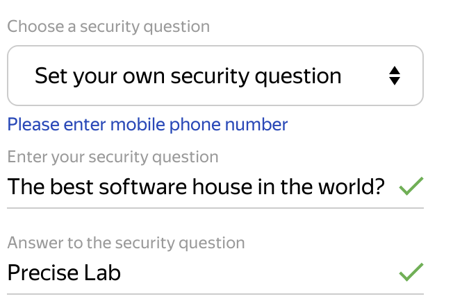

## Yandex is king

After both Google and Microsoft enabled creation of custom emails only for paid plans, one of the only email providers standing is Yandex Mail.

First we will go to [https://mail.yandex.com/](https://mail.yandex.com/) and create new Yandex account which will be organization-wide admin account.

You can choose to verify your account with phone number or a security question.

Login to newly created account on [https://mail.yandex.com/](https://mail.yandex.com/) and then go to [https://connect.yandex.com/portal/services/webmaster](https://connect.yandex.com/portal/services/webmaster).

## Adding a new domain

As an option choose DNS and add TXT record to your domain provider's DNS zone.

It should look simmilar to this.

## Adding user accounts/custom email prefixes

To create a new email account go to [https://connect.yandex.com/portal/admin/users/](https://connect.yandex.com/portal/admin/users/)
Then click **Все сотрудники**and add a new user by clicking "Add" and choosing "Add a person".
You can also create mailing lists by "Creating a department" and adding people to it.

Congratulations! You've just created a custom email for free!

If You want to create a new email for the same domain later, you can do it but only from the admin \_\_\_@yandex.com account that you've created at the beggining as it is only admin account in your organization.

If You know about other great Yandex functionalities, leave them in the comments :)

Thanks for reading through!
