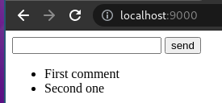
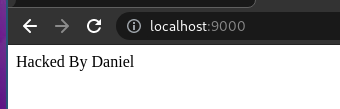
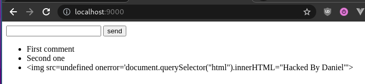

This article describes examples of XSS attacks. Usage of script tags is probably the most known case, but there also other possibilities. You can change the content of the website on your own using an image tag or pure css.

This is educational material and you should remember that hacking is illegal if you are caught red-handed. :)

## Website code

To present the attack we create a simple website based on PHP. I very like separate logic and view in code, but for simplicity and to minimize the number of lines of code we mixed in, and all website code is placed in index.php. To get the vulnerable website it has to be able to save text from user to database and display it on screen without filtering of this.

Again for the case of simplicity and clarity, we abandon best practices and use a json file instead of databases. The first file of our project is `db.json`

> db.json

```json
["First comment","Second one"]
```

To save comments send by using PHP script do the following things:

> index.php

```php
<?php
$comments = json_decode(file_get_contents('db.json'));

if($_SERVER["REQUEST_METHOD"] === "POST") {
    $comments[] = $_POST["comment"];
    file_put_contents('db.json', json_encode($comments));
}
```

* Read content of `db.json` file and convert it to PHP array.
* Check if the user sends a request by method POST - it means send the form
* If yes
* Append comment send by the user to an array
* Override file `db.json` by json encoding array with new comment

Independent from the method of request script goes on and display form and list of comments

> index.php

```php
echo '<form action="" method="post">
    <input type="text" name="comment">
    <input type="submit" value="send">
</form>
<ul>';

foreach ($comments as $comment) {
    echo "<li>".$comment."</li>";
}
echo '</ul>';
```

The created website looks like the following



It is fully functional, allows you to add a comment, save it in json, and display a list of comments. If users want to add text, not hack it could be the end of our adventure. But we should assume that at least one user of a website wants to hack it. :)

## How to hack it?

This flow of data - saving on the server and displaying on client make possible XSS attack if the text is not properly filtered. XSS means Cross-site scripting and enables attackers to inject client-side scripts into web pages viewed by other users.

Appended executable code is interpreted by browser, not server so we cannot conquer server by it, but can exchange client behavior. Exemplary benefits for attackers are the following:

* stealing cookies (session) - taking control over (logged in) session of the victim
* dynamic change of website content
* enabling key logger in browser

The script can be stored on a server or included in the link. In our case, we want to save the script to json file by typing comments. We are interested in change the content of the website to "Hacked by Daniel". In any case of presented below attack method website will look like this:



### Script

The simplest way is to append a script that dynamically after sile load changes his content to required. Try to add a comment:

```html
<script>document.querySelector('html').innerHTML="Hacked By Daniel"</script>
```

This code select `html` - it means all page, and change his content using `innerHTML` property.

### Style

Another method works even if javascript tags are stripped and javascript is disabled in the browser.

```html
<style>html::before {content: "Hacked By Daniel";} body {display: none;}</style>
```

We defined two rules for the styling of a website. The first one tells the browser to append text `Hacked By Daniel` before the body of a website. The second one to do not display body.

### Image

Of course, if we block `script` tag and `style` tag in our comments is not enough, because we can run the script also in other tags.

```html

```

This is an example of an image that has an invalid address. If the address is invalid browser run script being the value of the attribute `onerror`.

## How to defense?

To defend against this attack we need to filter the comments of our users and strip HTML tags. We can do it by changing the code in `index.php` as below

```diff
-      $comments[] = $_POST["comment"];
+      $comments[] = htmlspecialchars($_POST["comment"]);
```

After applying this fixed text written in the form will be displayed in comments lists literally equal text typed by the user, and will be not interpreted as Html tag.



## Summary

We showed simple examples of XSS attacks. If you use a framework like Symfony then framework have security mechanism build in his structure, but you should remember about `htmlspecialchars` function if you write in pure PHP.
