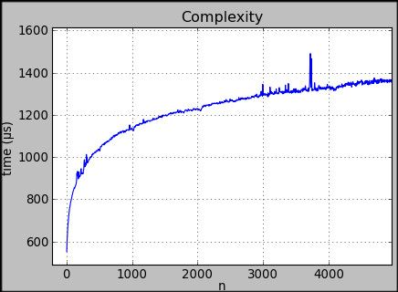
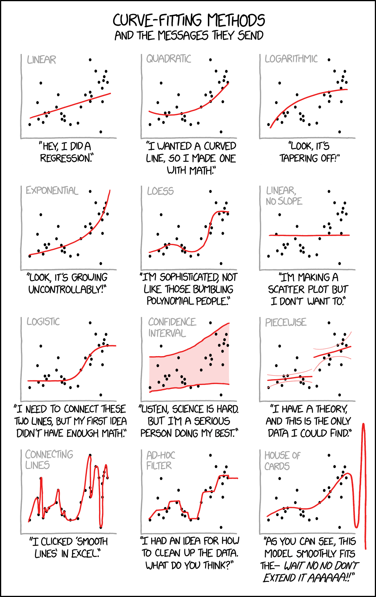

We will discuss exercise:

[Coding Games and Programming Challenges to Code Better

CodinGame is a challenge-based training platform for programmers where you can play with the hottest programming topics. Solve games, code AI bots, learn from your peers, have fun.

CodinGame

](https://www.codingame.com/ide/puzzle/blunder-episode-3)

Goal is find best fitting model for given dataset. For example for data:



we should print `O(log n)`. We can select models from list:

* O(1),
* O(log n),
* O(n),
* O(n log n),
* O(n^2),
* O(n^2 log n),
* O(n^3),
* O(2^n)

Input of program will contain first line with number of next lines and any following line will contain `n` and `t` values.

There are constrains:

```
5 < N < 1000
5 < num < 15000
0 < t < 10000000
```

and exemplary input:

```
10
5 341
1005 26324
2005 52585
3005 78877
4005 104925
4805 125920
6105 159156
7205 188017
8105 211417
9905 258991
```

should give to us

```
O(n)
```

because of is is similar to linear growth.

---

## Least Square Fitting

We can derive equation on coefficient and assuming that we want to minimize sum of second powers of differences between measurement and prediction of our model.
$$ R^2 = \\sum\_i \\left( t\_i - f(n\_i, a) \\right)^2 $$


This approach is called least squares fitting, and you can read more about it on MathWorld

[Least Squares Fitting -- from Wolfram MathWorld

A mathematical procedure for finding the best-fitting curve to a given set of points by minimizing the sum of the squares of the offsets (“the residuals”) of the points from the curve. The sum of the squares of the offsets is used instead of the offset absolute values because this allows the residua…

from Wolfram MathWorld

](https://mathworld.wolfram.com/LeastSquaresFitting.html)

Minimal value means that partial derivative by parameter of model `a` is 0.
$$ \\frac{\\partial (R^2)}{\\partial a} = - 2 \\sum\_i \\left( t\_i - f(n\_i, a) \\right) \\frac{\\partial f(n\_i, a)}{\\partial a} = 0 $$

## Linear Regression

Now we can assume that function is linearly dependent from scaling parameter `a`.
$$ f(n\_i, a) = a \* f(n\_i) $$


Our goal is find equation to compute `a` and then `R^2`. Our derivative can be simplified:
$$ \\frac{\\partial f(n\_i, a)}{\\partial a} = \\frac{\\partial a f(n\_i)}{\\partial a} = f(n\_i) $$


Using last equation from `Linear Square Fitting` we can compute `a`
$$ \\sum\_i \\left( t\_i f(n\_i) - a (f(n\_i))^2 \\right) = 0 $$


so
$$ a = \\frac{\\sum\_i t\_i f(n\_i)}{\\sum (f(n\_i))^2 } $$


and
$$ R^2 = \\sum\_i \\left( t\_i - a f(n\_i) \\right)^2 $$


Our equations looks beautifully but the devil is in the details.

If we will look at constrains of data for this exercise:

```
5 < N < 1000
5 < num < 15000
0 < t < 10000000
```

and remember models that we need to test it is easy too see that we will operate on huge numbers.

For example `2^n` with `n = 15 000` is much more than max range of 64 bit float

[MAX in std::f64 - Rust

Largest finite `f64` value. Use \[`f64::MAX`\] instead.

logo

](https://doc.rust-lang.org/std/f64/constant.MAX.html)

that is constrained to `2^1024`. There are tricks that allow to operate on these ranges, but instead of hacking computers constrains we will use math.

Instead of operating on big numbers we will use their logarithm to computation.

## Logarithmic Regression

Our solution is consequence of observation that if we will match logarithms of models to logarithms of `t` data then in result will will select the same model.

So adding `log` both to data and function we getting equation:
$$ \\frac{\\partial (R^2)}{\\partial a} = - 2 \\sum\_i \\left( log( t\_i) - log(a f(n\_i) ) \\right) \\frac{\\partial log( a f(n\_i) )}{\\partial a} = 0 $$


rewriting this equation we can obtain `a`
$$ \\sum\_i \\left( log( t\_i) - log(a) - log( f(n\_i)) ) \\right) \\frac{\\partial log( a ) + log(f(n\_i) )}{\\partial a} = 0 $$$$ \\sum\_i \\left( log( t\_i) - log(a) - log( f(n\_i)) ) \\right) \\frac{1}{a} = 0 $$$$ a = exp( \\frac{\\sum\_i log(t\_i) - \\sum\_i log(f(n\_i))}{N} ) $$


where
$$ N = \\sum\_i 1 $$


and rewriting equation for `R^2` we see:
$$ R^2 = \\sum\_i ( log( t\_i) - log( a \* f(n\_i) ) )^2 = \\sum\_i ( log( t\_i) - log( f(n\_i) ) - log(a) )^2 $$


Lets introduce new variable `c` defined as
$$ c = log(a) = 1/N ( \\sum\_i log( t\_i) - \\sum\_i log( f(n\_i)) ) ) $$


and then `R^2` can be rewritten as
$$ R^2 = \\sum\_i ( log( t\_i) - log( f(n\_i) ) - c )^2 $$


we can see that now there is no chance to operate on too big numbers so we can start implementation of these equations.


## Reading series of data from standard input

Lets start from definition of `Point` structure that represents single measurement.

```rust
#[derive(Debug)]
struct Point {
    n: u32,
    t: u32,
}
```

in `main` we will read standard input to `String` named `buffer`.

```rust
fn main() {
    let mut buffer = String::new();
    std::io::stdin().read_to_string(&mut buffer).unwrap();
}
```

we want to process this buffer and obtain vector of `Points`. To do it we writing function:

```rust
fn read_series(input: String) -> Vec<Point> {
    let mut iterator = input.lines();
    let n = iterator.next();
    let mut res: Vec<Point> = vec![];

    if Some(n).is_some() {
        for line in iterator {
            if let Some((n, y)) = line.split_once(' ') {
                res.push(Point {
                    n: n.parse::<u32>().unwrap_or(0),
                    t: y.parse::<u32>().unwrap_or(0),
                });
            }
        }
        return res;
    }

    return vec![];
}
```

we can check if it works adding to `main` line

```rust
    println!("{:?}", read_series(buffer));
```

## Computing sum on series using closure

In presented equations we had some sums, so to simplify further code lets implement `sum` function that can use closures to define operation what should be summed.

I initially wrote it as `noob`

```rust
fn sum(series: &Vec<Point>, expression: impl Fn(&Point) -> f64) -> f64 {
    let mut res = 0f64;
    for point in series {
        res += expression(point)
    }
    res
}
```

but soon fixed as `hacker`

```rust
fn sum(series: &Vec<Point>, expression: impl Fn(&Point) -> f64) -> f64 {
    series.into_iter().fold(0f64, |acc, point| { acc + expression(point) })
}
```

we can add test

```rust
#[cfg(test)]
mod tests {
    use crate::{Point, sum};

    #[test]
    fn sum_test() {
        assert_eq!(sum(
            &vec![Point { n: 0u32, t: 1u32 }, Point { n: 1u32, t: 2u32 }],
            |p: &Point| { f64::from(p.t) },
        ), 3f64);
    }
}
```

## Evaluating Sum of Least Squares

Our models to test can be represented using structure

```rust
struct Model {
    name: String,
    fn_log: fn(u32) -> f64,
}
```

but after computing `R^2` we can save result as

```rust
struct EvaluatedMode {
    name: String,
    r2_log: f64,
}
```

this is convenient data organization because results of evaluation will be compared by `r2_log` but then `name` should be available to print as output.

Due to this reason we will select following signature for `R^2` evaluation

```rust
fn evaluate_r2(model: Model, series: &Vec<Point>) -> EvaluatedMode
```

Series is passed by reference similarly like in `sum`. We do not want to change them or copy so operating on reference is preferred option for us.

Rewriting equations derived before to rust we can implement in this way

```rust
fn evaluate_r2(model: Model, series: &Vec<Point>) -> EvaluatedMode {
    let Model { name, fn_log } = model;
    let c = 1.0 / series.len() as f64 * sum(
        &series,
        |p| { f64::ln(f64::from(p.t)) - fn_log(p.n) },
    );
    let r2_log = sum(
        &series,
        |p| f64::powi(f64::ln(f64::from(p.t)) - fn_log(p.n) - c, 2),
    );
    EvaluatedMode {
        name,
        r2_log,
    }
}
```

## Selection best fitting model

To select model we starting from function signature

```rust
fn select_model(series: &Vec<Point>) -> String {
```

and defining vector with models possible to select. Instead of original functions we adding `fn_log` what are logharithms of these functions.

```rust
    let models: Vec<Model> = vec![
        Model {
            name: String::from("O(1)"),
            fn_log: |_n| 0f64,
        },
        Model {
            name: String::from("O(log n)"),
            fn_log: |n| f64::ln(f64::ln(f64::from(n))),
        },
        Model {
            name: String::from("O(n)"),
            fn_log: |n| f64::ln(f64::from(n)),
        },
        Model {
            name: String::from("O(n log n)"),
            fn_log: |n| f64::ln(f64::from(n)) + f64::ln(f64::ln(f64::from(n))),
        },
        Model {
            name: String::from("O(n^2)"),
            fn_log: |n| 2.0 * f64::ln(f64::from(n)),
        },
        Model {
            name: String::from("O(n^2 log n)"),
            fn_log: |n| 2.0 * f64::ln(f64::from(n)) + f64::ln(f64::ln(f64::from(n))),
        },
        Model {
            name: String::from("O(n^3)"),
            fn_log: |n| 3.0 * f64::ln(f64::from(n)),
        },
        Model {
            name: String::from("O(2^n)"),
            fn_log: |n| f64::from(n) * f64::ln(2.0),
        },
    ];
```

finally we mapping these models to evaluated models and reducing result to model with smallest `r2_log`

```rust
    models.into_iter().map(|m| { evaluate_r2(m, series) }).reduce(|p, n| {
        if p.r2_log < n.r2_log { p } else { n }
    }).unwrap().name
}
```

its everything. Now we can change last line of `main` to

```rust
    println!("{}", select_model(&read_series(buffer)));
```

and our program works.

Traditionally you can check full code with test on my github

[GitHub - gustawdaniel/codingame-computational-complexity

Contribute to gustawdaniel/codingame-computational-complexity development by creating an account on GitHub.

GitHubgustawdaniel

](https://github.com/gustawdaniel/codingame-computational-complexity)


