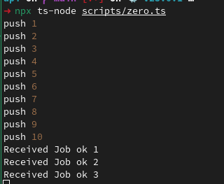

ZeroMQ is a messaging library that enables fast and efficient communication between distributed systems. With ZeroMQ, developers can easily build complex messaging systems that can handle high volumes of data and are resilient to network failures. In Node.js, the ZeroMQ library can be used to create messaging endpoints and send and receive messages between them.

In this article, we will explore how to use the ZeroMQ library in Node.js by examining a code snippet that demonstrates how to send and receive messages using the ZeroMQ `Push` and `Pull` sockets. The code shows how to create a `push` function that sends a message to a `Pull` socket, and a `pull` function that receives messages from a `Push` socket. We will examine the various components of the code and explain how they work together to create a reliable messaging system. We will also explore some best practices for using ZeroMQ in Node.js and discuss some common use cases for the library.

[ZeroMQ

An open-source universal messaging library


](https://zeromq.org/)

The built-in core ZeroMQ patterns are:

* [****Request-reply****](https://zeromq.org/socket-api/#request-reply-pattern), which connects a set of clients to a set of services. This is a remote procedure call and task distribution pattern.
* [****Pub-sub****](https://zeromq.org/socket-api/#publish-subscribe-pattern), which connects a set of publishers to a set of subscribers. This is a data distribution pattern.
* [****Pipeline****](https://zeromq.org/socket-api/#pipeline-pattern), which connects nodes in a fan-out/fan-in pattern that can have multiple steps and loops. This is a parallel task distribution and collection pattern.
* [****Exclusive pair****](https://zeromq.org/socket-api/#exclusive-pair-pattern), which connects two sockets exclusively. This is a pattern for connecting two threads in a process, not to be confused with “normal” pairs of sockets.

We are interested strictly in `pipeline`. Our goal is write code from wich I can import and export `pull` and `push` functions to easy use them later without worrying if socket is open or maintaining socket in context or global state.

```typescript
import {Push, Pull, MessageLike} from "zeromq";

// Import the required ZeroMQ sockets and types

const sleep = (time: number): Promise<void> => new Promise((resolve) => setTimeout(resolve, time))

// Define a sleep function that returns a Promise that resolves after a given time interval

const pushSocket = new Push();
const pullSocket = new Pull();

// Create a new ZeroMQ Push socket and a new Pull socket

export async function push<T extends MessageLike | MessageLike[]>(job: T): Promise<void> {

    // Define a push function that takes a generic message and sends it to the Pull socket
    // The function returns a Promise that resolves when the message is sent

    if(!pushSocket.writable){
        await pushSocket.bind("tcp://*:7777");
    }

    // If the socket is not yet writable, bind it to the address "tcp://*:7777"

    await pushSocket.send(job);

    // Send the message to the connected Pull socket
}

export async function pull<T>(): Promise<void> {

    // Define a pull function that receives messages from the Push socket
    // The function returns a Promise that resolves when a message is received

    pullSocket.connect("tcp://localhost:7777");

    // Connect the Pull socket to the address "tcp://localhost:7777"

    for await (const [msg] of pullSocket) {
        await sleep(2000);
        console.log(`Received Job ${msg.toString()}`);
    }

    // Use a for-await-of loop to iterate over incoming messages from the Pull socket
    // The sleep function is called to simulate a delay in processing the message
    // The message is then logged to the console
}
```

Assuming that i called this file `zero.ts` I can use it in script below

```typescript
import {pull, push} from "./zero";

pull().catch(console.error)

async function main() {
    for(let i = 1; i <= 10; i++) {
        console.log("push", i);
        await push(`ok ${i}`)
    }
}

main().catch(console.error)
```

I will see almost instant `push 1..10` and then any `2` seconds new lines with `Received Job`.



Of course you can use many instances of scripts that are workers and do these jobs in independent processes. In this case I wanted streamline outgoing http requests so I decided to process them in single `pull` and inject these requests from different places of code by `push`. So you can see that there is huge variety of applications especially, taking into account that I presented only one pattern from 4 available in ZeroMQ.
