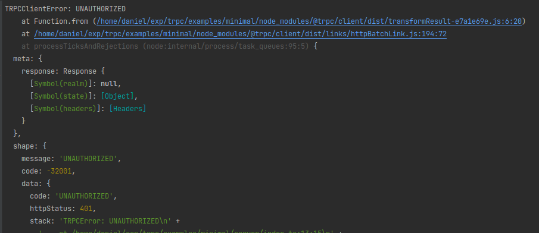
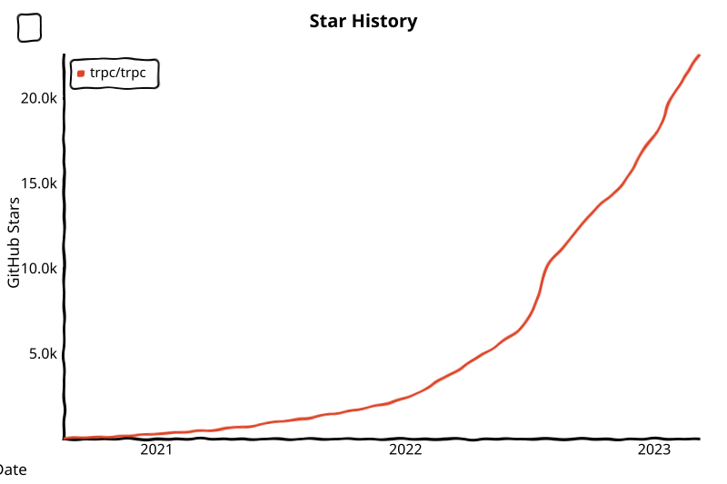

I learned tRPC today and fall in love ❤️ instantly deciding to rewrite project that I currently developing to this framework.

In short words what it is:
1\. You can develop schema like in gRPC
2\. But you are only constrain to typescript (rust support in progress)
3\. Instead of protobuf that is hard to read/debug you have lightweight types generated from your validators (like zod) and resolvers

Finally you obtaining fastest fullstack development cycle that I ever seen and I can compare it only with ruby on rails.

## Minimal example of tRPC with query by http

Let me show you minimal project using this stack.

We will start from 2 folders:

* client
* server

I `client` we have to install `@trpc/client` and in `server` we installing `@trpc/server` and `zod`.

In `server/index.ts` we creating server with schema generated from our code

```typescript
import {initTRPC} from '@trpc/server';
import {createHTTPServer} from '@trpc/server/adapters/standalone';
import {z} from 'zod'

export type AppRouter = typeof appRouter;

const t = initTRPC.create();

const publicProcedure = t.procedure;
const router = t.router;

const appRouter = router({
    greet: publicProcedure
        .input(z.string())
        .query(({input}) => ({greeting: `hello, ${input}!`})),
});

createHTTPServer({
    router: appRouter,
}).listen(2022);
```

Look at `export type AppRouter` this line is responsible for exporting schema for client. Few lines later we defining all routes using `router` function.

There is not only `query`, but also `mutation` and `subscription`. But in our example we have to show minimal starter so lets see client code.

```typescript
import { createTRPCProxyClient, httpBatchLink } from '@trpc/client';
import type { AppRouter } from '../server';

const client = createTRPCProxyClient<AppRouter>({
  links: [
    httpBatchLink({
      url: 'http://localhost:2022',
    }),
  ],
});

async function main() {
  const result = await client.greet.query('tRPC');

  // Type safe
  console.log(result.greeting.toUpperCase());
}

void main();
```

Here is import of `AppRouter` and we using it as generic type to create `client`. So all of:

* client methods
* methods arguments
* methods outputs

have strong typing.

## Authentication with tRPC

Lets add mutation that can be done only by admin. To simplify we will skip jwt / login / register and will consider situation when client can send `Authorization` header with `ABC` to authorize him.

So in this part you will learn how to add authorization, middlewares and mutations.

Lets create `context.ts` in `server`

```typescript
import {inferAsyncReturnType} from '@trpc/server';
import {CreateNextContextOptions} from '@trpc/server/adapters/next';

export async function createContext({req}: CreateNextContextOptions) {
    return {
        auth: req.headers.authorization === 'ABC'
    };
}

export type Context = inferAsyncReturnType<typeof createContext>;
```

Now we can change

```typescript
const t = initTRPC.create();
```

to

```typescript
import type { Context } from './context';
export const t = initTRPC.context<Context>().create();
```

Now we expect that in `context` we will be able to check if user is authorized.

You have to also add `createContext` to `createHTTPServer` options, so change:

```typescript
createHTTPServer({
    router: appRouter,
}).listen(2022);
```

to

```typescript
import {createContext} from "./context";

createHTTPServer({
    router: appRouter,
    createContext
}).listen(2022);
```

Now we have 2 options. We can check `auth` in resolver

```typescript
secret: t.procedure.query(({ ctx }) => {
    if (!ctx.auth) {
      throw new TRPCError({ code: 'UNAUTHORIZED' });
    }
    return {
      secret: 'sauce',
    };
  }),
```

but better approach is probably adding this check to middleware called `protectedProcedure`.

It is a little more code, but give us some advantages

```typescript
const isAuthed = t.middleware(({ next, ctx }) => {
    if (!ctx.auth) {
        throw new TRPCError({ code: 'UNAUTHORIZED' });
    }
    return next({
        ctx: {
            auth: ctx.auth
        }
    });
});
const protectedProcedure = t.procedure.use(isAuthed);
```

Firstly we can redefine our context, eg finding user in database and converting id in token to full set of user parameters. Additionally we can reuse `protectedProcedure` in all places without repetition of this check every time.

Now there is last final step in server: adding new route to `router` argument keys

```typescript
secret: protectedProcedure.mutation(() => "access granted")
```

In client we can use it in following way:

```typescript
  const unauthorizedError = await client.secret.mutate();
  console.log(unauthorizedError);
```

and we will see a beautiful unauthorized error like this



To be authorized we can add headers in client definition

```typescript
const client = createTRPCProxyClient<AppRouter>({
  links: [
    httpBatchLink({
      url: 'http://localhost:2022',
      headers: {
        Authorization: 'ABC'
      }
    }),
  ],
});
```

If I would left it in that form I have to recreate client with new headers on every headers change. Fortunately this simple form can be enhanced and we can write this way:

```typescript
const headers: Map<string, string> = new Map<string, string>();

const client = createTRPCProxyClient<AppRouter>({
  links: [
    httpBatchLink({
      url: 'http://localhost:2022',
      headers: () => Object.fromEntries(headers)
    }),
  ],
});
```

and decide about shape of headers dynamically on runtime, eg setting `Authorization` by

```typescript
headers.set('Authorization', 'ABC');
```

## Time to real time with tRPC subscriptions

In `server` we installing `ws`.

```bash
npm i ws
npm i -D @types/ws
```

To `router` we can add new subscription that will give us time every second

```typescript
time: publicProcedure.subscription(() => {
        return observable<Date>((emit) => {
            // logic that will execute on subscription start
            const interval = setInterval(() => emit.next(new Date()), 1000);
            // function to clean up and close interval after end of connection
            return () => {
                clearInterval(interval);
            }
        })
    })
```

Now we have to open `websocket` server so let's add it using code:

```
const wss = new ws.Server({
    port: 3001,
});
const handler = applyWSSHandler({ wss, router: appRouter, createContext });
wss.on('connection', (ws) => {
    console.log(`➕➕ Connection (${wss.clients.size})`);
    ws.once('close', () => {
        console.log(`➖➖ Connection (${wss.clients.size})`);
    });
});
console.log('✅ WebSocket Server listening on ws://localhost:3001');
process.on('SIGTERM', () => {
    console.log('SIGTERM');
    handler.broadcastReconnectNotification();
    wss.close();
});
```

I checked in `insomia` that I can connect


In payload I used object with shape described in `jsonrpc` spec

```json
{
  id: number | string;
  jsonrpc?: '2.0';
  method: 'subscription';
  params: {
    path: string;
    input?: unknown; // <-- pass input of procedure, serialized by transformer
  };
}
```

So let's connect our client in typescript now.

Following after official docs you will see error

```typescript
ReferenceError: WebSocket is not defined
```

because `createWSClient` assume that operate in browser, but we are using node client in this example.


To fix it we have to install `ws` and assign it to `global` scope but if your client live in browser you can skip this step.

```bash
npm i ws
npm i -D @types/ws
```

Now you can create `wsClient`

```typescript
const WebSocket = require('ws');
const wsClient = createWSClient({
    url: `ws://localhost:3001`,
    WebSocket: WebSocket,
});
```

use it wrapping in link

```typescript
const client = createTRPCProxyClient<AppRouter>({
    links: [
        wsLink({
            client: wsClient
        }),
    ],
});
```

and finally subscribe to see series of Dates

```typescript
    client.time.subscribe(undefined, {
        onData: (time) => {
            console.log(time)
        }
    })
```

Unfortunately you have to remove our secret mutation

```typescript
await client.secret.mutate();
```

to make it working.


## Lacking docs - websocket authentication in tRPC

Now we facing issue of providing authentication to websocket, but you probably know that pure websockets do not support http headers. You can pass them on handshake http request that will upgrade protocol to websocket. Details are described in RFC 6455

[RFC 6455: The WebSocket Protocol](https://www.rfc-editor.org/rfc/rfc6455)

In more mature projects like apollo server you can see that upgrade request is used to pass authentication info, but unfortunately now tRPC do not support it.

Anyway can split you split your client to http and websocket parts.

```typescript
const client = createTRPCProxyClient<AppRouter>({
    links: [
        splitLink({
            condition: (op) => op.type === 'subscription',
            true:         wsLink({
                client: wsClient
            }),
            false: httpBatchLink({
                url: 'http://localhost:2022',
                headers: () => Object.fromEntries(headers)
            }),
        }),
    ],
});
```

Probably most of operations will be http operations, so you can use mechanism with authentication described earlier for queries and mutations. In case of websocket you can use payload to pass token now or use trick taht I describe below.

To give you more context there is open issue:

[feat: Authentication by Websocket · Issue #3955 · trpc/trpc

Describe the feature you&#39;d like to request We know that websocket do not use http headers, but during handshake http request can be used. Page 14 RFC 6455 https://www.rfc-editor.org/rfc/rfc6455...

GitHubtrpc

](https://github.com/trpc/trpc/issues/3955)

Interesting but misleading topic on stackoverflow

[HTTP headers in Websockets client API

Looks like it’s easy to add custom HTTP headers to your websocket client with any HTTP header client which supports this, but I can’t find how to do it with the web platform’s WebSocket API.Anyone...

Stack OverflowJulien Genestoux

](https://stackoverflow.com/questions/4361173/http-headers-in-websockets-client-api)

Answer with most votes is wrong, because not taking into account handshake. And `ws` implements it as third arguments, but you can't find it in official README.md

[GitHub - websockets/ws: Simple to use, blazing fast and thoroughly tested WebSocket client and server for Node.js

Simple to use, blazing fast and thoroughly tested WebSocket client and server for Node.js - GitHub - websockets/ws: Simple to use, blazing fast and thoroughly tested WebSocket client and server for...

GitHubwebsockets

](https://github.com/websockets/ws)

In `trpc` code this third argument is skipped

[trpc/wsLink.ts at main · trpc/trpc

?‍♀️ Move Fast and Break Nothing. End-to-end typesafe APIs made easy. - trpc/wsLink.ts at main · trpc/trpc

GitHubtrpc

](https://github.com/trpc/trpc/blob/main/packages/client/src/links/wsLink.ts#L130-L134)


You cannot also use `Sec-WebSocket-Key` because `ws` override it by random hash.

[ws/websocket.js at master · websockets/ws

Simple to use, blazing fast and thoroughly tested WebSocket client and server for Node.js - ws/websocket.js at master · websockets/ws

GitHubwebsockets

](https://github.com/websockets/ws/blob/master/lib/websocket.js#L717-L723)


and loosing `trpc` loose this information.

There are three approaches to solve this problem.

* pass auth header to handshake ( easy, but constraint and not practical )
* build Map between connection ids and these tokens on server ( has flaws but works )
* passing token to any subscription in payload ( less elegant but more scalable )


### Scenario 1: We know auth token before client is created

This is scenario that is extremely easy to implement, but not practical. I am presenting it only because it not require changes on backend and will be our proof of concept that we will use to improve in next step.

Lets build your Proxy that will add headers anyway.

```typescript
const WebSocket = require('ws');

const WebSocketProxy = new Proxy(WebSocket, {
    construct(target, args) {
        return new target(args[0], undefined, {
            headers: Object.fromEntries(headers)
        });
    }
})
```

This object will use headers defined earlier as a map in part about authorization

```typescript
const headers: Map<string, string> = new Map<string, string>();
```

`args[0]` will be your server url, and undefined is for protocol, you do not have to worry about it. It was undefined/skipped anyway.

But we have to set header by

```typescript
headers.set('Authorization', 'ABC');
```

before call of `createWSClient`.

Now you can use `WebSocketProxy` instead of original `Websocket` implementation

```typescript
const wsClient = createWSClient({
    url: `ws://localhost:3001`,
    WebSocket: WebSocketProxy,
});
```

Client can have only wsLink

```typescript
const client = createTRPCProxyClient<AppRouter>({
    links: [
        wsLink({
            client: wsClient
        }),
    ],
});
```

Or be splitted to http and websocket parts

```typescript
const client = createTRPCProxyClient<AppRouter>({
    links: [
        splitLink({
            condition: (op) => op.type === 'subscription',
            true: wsLink({
                client: wsClient
            }),
            false: httpBatchLink({
                url: 'http://localhost:2022',
                headers: () => Object.fromEntries(headers)
            }),
        }),
    ],
});
```

On server side we do not need changes, but we will do only one simple imprvement. We will return `auth` state from `time` subscription

```typescript
time: publicProcedure.subscription(({ctx}) => {
        return observable<{ date: Date, auth: boolean }>((emit) => {
            // logic that will execute on subscription start
            const interval = setInterval(() => emit.next({date: new Date(), auth: ctx.auth}), 1000);
            // function to clean up and close interval after end of connection
            return () => {
                clearInterval(interval);
            }
        })
    })
```

Now our client `main` function will be following

```typescript
async function main() {
    const result = await client.greet.query('tRPC');
    console.log(result.greeting.toUpperCase());

    const secret = await client.secret.mutate();
    console.log(secret);

    client.time.subscribe(undefined, {
        onData: ({auth, date}) => {
            console.log(`I am ${auth ? 'auth' : 'not auth'} at ${date}`)
        }
    })
}
```

we should see that all requests works correctly and we have access to token on websocket context too.


But in real use case you starting app as unauthenticated user, that will authenticate by http and then open websocket connections to operate over them.

tRPC define `tryReconnect` function for `wsLink` but do not expose it. Additionally it would be better to be able to authenticate without reconnection and special websocket endpoint dedicated to login.

### Scenario 2: We authenticating by http context and passing result to websocket context

Let's start from high level design.

1. We will setup our `sec-websocket-key` that we are able to save and reuse on client
2. We will setup map of these keys and these authentication states on client
3. We will allow to modify this map using http requests with authorization headers
4. We will see that on websocket subscription state of auth can be obtained using `keys`

#### Setting header with client id

There is open [pr](https://github.com/websockets/ws/pull/2125) that will allow to override `sec-websocket-key` but now, lets use different name. `sec-websocket-id` seems to be great.

So when our client starting (eg user enter to our page url or in our case node process starts) we need to generate id. I will focus on `node` implementation, so can use `crypto`.

Our new lines on client will be

```typescript
import crypto from 'crypto';
const id = crypto.randomBytes(16).toString('hex')
headers.set('sec-websocket-id', id);
```

you have to set them before `const wsClient = createWSClient({`.

#### Setting connections map on server

Crucial point is that we share `headers` for `http` and `websocket` links. So in server `createContext` we expect to see this header for all types of requests - both standard http and http upgrade requests that will open websocket.

Our `context.ts` can be rewritten in this way:

```typescript
import {inferAsyncReturnType} from '@trpc/server';
import {CreateNextContextOptions} from '@trpc/server/adapters/next';

const authState = new Map<string, boolean>();

export async function createContext({req}: CreateNextContextOptions) {
    console.log(req.headers);
    const auth = req.headers.authorization === 'ABC';
    const id = req.headers['sec-websocket-id'];

    authState.set(id, auth);

    return {
        auth: () => authState.get(id) ?? false,
        id
    };
}

export type Context = inferAsyncReturnType<typeof createContext>;
```

so now, we are not checking auth state in current request, but last value saved in `Map`.

In our scenario there are the following events:

* public query
* setting token
* private mutation <– here we setting auth to true
* websocket subscription <— here we are using state from map

We need super small adjustments in two paces. In `isAuthed` function we need call auth

```typescript
const isAuthed = t.middleware(({next, ctx}) => {
    if (!ctx.auth()) {
        throw new TRPCError({code: 'UNAUTHORIZED'});
    }
    return next({
        ctx: {
            auth: ctx.auth
        }
    });
});
```

and in subscription we have to change `ctx.auth` to `ctx.auth()` too

```typescript
const interval = setInterval(() => emit.next({date: new Date(), auth: ctx.auth()}), 1000);
```

#### Lets check if it works for client

To achieve more dramatic effect we can use `setTimeout` to postpone authentication.

Our `main` function now have a form

```typescript
async function main() {
    const result = await client.greet.query('tRPC');
    console.log(result.greeting.toUpperCase());

    setTimeout(async () => {
        headers.set('Authorization', 'ABC');

        const secret = await client.secret.mutate();
        console.log(secret);
    }, 2000)


    client.time.subscribe(undefined, {
        onData: (ctx) => {
            console.log(`I am ${ctx.auth ? 'auth' : 'not auth'} at ${ctx.date}`)
        }
    })
}
```

and in console i see


#### Scenario 3: Passing token in subscription input

To cover problem completely I am presenting third last approach - passing token in payload to subscription, instead of to handshake requests. We can modify our `time`

```typescript
    time: publicProcedure.input(
        z.object({
            token: z.string(),
        }),
    ).subscription(({ctx, input}) => {
        return observable<{ date: Date, ctx_auth: boolean, input_auth: boolean }>((emit) => {
            // logic that will execute on subscription start
            const interval = setInterval(() => emit.next({
                date: new Date(),
                ctx_auth: ctx.auth(),
                input_auth: input.token === 'ABC'
            }), 1000);
            // function to clean up and close interval after end of connection
            return () => {
                clearInterval(interval);
            }
        })
    })
```

and on client side

```typescript
    client.time.subscribe({token: 'ABC'}, {
        onData: (ctx) => {
            console.log(`I am ${ctx.input_auth ? 'auth' : 'not auth'} at ${ctx.date}`)
        }
    })
```

## Recommended improvements

If you are user of grpc and simiarry to `Funwithloops` from this reddit topic:

[https://www.reddit.com/r/node/comments/117fgb5/trpc\_correct\_way\_to\_authorize\_websocket/](https://www.reddit.com/r/node/comments/117fgb5/trpc_correct_way_to_authorize_websocket/)

think about websocket authentication. You should consider this blog post as sketch written by person that learned `tRPC` few hours ago. On production environment you have to solve problem of sharing state saved in `authState` between your backend instances. Probably you will need redis for it. Then you should set `TX` parameters to not persist these keys infinitely. We forgot about logout endpoint.

Redis to manage authentication decrease performance in comparison to pure `jwt` so maybe better design would be append authentication to your subscription input, that on the other hand is less readable and require more boilerplate.

You should be aware that `trpc` do not implement `lazy` option for websocket client that is available in apollo and would simplify our first scenario that I described here.

This technology is super hot, but still in phase of development and this article can be outdated soon.



If you are one of `trpc` maintainers, you can use concepts presented here in official docs or suggest me better approach to websocket auth in comments section.
