Strukturyzacja danych to nadawanie danym kształtu pozwalającego na ich analizę i wygodne przetwarzanie. W tym wpisie pokażę jak może wyglądać taki proces na przykładzie danych pochodzących z NBP, które są składowane w plikach, których konwencja układania nagłówków ulegała zmianom na przestrzeni lat.

Dane z NBP nie nadają się przez to do natychmiastowego użycia i należy je uporządkować, jeśli chcieli byśmy je przetwarzać.

Od razu zaznaczę, że historyczne kursy walut są świetnie prezentowane na stronie:

[https://stooq.com/](https://stooq.com/)

Za przykład weźmy kurs franka szwajcarskiego:

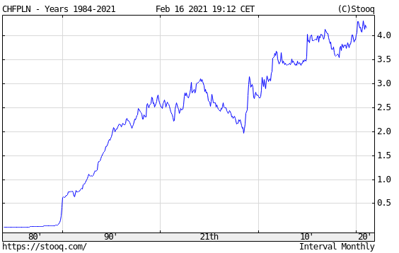

https://stooq.com/q/?s=chfpln&c=mx&t=l&a=ln&b=0

Aby pobrać te dane, wystarczy przejść na stronę:

[https://stooq.com/q/d/?s=chfpln](https://stooq.com/q/d/?s=chfpln)

i kliknąć przycisk poniżej tabeli


https://stooq.com/q/d/l/?s=chfpln&i=d

W tym artykule nie rozwiązuję *realnego problemu*, tylko prezentuję możliwe do zastosowania *metody strukturyzacji danych **na przykładzie*** konkretnego zbioru plików o niespójnej i nieprzewidywalnej konwencji.

Kolejno przejdziemy przez problemy:

1. Pobrania danych
2. Przetworzenia ich
3. Wyświetlenia wykresu

Główną wartością dla czytelnika jest śledzenie całego procesu od początku do końca i poznanie stosowanych tu narzędzi.

---

Dane z kursami pobierzemy ze strony

> [https://www.nbp.pl/home.aspx?f=/kursy/arch\_a.html](https://www.nbp.pl/home.aspx?f=/kursy/arch_a.html)

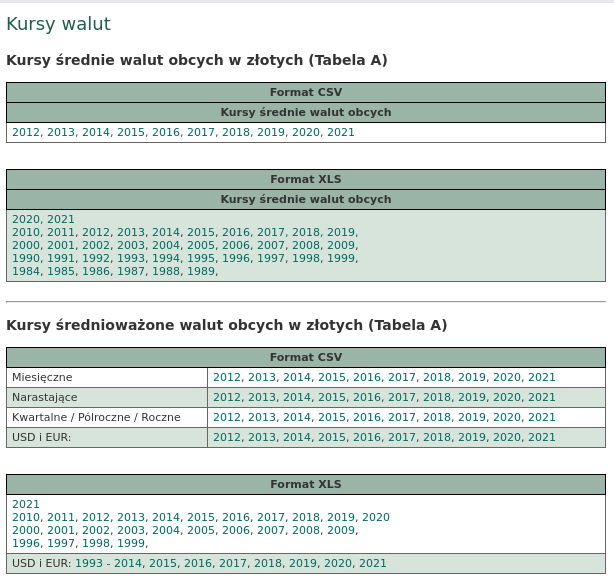

Dane są podzielone na osobne arkusze `xls`.

# Pobranie danych

Zaczniemy od pobrania tych danych. Z kodu `HTML` odczytujemy selektor.


W konsoli przeglądarki wpisujemy:

```js
[...document.querySelectorAll('.normal_2 a')]
    .map(a => `wget ${a.href}`)
    .filter(link => /archiwum_tab/.test(link))
    .join(' && ')
```

Wynikiem jest połączona `&&` lista poleceń `wget` pobierających kolejne pliki.

```bash
wget https://www.nbp.pl/kursy/Archiwum/archiwum_tab_a_2020.xls && wget https://www.nbp.pl/kursy/Archiwum/archiwum_tab_a_2021.xls && wget https://www.nbp.pl/kursy/Archiwum/archiwum_tab_a_2010.xls && wget https://www.nbp.pl/kursy/Archiwum/archiwum_tab_a_2011.xls && wget https://www.nbp.pl/kursy/Archiwum/archiwum_tab_a_2012.xls && wget https://www.nbp.pl/kursy/Archiwum/archiwum_tab_a_2013.xls && wget https://www.nbp.pl/kursy/Archiwum/archiwum_tab_a_2014.xls && wget https://www.nbp.pl/kursy/Archiwum/archiwum_tab_a_2015.xls && wget https://www.nbp.pl/kursy/Archiwum/archiwum_tab_a_2016.xls && wget https://www.nbp.pl/kursy/Archiwum/archiwum_tab_a_2017.xls && wget https://www.nbp.pl/kursy/Archiwum/archiwum_tab_a_2018.xls && wget https://www.nbp.pl/kursy/Archiwum/archiwum_tab_a_2019.xls && wget https://www.nbp.pl/kursy/Archiwum/archiwum_tab_a_2000.xls && wget https://www.nbp.pl/kursy/Archiwum/archiwum_tab_a_2001.xls && wget https://www.nbp.pl/kursy/Archiwum/archiwum_tab_a_2002.xls && wget https://www.nbp.pl/kursy/Archiwum/archiwum_tab_a_2003.xls && wget https://www.nbp.pl/kursy/Archiwum/archiwum_tab_a_2004.xls && wget https://www.nbp.pl/kursy/Archiwum/archiwum_tab_a_2005.xls && wget https://www.nbp.pl/kursy/Archiwum/archiwum_tab_a_2006.xls && wget https://www.nbp.pl/kursy/Archiwum/archiwum_tab_a_2007.xls && wget https://www.nbp.pl/kursy/Archiwum/archiwum_tab_a_2008.xls && wget https://www.nbp.pl/kursy/Archiwum/archiwum_tab_a_2009.xls && wget https://www.nbp.pl/kursy/Archiwum/archiwum_tab_a_1990.xls && wget https://www.nbp.pl/kursy/Archiwum/archiwum_tab_a_1991.xls && wget https://www.nbp.pl/kursy/Archiwum/archiwum_tab_a_1992.xls && wget https://www.nbp.pl/kursy/Archiwum/archiwum_tab_a_1993.xls && wget https://www.nbp.pl/kursy/Archiwum/archiwum_tab_a_1994.xls && wget https://www.nbp.pl/kursy/Archiwum/archiwum_tab_a_1995.xls && wget https://www.nbp.pl/kursy/Archiwum/archiwum_tab_a_1996.xls && wget https://www.nbp.pl/kursy/Archiwum/archiwum_tab_a_1997.xls && wget https://www.nbp.pl/kursy/Archiwum/archiwum_tab_a_1998.xls && wget https://www.nbp.pl/kursy/Archiwum/archiwum_tab_a_1999.xls && wget https://www.nbp.pl/kursy/Archiwum/archiwum_tab_a_1984.xls && wget https://www.nbp.pl/kursy/Archiwum/archiwum_tab_a_1985.xls && wget https://www.nbp.pl/kursy/Archiwum/archiwum_tab_a_1986.xls && wget https://www.nbp.pl/kursy/Archiwum/archiwum_tab_a_1987.xls && wget https://www.nbp.pl/kursy/Archiwum/archiwum_tab_a_1988.xls && wget https://www.nbp.pl/kursy/Archiwum/archiwum_tab_a_1989.xls
```

Po wklejeniu ich do terminala pliki zostaną pobrane na nasz komputer.

Zalecam stosowanie konwencji, w której takie surowe pobrane z internetu pliki lądują w osobnym katalogu np `raw`.

# Konwersja

Wykonujemy konwersję wszystkich plików do formatu `csv` ponieważ jest wygodniejszy w przetwarzaniu maszynowym niż `xls`.

```bash
for i in *.xls; do  libreoffice --headless --convert-to csv "$i" ; done
```

Po wykonaniu tej komendy w naszym katalogu zobaczymy zarówno pliki `xls` jak i odpowiadające im `csv`.

# Strukturyzacja

Niestety osoby przygotowujące te pliki nie zadbały o trzymanie wspólnej konwencji i pierwszy wiersz czasami należy wyrzucić, innym razem zawiera nazwy waluty, kraju a jeszcze innym kod waluty.

Co możemy z tym zrobić?

Najlepiej ustalić własną normę zapisu i ujednolicić strukturę danych w obrębie całego zbioru.

Konwencja zapisu dat, walut i kursów:

* data YYYY-MM-DD - ponieważ wygodnie się sortuje i jest to naturalny format dat w wielu językach
* waluta - za pomocą kodu ISO\_4217 (3 literowy kod walut)
* kurs - za pomocą formatu z kropką do oznaczania ułamków

Konwencja struktury danych (kompozycji):

* JSON w którym pierwszy klucz to waluta a drugi to data, wartość to wartość w złotówkach - ten format pozwala łatwo wyszukiwać po walutach a następnie po datach, wygodnie rzutuje się go względem walut. Mimo narzutu objętościowego względem CSV łatwość dalszego procesowania jest tu czynnikiem decydującym.

Kiedy mamy już konwencję możemy napisać kod. Użyjemy do tego `typescript`.

## Przygotowanie projektu

Zaczynamy projekt komendami

```bash
tsc --init
npm init -y
npm install chai
npm i --save-dev @types/node @types/chai
touch app.ts
```

Paczka, którą zainstalowaliśmy - `chai` pozwoli nam na pisanie testów automatycznych sprawdzających zgodność wyników z naszymi oczekiwaniami. Oszczędzi nam to czas na ich manualną weryfikację.

Do zadania powinniśmy dobrać strukturę katalogów i paradygmat. W naszym przypadku zakładamy max 100 linii kodu przetwarzającego i z tego powodu wystarczy jeden plik z proceduralnym kodem o szkielecie:

```typescript
// declarations
imports ...

constants ...

functions ...

main function

// execution
console.log(main())
```

## Odczyt plików

Pierwszą funkcją będzie tu `main`. Zaczniemy od pokazania listy plików.

```ts
import fs from 'fs'
import chai from 'chai'

const main = () => {
    const rawDir = process.cwd() + `/raw`

    const res = fs.readdirSync(rawDir).filter(f => f.endsWith('csv'));
    res.forEach(r => chai.expect(r).to.be.a('string'))

    return res;
}

console.dir(main(), {depth: Infinity, maxArrayLength: Infinity})
```

Wykonanie komendą

```bash
 ts-node app.ts
```

Daje nazwy plików, które przetworzymy:

```json
[
  'archiwum_tab_a_1984.csv',
  'archiwum_tab_a_1985.csv',
...
```

Dzięki linii korzystającej z `chai` mamy pewność, że wszystkie wyniki mają odpowiedni typ. Teraz może to nie robić wrażenia, ale na późniejszym etapie takie testowanie pozwoli nam szybko wykrywać i łatać błędy związane z odkrywaniem kolejnych niuansów w konwencji użytej w badanych plikach.

Aby wyświetlić zawartość pierwszego pliku, skorzystamy z funkcji `readFileSync`. Wybór filtrów i map nie jest przypadkowy. Te funkcje wraz z reduce idealnie nadają się do przetwarzania danych i zobaczymy je tu jeszcze wiele razy.

```diff
import fs from 'fs'
import chai from 'chai'

+ const FILES_FILTER = (e: string, i: number) => i <= 0

const main = () => {
  const rawDir = process.cwd() + `/raw`

  const res = fs.readdirSync(rawDir).filter(f => f.endsWith('csv'))
+    .filter(FILES_FILTER)
+    .map((name, i) => {
+      return fs
+        .readFileSync(`${rawDir}/${name}`)
+        .toString()
+    })
  res.forEach(r => chai.expect(r).to.be.a('string'))
  return res;
}

console.dir(main(), {depth: Infinity, maxArrayLength: Infinity})
```

Okazuje się, że pierwszy plik nie zawiera kodów walut.

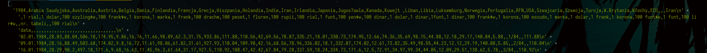

Więc zmuszeni jesteśmy do zbudowania słownika, który mapuje nazwy krajów na kody walutowe.

```ts
const dict: { [key: string]: string } = {
  'Szwajcaria': 'CHF'
}
```

## Przetworzenie nagłówków

Przyjrzenie się nagłówkom definiuje też podstawowe reguły dalszego przetwarzania.

1. Mamy w pierwszym wierszu wykonać wyszukanie nazwy kraju.
2. Na tej podstawie ustalić kolumnę `col` w której znajdują się dane.
3. W drugim wierszu w kolumnie `col` znajduje się dzielnik `div`
4. Później bierzemy tylko te wiersze, które zawierają datę w pierwszej kolumnie.
5. W tych wierszach w kolumnie `col` znajduje się wartość, która powinna być podzielona przez dzielnik `div` aby mieć wartość kursu walutowego.

Dzięki interfejsom w TypeScript możemy zdefiniować jak będzie wyglądała nasza docelowa struktura danych z pojedynczego pliku:

```ts
interface YearData {
  [key: string]: {
    col: number,
    div: number,
    values: { [key: string]: number }[]
  }
}
```

Linię zwracającą zawartość pliku:

```ts
return fs.readFileSync(`${rawDir}/${name}`).toString()
```

zmienimy na przypisanie do stałej `arr` tablicy tablic z plikiem `csv` rozbitym na znakach nowej linii oraz przecinkach

```ts
const arr = fs
  .readFileSync(`${rawDir}/${name}`)
  .toString()
  .split(`\n`)
  .map(l => l.split(','));
```

Do rozkładu pierwszej linii posłuży nam funkcja:

```ts
const decomposeBaseSettingsFromNames = (localArr: string[]) => localArr.reduce((p: YearData, n: string, i: number): YearData => {
  if (Object.keys(dict).includes(n)) {
    p[dict[n]] = { col: i, div: 1, values: [] }
  }
  return p
}, {})
```

Użyjemy jej zaraz po rozłożeniu pliku na tablicę `arr` w liniach

```ts
const head = arr.shift()
if (!head) throw Error('File do not have header line.')
let settings: YearData = decomposeBaseSettingsFromNames(head)
```

W przypadku sukcesu ustawienia będą zawierały klucz `CHF` z dobrze wyliczoną wartością kolumny. Do tego była nam potrzebna funkcja `decomposeBaseSettingsFromNames`, zwróćmy jednak uwagę, że wartość dzielnika ustawiłem na `1`. To dlatego, że dzielniki są dopiero w kolejnej linii. Znajdziemy je dzięki następującym liniom:

```ts
if (Object.keys(settings).length) {
  const subHead = arr.shift()
  if (!subHead) throw Error('File do not have sub-header line.')
  Object.keys(settings).forEach(key => {
    settings[key].div = parseInt(subHead[settings[key].col])
  })
}

return settings;
```

Zmianie ulegnie też test i obecnie przyjmie formę:

```
res.forEach(r => {
        chai.expect(r).to.haveOwnProperty('CHF');
        chai.expect(r.CHF).to.haveOwnProperty('col');
        chai.expect(r.CHF).to.haveOwnProperty('div');
        chai.expect(r.CHF).to.haveOwnProperty('values');
        chai.expect(r.CHF.col).to.be.a('number');
        chai.expect(r.CHF.div).to.be.a('number');
        chai.expect(r.CHF.values).to.be.a('array');
    })
```

Wykonanie powyższego kodu da nam

```json
[ { CHF: { col: 25, div: 1, values: [] } } ]
```

I jest to świetny wynik, ponieważ dokładnie takie wartości mieliśmy wydobyć z pierwszego pliku. Mówi nam on, że kolumna z funtami znajduje się na 26 pozycji (numerujemy od 0) oraz, że dzielnik to 1. Używamy go głównie przy okazji denominacji, więc w roku `1984` nie był nam potrzebny.

Cały kod `app.ts` na tym etapie można znaleźć pod linkiem:

[app.ts · ccd18f1f1f96ad13fad8157101f7632c4c1df73b · gustawdaniel / nbp

GitLab.com

GitLab

](https://gitlab.com/gustawdaniel/nbp/-/blob/ccd18f1f1f96ad13fad8157101f7632c4c1df73b/app.ts)

## Przetworzenie wartości

Daty w formacie `DD.MM.YYYY`, nie pasują do opisanej przez nas konwencji więc piszemy konwerter

```ts
const getDate = (input: string) => {
  if (/\d{2}\.\d{2}\.\d{4}/.test(input)) {
    return input.split('.').reverse().join('-')
  }
  return false
}
```

Teraz za przetworzeniem nagłówków możemy dodać kod strukturyzujący wartości kursów

```ts
arr.forEach(localArr => {
  const date = getDate(localArr[0])
  if (typeof date === 'string') {
    Object.keys(settings).forEach(key => {
      settings[key].values.push({ [date]: parseFloat(localArr[settings[key].col]) / settings[key].div })
    })
  }
})
```

Jak widzimy nagłówki były najtrudniejszą częścią. Kiedy je mamy, to ułożenie samych wartości staje się formalnością. Wykonanie kodu daje:

```json
[
  {
    CHF: {
      col: 28,
      div: 1,
      values: [
        { '1984-01-02': 140.84 },
        { '1984-01-09': 140.08 },
        { '1984-01-16': 138.62 },
...
```

Test poprawnej struktury danych mógł by wyglądać tak:

```
    res.forEach(r => {
        chai.expect(r).to.haveOwnProperty('CHF');
        chai.expect(r.CHF).to.haveOwnProperty('col');
        chai.expect(r.CHF).to.haveOwnProperty('div');
        chai.expect(r.CHF).to.haveOwnProperty('values');
        chai.expect(r.CHF.col).to.be.a('number');
        chai.expect(r.CHF.div).to.be.a('number');
        chai.expect(r.CHF.values).to.be.a('array');
        r.CHF.values.forEach(v => {
            chai.expect(Object.keys(v)[0]).to.be.a('string');
            chai.expect(/\d{4}-\d{2}-\d{2}/.test(Object.keys(v)[0])).to.be.true;
            chai.expect(Object.values(v)[0]).to.be.a('number');
            chai.expect(Object.values(v)[0]).to.be.greaterThan(0);
        })
    })
```

Cały kod można przejrzeć tutaj:

[app.ts · 9d401a925bc9e115dfaf9efe6528484f62cf2263 · gustawdaniel / nbp

GitLab.com

GitLab

](https://gitlab.com/gustawdaniel/nbp/-/blob/9d401a925bc9e115dfaf9efe6528484f62cf2263/app.ts)

Tu artykuł by mógł kończyć się połączeniem plików jedną funkcją i prezentacją ostatecznego wyniku...

Jednak tak nie jest. Teraz zaczyna się brudna robota z wykrywaniem niespójności w konwencji plików n NBP.

## Normalizacja i czyszczenie danych

Jeśli sprawdzimy za pomocą tego kodu plik `6` ustawiając funkcję filtrującą pliki na taką:

```ts
const FILES_FILTER = (e: string, i: number) => i === 5
```

to wynik będzie zaskakująco rozczarowujący

```json
[ { CHF: { col: 27, div: 1, values: [] } } ]
```

Aby to zdebugować za linią:

```ts
.split(`\n`)
```

dodamy

```ts
.filter(ROWS_FILTER)
```

z wartością `ROWS_FILTER` zdefiniowaną jako

```ts
const ROWS_FILTER = (e: string, i: number) => i <= 4
```

Aby uczynić czytanie bardziej wygodne wyświetliłem chwilowo tablicę `arr` używając `console.table` i wycinając tylko najciekawsze kolumny:

```ts
console.table(arr.map(l => l.filter((e,i) => i < 5 || Math.abs(i - 30) < 4)));
```

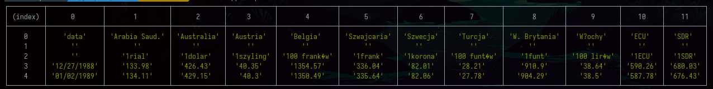

Co widzimy?

Że zmieniła się konwencja zapisu daty na `MM/DD/YYYY`.

Problem obsłużymy rozszerzając konwerter dat o kolejny `if`

```ts
if (/\d{2}\/\d{2}\/\d{4}/.test(input)) {
  const [m, d, y] = input.split('/')
  return [y, m, d].join('-')
}
```

Możemy dodać też filter, który usunie spacje z nazw krajów:

```ts
const DROP_SPACES = (l: string): string => l.replace(/\s+/g, '')
```

włożoną do mapy za linią

```ts
.split(`\n`)
```

Pozwoli to na traktowanie kraju `W. Brytania` oraz `W.Brytania` tak samo.

Po tych zmianach wprowadzimy też zmianę w testowaniu. Wymusimy niezerową długość wartości z cenami. Przeniesiemy też testowanie do osobnej funkcji

```ts
const testYearData = (r:YearData):void => {
    chai.expect(r).to.haveOwnProperty('CHF');
    chai.expect(r.CHF).to.haveOwnProperty('col');
    chai.expect(r.CHF).to.haveOwnProperty('div');
    chai.expect(r.CHF).to.haveOwnProperty('values');
    chai.expect(r.CHF.col).to.be.a('number');
    chai.expect(r.CHF.div).to.be.a('number');
    chai.expect(r.CHF.values).to.be.a('array');
    chai.expect(r.CHF.values.length).to.be.greaterThan(0);
    r.CHF.values.forEach(v => {
        chai.expect(Object.keys(v)[0]).to.be.a('string');
        chai.expect(/\d{4}-\d{2}-\d{2}/.test(Object.keys(v)[0])).to.be.true;
        chai.expect(Object.values(v)[0]).to.be.a('number');
        chai.expect(Object.values(v)[0]).to.be.greaterThan(0);
    })
};
```

I wykonujmy ją przez zwróceniem `settings`.

```ts
testYearData(settings);
```

Po odblokowaniu filtrów

```ts
const FILES_FILTER = (e: string, i: number) => i < Infinity
const ROWS_FILTER = (e: string, i: number) => i <= Infinity
```

Wykonanie zakończy się błędem

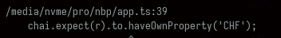

Dzięki liniom z pozwalającym na debug:

```ts
console.table(arr.map(l => l.filter((e,i) => i < 3 || Math.abs(i - 27) < 5)));
```

oraz

```ts
console.dir(settings, {depth: Infinity});
```

widzimy, że problemem są zupełnie puste linie.

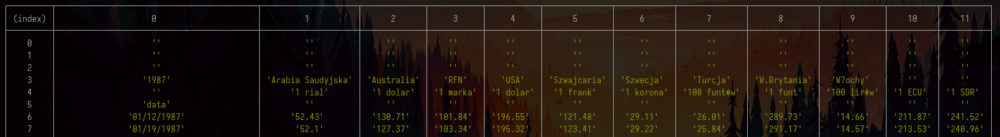

Przyczyną błędu jest sztywne trzymanie się konkretnego wiersza jako miejsca gdzie trzymamy dzielniki czy nazwy walut, a tymczasem powinniśmy skasować puste linie przez wykryciem nagłówków.

Jest to powszechny problem przy parsowaniu plików excel. Użytkownicy mogąc przygotować dane w bardzo dowolnej strukturze często nie trzymają się konwencji umieszczania nagłówków w tan sam sposób we wszystkich plikach.

Użyjemy tu funkcji `test` i wyrażenia regularnego oznaczającego same przecinki lub nic w całej linii:

```ts
const DROP_EMPTY_LINES = (e:string) => !/^,*$/.test(e)
```

Dołączymy ją za `DROP_SPACES` w funkcji `filter`.

```ts
const arr = fs
  .readFileSync(`${rawDir}/${name}`)
  .toString()
  .split(`\n`)
  .map(DROP_SPACES)
  .filter(DROP_EMPTY_LINES)
  .filter(ROWS_FILTER)
  .map(l => l.split(',')
```

Tym razem znowu nie działa. Powodem jest bardzo nietypowa linia w jednym z plików.

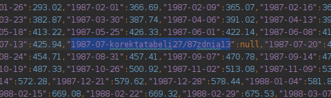

Korekta Kursu z 1987? Jak to? Faktycznie w `xls` mamy coś takiego:

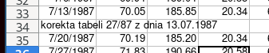

Jednak dotyczy ona waluty `ECU` więc najrozsądniej jest pominąć tą linię zaostrzając kryteria rozpoznawania dat.

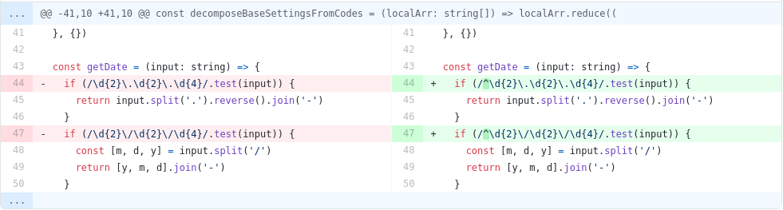

Cały kod z tego etapu znajduje się pod linkiem:

[app.ts · 845527b631054744329b53293bfbf6705956b361 · gustawdaniel / nbp

GitLab.com

GitLab

](https://gitlab.com/gustawdaniel/nbp/-/blob/845527b631054744329b53293bfbf6705956b361/app.ts)

Jednak jego wykonanie wciąż powoduje błędy

```json
[
  {
    CHF: {
      col: 27,
      div: NaN,
      values: [ { '1988-12-27': NaN }, { '1989-01-02': NaN } ]
    }
  }
]
```

Po głębszym sprawdzeniu okazuje się, że problem stanowi linia, która była prawie pusta, ale nie całkowicie pusta:

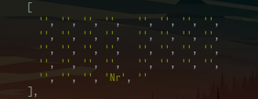

Ktoś umieścił w niej `Nr` na zupełnie nie znaczącej kolumnie. Wracamy więc do kodu i usuniemy tą linię kolejnym filtrem: `DROP_JUNK_LINES`, umieszczonym przed `DROP_EMPTY_LINES`.

Kiedy pisałem ten kod wracałem do tego filtru jeszcze kilka razy. Nie będę odtwarzał tego tym razem lecz uproszczę i podam finalną wartość tej funkcji:

```ts
const DROP_JUNK_LINES = (l: string): string => l.replace(/(Nr)|(data)|(WALUTA\/CURRENCY)|(\.tab)/ig, '')
```

Okazało się, że w tej linii były:

* Nr
* data
* Waluta/Currency
* .tab

Te rzeczy czasami z dużych liter, a co mnie najbardziej zaskoczyło było też \`W A L U T A / C U R R E N C Y\`. Na szczęście dzięki mapie `DROP_SPACES` i flagom `g` oraz `i` w mapie `DROP_JUNK_LINES` filter `DROP_EMPTY_LINES` traktuje te wszystkie linie jako tak samo puste czyli potrzebne.

```diff
     .split(`\n`)
     .map(DROP_SPACES)
+    .map(DROP_JUNK_LINES)
     .filter(DROP_EMPTY_LINES)
     .filter(ROWS_FILTER)
```

Po wprowadzeniu tych poprawek możemy zobaczyć wymaganą strukturę dla kolejnych plików:

```json
[
  {
    CHF: {
      col: 30,
      div: 1,
      values: [
        { '1988-12-27': 910.9 },
        { '1989-01-02': 904.29 },
        { '1989-01-09': 915.44 }
...
```

Link do zmiany w kodzie

[Dropped junk lines (fd13a96c) · Commits · gustawdaniel / nbp

GitLab.com

GitLab

](https://gitlab.com/gustawdaniel/nbp/-/commit/fd13a96ceb1effe2471445a1e954600fb51c56af)

Wystarczy jednak zmienić przetworzyć kilka kolejnych plików aby wrócić do punktu wyjścia, zobaczyć

```json
[ {} ]
```

i naprawiać od nowa.

Co stało się tym razem?

Pomoże nam wydrukowanie tablicy z plikiem `CSV` po przetworzeniu

```ts
console.table(arr.map(e => e.filter((e,i) => i < 10)));
```

żeby zobaczyć zupełnie nową organizację nagłówka oraz zmianę kolumny z datą

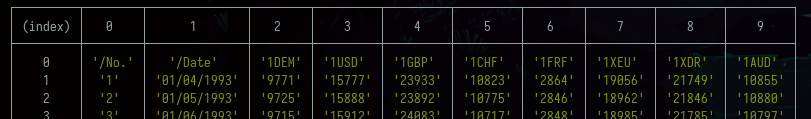

Tym razem zarówno waluta jak i dzielnik umieszczone są w tej samej linii. Więc obsłużymy przypadek `else` po linii

```ts
if (Object.keys(settings).length) {
```

użyjemy do tego funkcji `decomposeBaseSettingsFromCodes` zdefiniowanej jako

```ts
const decomposeBaseSettingsFromCodes = (localArr: string[]) => localArr.reduce((p: YearData, n: string, i: number): YearData => {
  const [, div, curr] = n.match(/^(\d+)(\w+)$/) || []
  if (parseInt(div) && curr && Object.values(dict).includes(curr)) {
    p[curr] = { col: i, div: parseInt(div), values: [] }
  }
  return p
}, {})
```

Co ona zmienia?

* Rozkłada za pomocą `match` wartość na dzielnik `div` oraz kod waluty
* Nie potrzebuje kolejnej instrukcji `shift` do wydobycia dzielnika

Z tego względu zostanie ona wkomponowana w kod następująco

```ts
const head = arr.shift()
if (!head) throw Error('File do not have header line.')
let settings: YearData = decomposeBaseSettingsFromNames(head)
if (Object.keys(settings).length) {
  const subHead = arr.shift()
  if (!subHead) throw Error('File do not have sub-header line.')
  Object.keys(settings).forEach(key => {
    settings[key].div = parseInt(subHead[settings[key].col])
  })
} else {
  settings = decomposeBaseSettingsFromCodes(head)
}
```

Kolejny problem to liczby porządkowe w pierwszej kolumnie zamiast dat. Datami zajmiemy się zastępując funkcję `getDate` funkcją `getDateFromArr`

```ts
const getDateFromArr = (arr: string[]) => {
  return getDate(arr[0]) || getDate(arr[1])
}
```

teraz jest ona używana tak:

```diff
arr.forEach(localArr => {
-  const date = getDate(localArr[0])
+  const date = getDateFromArr(localArr)
  if (typeof date === 'string') {
    Object.keys(settings).forEach(key => {
      settings[key].values.push({ [date]: parseFloat(localArr[settings[key].col]) / settings[key].div })
    })
  }
})
```

Poprawki można zobaczyć w commicie:

[Fixed decoding codes and column with indexes (81db32a6) · Commits · gustawdaniel / nbp

GitLab.com

GitLab

](https://gitlab.com/gustawdaniel/nbp/-/commit/81db32a6bb6d1b25569680a1605961d6efa8b190)

Czy to wszystkie problemy? Absolutnie nie. W roku 2008 zastosowano jeszcze inną konwencję.

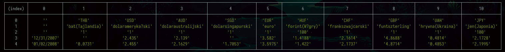

Polega ona na nie umieszczeniu nigdzie "Szwajcaria", ani nigdzie "1CHF", zatem obie metody rozpoznające zawodzą. Co powinniśmy zrobić? Możemy rozpisać algorytm rozpoznawania nagłówków następująco:

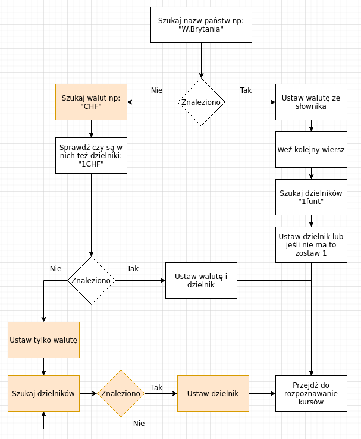

Kolorem pomarańczowym zaznaczyliśmy brakujące elementy.

Ponieważ wyszukiwanie dzielnika się powtarza wydzielimy to do osobnej funkcji:

```ts
const extendSettingsByDivCoefficient = (arr: string[][], settings: YearData) => {
  const subHead = arr.shift()
  if (!subHead) throw Error('File do not have sub-header line.')
  Object.keys(settings).forEach(key => {
    settings[key].div = parseInt(subHead[settings[key].col])
  })
}
```

Nie powinniśmy trzymać w `main` zbyt dużo kodu, bo traci on czytelność, więc całą logikę rozpoznawania nagłówków wyrzucamy do osobnej funkcji:

```ts
const recognizeSettingsFromHead = (arr: string[][]):YearData => {
  const head = arr.shift()
  if (!head) throw Error('File do not have header line.')
  let settings: YearData = decomposeBaseSettingsFromNames(head)
  if (Object.keys(settings).length) {
    extendSettingsByDivCoefficient(arr, settings);
  } else {
    settings = decomposeBaseSettingsFromCodes(head);
    while (Object.keys(settings).some(key => Number.isNaN(settings[key].div))) {
      extendSettingsByDivCoefficient(arr, settings);
    }
  }

  return settings;
}
```

W main zostanie w tym miejscu tylko:

```
const settings = recognizeSettingsFromHead(arr);
```

Dla parsowania dzielników kluczowy stał się warunek:

```
Number.isNaN(settings[key].div)
```

Zatem w rozkładzie ustawień na kody nie możemy już optymistycznie zakładać ustawienia tam `1` jako wartości domyślnej, ani wymuszać wystąpienia liczby przy kodzie waluty, anie wymagać.

Zmiany w funkcjach wykonujących wcześniej przetwarzanie nagłówków wyglądają tak

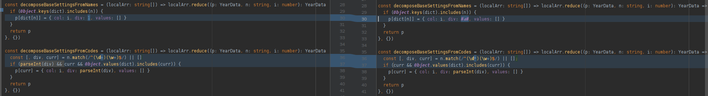

W ten sposób natomiast wygląda ich aktualny kod

```ts
const decomposeBaseSettingsFromNames = (localArr: string[]) => localArr.reduce((p: YearData, n: string, i: number): YearData => {
    if (Object.keys(dict).includes(n)) {
        p[dict[n]] = { col: i, div: NaN, values: [] }
    }
    return p
}, {})

const decomposeBaseSettingsFromCodes = (localArr: string[]) => localArr.reduce((p: YearData, n: string, i: number): YearData => {
    const [, div, curr] = n.match(/^(\d*)(\w+)$/) || []
    if (curr && Object.values(dict).includes(curr)) {
        p[curr] = { col: i, div: parseInt(div), values: [] }
    }
    return p
}, {})
```

Całość projektu na tym etapie:

[app.ts · 4bca2afc7fcac9779ea4afdf0bcda89a08f6ab52 · gustawdaniel / nbp

GitLab.com

GitLab

](https://gitlab.com/gustawdaniel/nbp/-/blob/4bca2afc7fcac9779ea4afdf0bcda89a08f6ab52/app.ts)

Jak widać, czyszczenie danych jest żmudnym procesem w którym problemy nigdy się nie kończą. Na szczęście te dane napływają w tempie jeden plik na rok i wygląda na to, że udało się je ustrukturyzować zanim upłynął ten czas.

Wykonanie kodu komendą

```bash
ts-node app.ts
```

wyświetli długie listy tabel i konfiguracji, ale nie rzuci żadnego błędu.

## Łączenie plików

Do połączenia plików wymagane są:

1\. dodanie typu wynikowego

```ts
interface OutData {
  [key: string]: {
    [key: string]: number
  }
}
```

3\. Przygotowanie funkcji łączącej

```ts
const mergeYears = (payload: YearData[]): OutData => {
  return payload.reduce((p: OutData, n: YearData) => {
    Object.keys(n).forEach(key => {
      if (p.hasOwnProperty(key)) {
        p[key] = {...p[key], ...n[key].values.reduce((p,n) => ({...p,...n}))}
      } else {
        p[key] = n[key].values.reduce((p,n) => ({...p,...n}))
      }
    })
    return p
  }, {})
}
```

4\. Dołączenie `mergeYears` przed `return` w funkcji `main`.

```ts
return mergeYears(fs.readdirSync(rawDir).filter(f => f.endsWith('csv'))
```

Wprowadzenie tych zmian pozwala zobaczyć kursy z całego zakresu

```json
{
  CHF: {
    '1984-01-02': 140.84,
    '1984-01-09': 140.08,
    '1984-01-16': 138.62,
...
```

Aby zapisać wynik dopiszemy lini:

```ts
!fs.existsSync(process.cwd() + '/out') && fs.mkdirSync(process.cwd() + '/out', {recursive: true})
fs.writeFileSync(process.cwd() + '/out/chf.json', JSON.stringify(main()))
```

Wykonanie:

```bash
time ts-node app.ts
```

zwróci:

```bash
ts-node app.ts  7.67s user 0.29s system 147% cpu 5.412 total
```

i spowoduje utworzenie pliku `/out/chf.json` o wadze `156K`.

Plik projektu zawierający `126` linii kodu dostępny jest pod linkiem:

[app.ts · 12edf429a1ddba80f04f29e0f9d2a0309aa372e2 · gustawdaniel / nbp

GitLab.com

GitLab

](https://gitlab.com/gustawdaniel/nbp/-/blob/12edf429a1ddba80f04f29e0f9d2a0309aa372e2/app.ts)

Jeśli potrzebujesz tych danych, możesz samodzielnie odtworzyć wszystkie kroki lub pobrać gotowe dane JSON z linku

[[https://chf-pnl.netlify.app/chf.json](https://chf-pln.netlify.app/chf.json)](https://goofy-franklin-2f9df8.netlify.app/chf.json)

# Wizualizacja

Nie mogę się oprzeć pokusie narysowania i omówienia kursu Franka Szwajcarskiego kiedy już udało mi się wydobyć kurs sprzed tak wielu lat. Szczególnie interesujący jest okres przed początkiem obecnego stulecia i boomem na kredyty w CHF z lat 2005-2008.

## Przygotowanie projektu

Do rysowania wykresów posłuży nam plik `index.html` o zawartości:

```html
<html>
<body>
<script src="./index.ts"></script>
</body>
</html>
```

oraz pustego `index.ts`. Teraz instalujemy `parcel`

```bash
npm install -g parcel-bundler
```

Jest to narzędzie do budowania jak `webpack`, `gulp` czy `grunt` z tym, że w przeciwieństwie do wymienionych jego konfiguracja nie zajmuje setek lat i nie wymaga wklejania konfiguracja oraz szukania paczek.

Po wpisaniu:

```bash
parcel index.html
```

zobaczymy komunikat o zbudowaniu oraz link do strony


Po otworzeniu linku i konsoli deweloperskiej a następnie dodaniu do `index.ts` linii `***console***.log("test")` zobaczymy automatyczne przeładowanie się strony i wpisanie "test" do konsoli.

## Integracja biblioteki do wykresów

Do rysowania wykresów użyjemy Apex Chatrs.

```bash
npm install apexcharts --save
```

Do body w pliku `index.html` dołączymy:

```
<main id='chart'></main>
```

żeby móc przyczepić wykres. Natomiast w `index.ts` konfigurację prostego wykresu giełdowego

```js
import ApexCharts from 'apexcharts'

const options = {
  series: [{
    data: [{
      x: new Date(1538778600000),
      y: [6629.81, 6650.5, 6623.04, 6633.33]
    },
      {
        x: new Date(1538780400000),
        y: [6632.01, 6643.59, 6620, 6630.11]
      }
    ]
  }],
  chart: {
    type: 'candlestick',
    height: 350
  },
  title: {
    text: 'CandleStick Chart',
    align: 'left'
  },
  xaxis: {
    type: 'datetime'
  },
  yaxis: {
    tooltip: {
      enabled: true
    }
  }
};

const chart = new ApexCharts(document.querySelector("#chart"), options);
chart.render().then(console.log).catch(console.error);
```

Można powiedzieć - super prostego:

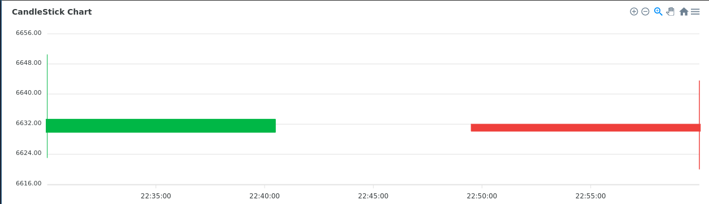

Jednak ta prostota ma cel. Pozwala nie zaśmiecać artykułu testowymi danymi, tylko kiedy już mamy strukturę danych do wykresu możemy wykonać transformację naszej struktury wydobytej z plików `xls`.

## Ułożenie danych na wykresie

Podsumujmy:

1. Nasza struktura

```
{
  CHF: {
    'YYYY-MM-DD': number,
    ...
  }
}
```

Struktura do wykresu:

```
{
  x: Date,
  y: [number, number, number, number] // open, high, low, close
}[]
```

Aby wykonać tą transformację musimy podzielić nasze dane na zakresy, to znaczy wybrać ile świec ma zawierać wykres. Następnie po wyliczeniu granicznych dat będziemy iterować po zakresach wybierając z dostępnych dat te, które mieszczą się w zakresie, z nich z kolei wyszukamy wartości początkowe, końcowe oraz skrajne.

Zaczniemy od importu pliku z danymi zapisanym przez skrypt z poprzedniej części:

```ts
import {CHF} from './out/chf.json'
```

Aby to poprawnie obsłużyć w pliku `tsconfig.json` dodajemy flagę `resolveJsonModule`

```json
{
  "compilerOptions": {
    "resolveJsonModule": true,
    ...
```

Teraz definiujemy interfejs z danymi wyjściowymi

```ts
interface StockRecord {
  x: Date,
  y: [number, number, number, number]
}
```

Do rozkładu funkcji na interwały wykorzystamy funkcję:

```ts
const splitDateIntoEqualIntervals = (startDate: Date, endDate: Date, numberOfIntervals: number): { start: Date, end: Date, avg: Date }[] => {
  const intervalLength = (endDate.getTime() - startDate.getTime()) / numberOfIntervals
  return [...(new Array(numberOfIntervals))]
    .map((e, i) => {
      return {
        start: new Date(startDate.getTime() + i * intervalLength),
        avg: new Date(startDate.getTime() + (i + 0.5) * intervalLength),
        end: new Date(startDate.getTime() + (i + 1) * intervalLength)
      }
    })
}
```

opisaną pod linkiem:

[divide date range into known number of equal chunks

I’ve seen Split date range into date range chunksand Split date range into several specific date range chunks, that is not what I’m looking for.I’m looking for simple function from momenjs, that ...

Stack Overflowdeathfry

](https://stackoverflow.com/questions/63273494/divide-date-range-into-known-number-of-equal-chunks)

Samo mapowanie danych zostało ułożone w kolejnej funkcji

```ts
const mapToStockData = (values: { [key: string]: number }, parts: number):StockRecord[] => {
  const entries = Object.entries(values)
  const start = new Date(entries[0][0])
  const end = new Date(entries[entries.length - 1][0])
  const intervals = splitDateIntoEqualIntervals(start, end, parts)

  const stockData: StockRecord[] = []

  while (intervals.length) {
    const int = intervals.shift()
    if (!int) break
    let currDate = int.start
    stockData.push({
      x: int.avg,
      y: [NaN, NaN, NaN, NaN]
    })

    const currStock = stockData[stockData.length - 1]
    let stat = {
      min: Infinity,
      max: -Infinity
    }

    while (currDate < int.end) {
      const [dateString, value] = entries.shift() || []
      if (!dateString || typeof value !== 'number') break
      currDate = new Date(dateString)
      if (isNaN(currStock.y[0])) currStock.y[0] = value
      currStock.y[3] = value
      stat.min = Math.min(stat.min, value)
      stat.max = Math.max(stat.max, value)
    }
    currStock.y[1] = stat.max
    currStock.y[2] = stat.min
  }

  return stockData
}
```

Ten dłuższy fragment kodu wymaga komentarza. Można było to zadanie zrealizować za pomocą map filtrów i pętli forEach, ale wybrałem podwójny while z podwójnym shiftem. Nie jest to przypadek. W tym wypadku chodzi o wydajność. O ile te bardziej modne i eleganckie metody są zawsze moim pierwszym wyborem, to w przypadku gdy redukcja złożoności obliczeniowej wymaga trzymania pewnego rodzaju cache robię wyjątek. Komunikacja między osobnymi wykonaniami metod `map`, `filter`, `reduce`, `forEach` jest trudniejsza, wymaga posługiwania się zmiennymi z wyższego zakresu. W szczególności zagnieżdżanie pętli domyślnie zakłada wykonanie `n x m` operacji gdzie `n` i `m` są wymiarami tablic. U nas jednak chcę wykonać raczej `n + m` przebiegów, nie chcę dwa razy przetwarzać, odrzucać, filtrować czy sprawdzać tego samego klucza w obiekcie z kursami jeśli to nie jest potrzebne.

O jakiej oszczędności mówimy?

Jeśli ten kod został by napisany nie wydajnie i nie ułożyli byśmy dobrze iteracji to może wyglądał by na bardziej czytelny i zwięzły, ale przy granulacji na 500 świec wykonał by `7200 x 500 = 3.6e6` pętli, tym czasem mamy ich około `7200 + 500 = 7.7e4` czyli około 50 razy krótszy czas ładowania.

Generowanie opcji to po prostu funkcja wkładająca dane do szablonu konfiguracji Apex Chart

```ts
const generateOptions = (data: StockRecord[]) => ({
  series: [{
    data
  }],
  chart: {
    type: 'candlestick',
    height: window.innerHeight - 50,
    zoom: {
      autoScaleYaxis: true
    }
  },
  title: {
    text: 'CandleStick Chart',
    align: 'left'
  },
  xaxis: {
    type: 'datetime'
  },
  yaxis: {
    tooltip: {
      enabled: true
    }
  }
})
```

Na końcu wykonanie programu, czyli załączenie danych do konfiguracji i utworzenie za jej pomocą wykresu:

```
const chart = new ApexCharts(document.querySelector('#chart'), generateOptions(mapToStockData(CHF, 500)))
chart.render().then(console.log).catch(console.error)
```

Wykres wygląda świetnie. Idealnie oddaje realia walutowego dzikiego zachodu z początku lat 90. Widzimy jak w 1991 inflacja wywindowała cenę franka o rzędy wielkości, oraz drastyczny spadek na początku 1995 spowodowany wejściem w życie ustawy o denominacji z 7 lipca 1994.

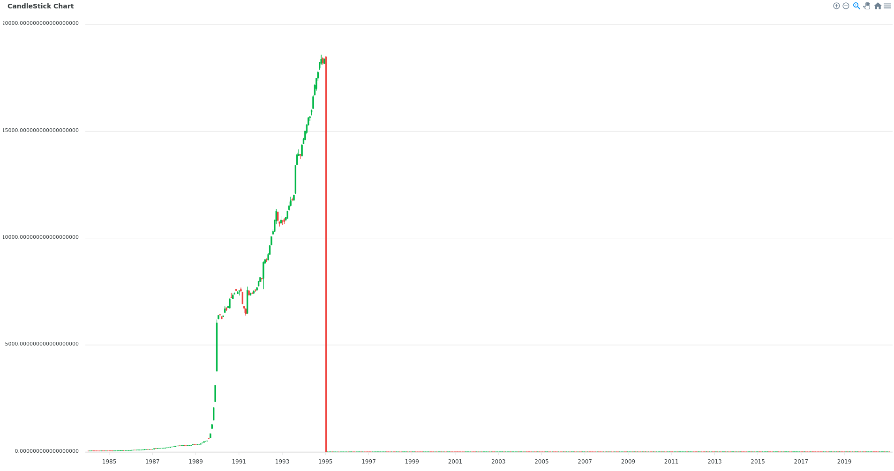

Nie wykrytym wcześniej problemem okazuje się tutaj błędne skalowanie z roku 1995.

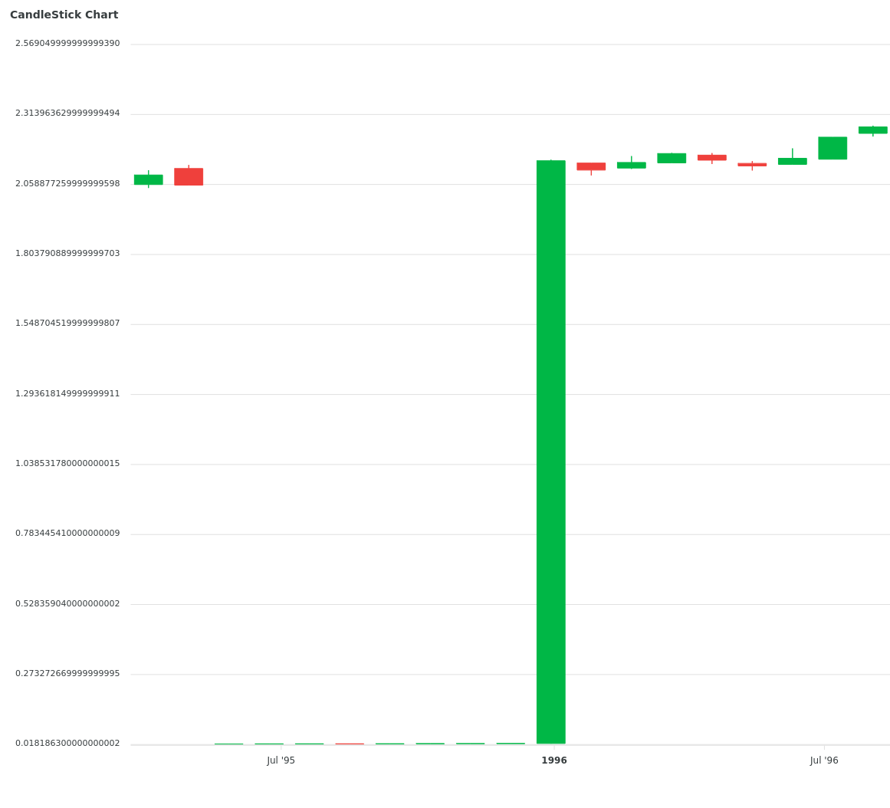

Faktycznie mamy zmianę mnożnika w trakcie roku 1995

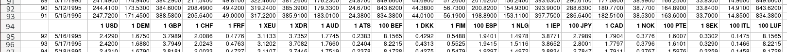

Ten problem możemy naprawić dodając linie przestawiające dzielnik jeśli jego zmiana nastąpi między wartościami, a nie w nagłówku:

```diff
             arr.forEach(localArr => {
                 const date = getDateFromArr(localArr)
+
+                const newSettings = decomposeBaseSettingsFromCodes(localArr)
+                if (Object.keys(newSettings).length) {
+                    Object.keys(settings).forEach(key => {
+                        settings[key].div = newSettings[key].div
+                    })
+                }
+
                 if (typeof date === 'string') {
                     Object.keys(settings).forEach(key => {
```

Kolejną zmianą będzie wprowadzenie normalizacji. Jeśli chcemy porównywać wartości na wykresie powinniśmy uwzględnić denominację. Pomoże nam w tym funkcja

```ts
const denominationFactor = (date:string): number => {
    return Number.parseInt(date.substr(0,4)) <= 1994 ? 1e4 : 1;
}
```

i włączenie jej wyniku w linii:

```ts
settings[key].values.push({[date]: parseFloat(localArr[settings[key].col]) / settings[key].div / denominationFactor(date)})
```

Ponowne wygenerowanie danych pozwala zobaczyć wykres

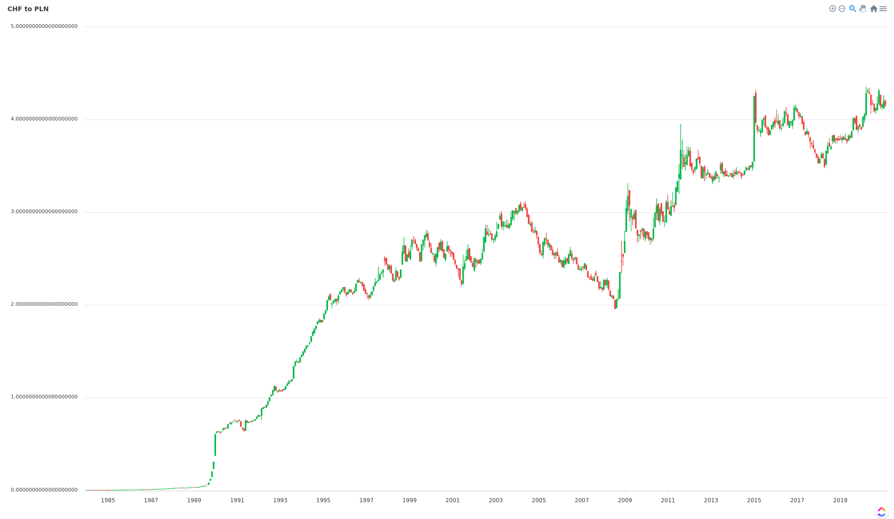

Aby wykonać deployment użyjemy serwisu Netlify.

[Kurs CHF w PLN

Wykres kursu Polskiej złotówki wzglęm Franka Szwajcarskiego. Od 1995 są PLN, wcześniej były PLZ.

Precise LabDaniel Gustaw

](https://chf-pln.netlify.app/)

W tym celu dołączamy `parcel` do zależności deweloperskich projektu:

```
 npm install -D parcel-bundler
```

I dodajemy w `package.json` komendę budującą

```json
  "scripts": {
    "build": "parcel build index.html",
  },
```

Po wybraniu w panelu Netlify katalogu `dist` oraz komendy `npm run build` możemy cieszyć się skonfigurowanym deploymentem CI.

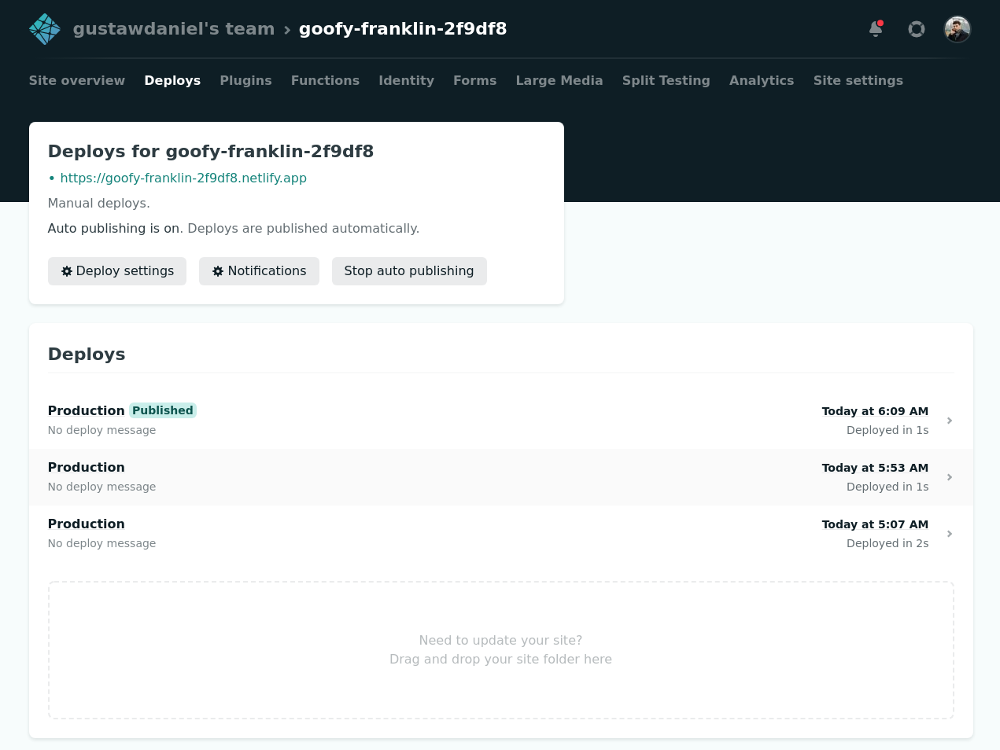

Na koniec kurs CHF od końcówki lat 90 do czasów współczesnych

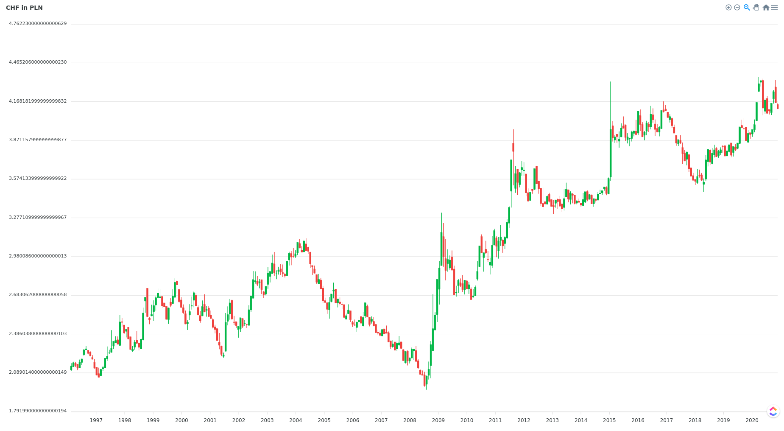

Tu dobrze widać, że rosnące osoby biorące kredyty w CHF w roku 2004 mogły przez 5 lat cieszyć się spadkiem siły nabywczej swojego zadłużenia, kolejne 4 lata wartość franka wracała do pierwotnego poziomu, lecz wówczas kredyt mógł być już spłacony. Osoby biorące go w latach 2006-2007 popełniały błąd zakładając, że ten trend będzie się utrzymywał przez dziesięciolecia.

# Wnioski

Czasami zdarza się, że w internecie nie potrafimy znaleźć danych, których potrzebujemy. W rozważanym scenariuszu potrzebowaliśmy pełnej historii kursu CHF do PLN. W takim przypadku może się zdarzyć, że musimy je składać samodzielnie. Jest to uciążliwe zadanie jeśli dane te są zaśmiecone ludzkimi modyfikacjami i nie mają nałożonej jednolitej struktury. Narysowanie wykresu, wybranie nagłówków oraz danych łącznie zajęło tyle samo czasu co poprawki i debugowanie oraz zmiany w logice spowodowane odkrywaniem różnych konwencji i zapisów w plikach NBP.

Jeśli chcesz ze mną porozmawiać o problemie podobnym do tego umów się na niezobowiązującą, bezpłatną konsultację.

Możesz też napisać do nas wypełniając formularz:

---

Artykuły, które pomogły w przygotowaniu tego wpisu

[Złote czasy franka - jak się zaczął kredytowy boom?

Nagła kredytowa kariera szwajcarskiego franka sprawiła, że tysiące Polaków co najmniej raz w miesiącu z niepokojem zerkają na notowania. Popularność zobowiązań w helweckiej walucie była wynikiem zbiegu kilku okoliczności w określonym momencie gospodarczej historii Polski. Kredytobiorcy, którzy w poł…

Bankier.plMichał Kisiel

](https://www.bankier.pl/wiadomosc/Zlote-czasy-franka-jak-sie-zaczal-kredytowy-boom-2894462.html)

[Denominacja złotego - Muzeum Historii Polski

Muzeum Historii Polski

](https://muzhp.pl/pl/e/1357/denominacja-zlotego)
