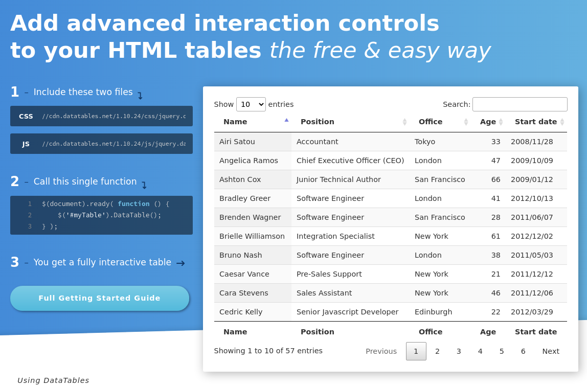
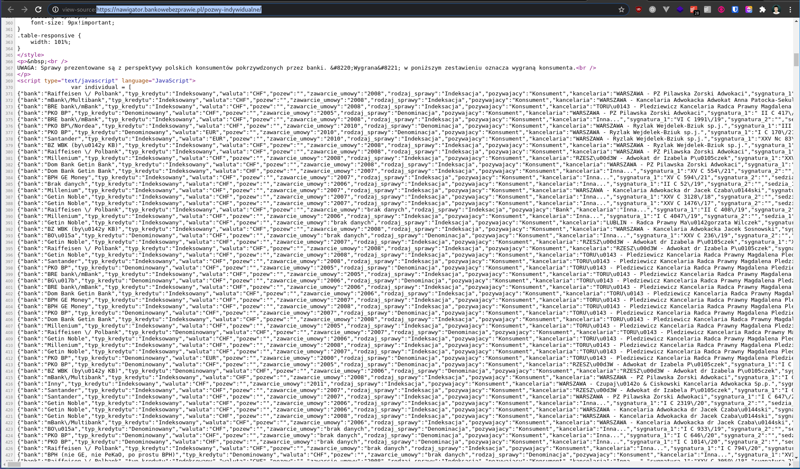
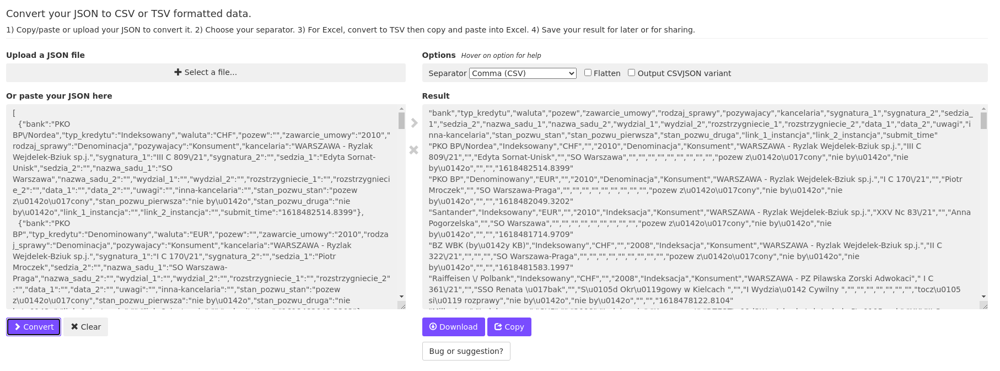

Nie często się zdarza, żeby wykonanie usługi trwało krócej niż jej wycenienie, ale przy scrapingu tak może się stać. Scraping przypomina pod tym względem hacking, że w zależności od zabezpieczeń i skomplikowania systemu, z którego pobieramy dane, może on być banalnie prosty lub stanowić poważne wyzwanie.

W tym wpisie pokażę jak wykonałem usługę scrapingu zanim zdążyłem ją wycenić. Nie napisałem żadnej linii kodu, a całość zajęła mi kilka minut.

## Czego potrzebował klient:

Zapytanie dotyczyły bazy wyroków sądowych ze strony

[https://nawigator.bankowebezprawie.pl/pozwy-indywidualne/](https://nawigator.bankowebezprawie.pl/pozwy-indywidualne/)

Dzięki wtyczce Wappalyzer możemy przeczytać, że to WordPress - antyczna technologia, która zwykle jest przyjazna dla scrapingu, bo jej wybór świadczy o braku funduszy na jakiekolwiek antyscrapingowe działania.

Tabela przeładowuje się w czasie rzeczywistym. Paginacja nie zmienia adresów url. Jest to typowe rozwiązanie dla paczki `datatable` będącej wtyczką `jquery`.

[https://datatables.net/](https://datatables.net/)

Na stronie tej wtyczki znajdziemy tą samą tabelę, tylko z odrobinę zmienionymi stylami:

Są to wystarczające poszlaki, by sądzić, że dane do tabeli są ładowane z jednej końcówki. Szybka analiza ruchu sieciowego nie pokazuje niczego ciekawego, ale pokazanie źródła strony już tak:

Reszta usługi polegała już tylko na zaznaczeniu tych kilu tysięcy linii tekstu i zapisaniu ich w pliku `json`. Potencjalnie dla wygody końcowego odbiorcy konwersja do `csv` lub `xlsx`, na przykład na stronie

[JSON to CSV - CSVJSON

Online tool for converting JSON to CSV or TSV. Convert JSON to Excel.

CSVJSON

](https://csvjson.com/json2csv)

Linki do pobranych danych:

[https://preciselab.fra1.digitaloceanspaces.com/blog/scraping/pc.json](https://preciselab.fra1.digitaloceanspaces.com/blog/scraping/pc.json)

[https://preciselab.fra1.digitaloceanspaces.com/blog/scraping/pc.json.xlsx](https://preciselab.fra1.digitaloceanspaces.com/blog/scraping/pc.json.xlsx)

Na końcu zaznaczę, że mimo, że dostęp do tych danych jest darmowy, to ludzie pracujący nad ich strukturyzacją robią to w ramach wolontariatu aby realizować cel postawiony przez stowarzyszenie:

> B) gromadzenie informacji o nieuczciwych praktykach przedsiębiorcy i innych przypadkach naruszeń prawa przez te podmioty oraz opracowywanie i upublicznianie informacji, artykułów, raportów i opinii w tym zakresie

[https://rejestr.io/krs/573742/stowarzyszenie-stop-bankowemu-bezprawiu](https://rejestr.io/krs/573742/stowarzyszenie-stop-bankowemu-bezprawiu)

Jeśli chcecie korzystać z ich pracy zachęcam Was do wsparcia ich na stronie

[https://www.bankowebezprawie.pl/darowizna/](https://www.bankowebezprawie.pl/darowizna/)

