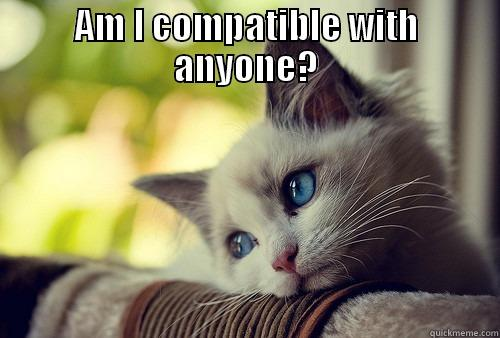
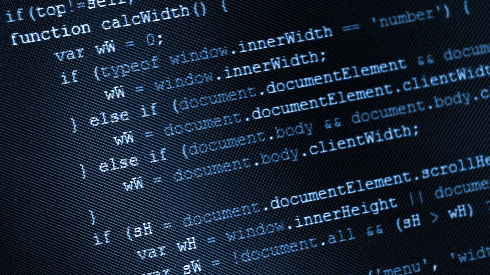
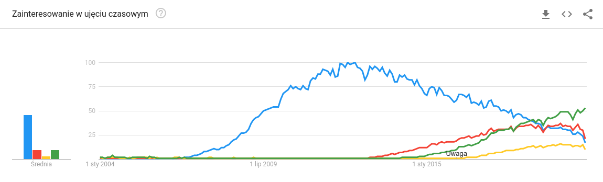

Problem niekompatybilnych wersji oprogramowania czy sprzętu prawdopodobnie nie raz przeszkadzał nam w codziennym życiu. Być może spotkałeś się z sytuacjami lub zauważyłeś:

* jak pytając kogoś o ładowarkę do telefonu 10 lat temu trzeba było ustalać czy na pewno pasuje
* jak BIOS był wypierany przez UEFI, bo nie wspierał startu systemów z dysków powyżej 2TB
* jaką stare gry z młodości sprawiały problemy na nowych systemach operacyjnych
* jak dwa portfele BTC potrafią dla tego samego seeda wyświetlać różne wartości stanu konta

Być może jako przedsiębiorca mierzyłeś się już z problemem migrowania swojego systemu informatycznego, albo jako programista walczyłeś z błędami powodowanymi aktualizacją jakiejś paczki.

Ten artykuł ma na celu pokazanie jak kompatybilność wsteczna wpływała na kierunek rozwoju technologii webowych.

Znajomość mechanizmów, które opiszę pomoże Ci łatwiej prognozować trendy w technologiach i optymalizować decyzje dotyczące tego w jaką technologię inwestować.

**Wojna o kompatybilność ukształtowała dzisiejszy web.**

Kwestia kompatybilności to nie tylko problemy zwykłych ludzi, a sprawa wpływająca znacznie na kierunku rozwoju cywilizacji. To dzięki niej, lub przez jej brak pewne technologie mogą rosnąć, a inne są zapominane.

Za przykład niech posłuży nam historia rozwoju frontendu webowego, którą w bardzo skróconej wersji przybliżę. Był początek millenium. Twórcy przeglądarek toczyli krwawą walkę o klientów, których próbowali przyciągnąć coraz to nowszymi funkcjonalnościami. Pracowali nad nimi niezależnie i kiedy je publikowali programiści uczyli się wprowadzonych przez przeglądarki specyfikacji i coraz bardziej załamywali ręce.

Często dla każdej przeglądarki trzeba było pisać osobny kod do wykonania tego samego zadania. Niektóre zmieniały interfejs programistyczny nawet z wersji na wersję kilka razy! Pisząc kod programista zamiast zapytać o szerokość okna, sprawdzał na początku o to z jaką przeglądarką ma do czynienia, później dopiero w długiej liście warunków wykonywał odpowiednie komendy stosownie do przeglądarki jaką wykrył

W tych warunkach w 2005 pojawiła się biblioteka jQuery. Stanowiła ona warstwę pośredniczącą między programistami webowymi a przeglądarkami. Błyskawicznie zaczęła zdobywać popularność, bo choć obciążała przeglądarki, to dzięki niej programista pisał znacznie mnie kodu, a dodatkowo to ona przejmowała odpowiedzialność za obsługę starych przeglądarek. Wraz ze zdobywanie popularności wprowadzała nowatorskie rozwiązania jak niektóre selektory do wyszukiwania elementów na stronie, które dopiero później znalazły się na stałe w standardach. Do jQuery napisano niezliczoną liczbę wtyczek i w 2012 stała się technologią, którą poznawał każdy programista jeśli chciał pisać strony internetowe.

Wszyscy wiedzieli, że kod bez jQuery działa często znacznie szybciej, ale ogromny sukces jQuery pokazuje jak wielka nagroda czeka tego kto rozwiąże problem kompatybilności, który pojawia się zawsze w momencie dynamicznego budowania nowoczesnych technologii.

Popularność jQuery zaczęła przygasać, dopiero kiedy stało się jasne, że twórcy przeglądarek dogadali się i uporządkowali proces wdrażania rekomendacji organizacji standaryzujących jak W3C. Ta organizacja powstała z kooperacji MIT i CERN przy poparciu DARPA i Komisji Europejskiej dba o to, żeby technologie webowe były kompatybilne i tworzy dokumentację dla twórców języków i przeglądarek. Budowa tego w przemyślany sposób pozwala obecnie na osiąganie znacznie trudniejszego celu - kompatybilności w przód. To znaczy, że standardy webowe projektowane są teraz tak, żeby ich późniejsze zmiany nie powodowały problemów w działaniu poprzednich wersji.

Jednak to nie koniec historii. Być może interesuje was, co się stało z technologiami webowymi po tym, jak jQuery przestawało powoli być już potrzebne.

W 2013 roku zaczęło być głośno o frameworku Angular Js stworzonym 4 lata wcześniej przez Google. W tym samym momencie Facebook ogłosił powstanie Reacta. Oba narzędzia wdrażały deklaratywny paradygmat budowania interfejsów za pomocą bezstanowych komponentów. Krótko mówiąc, programista definiował warunki mówiące jak frontend ma działać, a komponenty przejmowały odpowiedzialność za warstwę wizualną pozostawiając więcej uwagi programisty do pracy nad logiką biznesową. W uproszczeniu: każde z sprawiało, że kod pisało się jeszcze szybciej niż w jQuery.

Angular Js zaczął jako ten pierwszy i miał przewagę. Sam pamiętam jak przecierałem oczy ze zdziwienia oglądając jak mój przyjaciel pierwszy raz pokazał mi aplikację napisaną w Angularze Js w 2015 roku. Wszystko wskazywało wtedy, że warto uczyć się bardziej Angulara Js niż Reacta.

W 2016 wydany został Angular 2.0, już bez Js. Początkowo miał być po prostu kolejną wersją Angular Js, ale decyzje projektowe sprawiły, że nie był on kompatybilny z pierwszą wersją Angulara Js. Od początku wzbudzało to duże kontrowersje. Podobnie jak fakt, że od tego momentu nowe wersje miały wychodzić co pół roku, a kompatybilność wsteczna miała być trzymana tylko dwie wersje wstecz.

Frameworki webowe szybko rosły, było ich coraz więcej i rok 2017 stał się rokiem hasła "Jakiego nowego frameworka nauczę się dzisiaj?". W szkole programowania w której wykładałem zadawano sobie pytanie: "Jakiego frameworka mamy uczyć naszych kursantów?". Jej założyciel postawił na Reacta. Kompatybilność wsteczna była znaczącym czynnikiem tej decyzji.

Łatwo domyślić się, że wielu twórców materiałów edukacyjnych chciało, żeby raz wytworzony kurs przynosił im korzyści dłużej. Wielu programistów chciało uczyć się narzędzia, które będzie działało w ten sam sposób za rok i przy którym aktualizacje nie będą podbijać kosztów utrzymania.

W roku 2017 - czyli rok po nadużyciu przez Angulara zaufania budowanego przez kompatybilność wsteczną React wyprzedził Angulara i już nigdy nie wypuścił tej przewagi.

Jaka lekcja płynie z tej historii? Że kompatybilność jest jednym z kluczowych czynników, które należy traktować poważnie analizując lub planując rozwój technologii.

Źródła do dalszej lektury:

Kompatybilność na przykładzie monitorów

[https://www.eizo.pl/baza-wiedzy/od-displayport-po-d-sub-przeglad-zlaczy-wideo-w-monitorach-lcd/](https://www.eizo.pl/baza-wiedzy/od-displayport-po-d-sub-przeglad-zlaczy-wideo-w-monitorach-lcd/)

Komisja Europejska chce zmusić Apple do porzucenia Lightning w iPhone'ach

[https://www.spidersweb.pl/2018/08/iphone-ladowarka-lightning.html](https://www.spidersweb.pl/2018/08/iphone-ladowarka-lightning.html)

Problemy z BIOS i dyskami

[http://itfocus.pl/dzial-it/storage/duze-dyski-duze-klopoty/](http://itfocus.pl/dzial-it/storage/duze-dyski-duze-klopoty/)

Historia W3C

[http://www.tlumaczenia-angielski.info/w3c/history.html](http://www.tlumaczenia-angielski.info/w3c/history.html)
