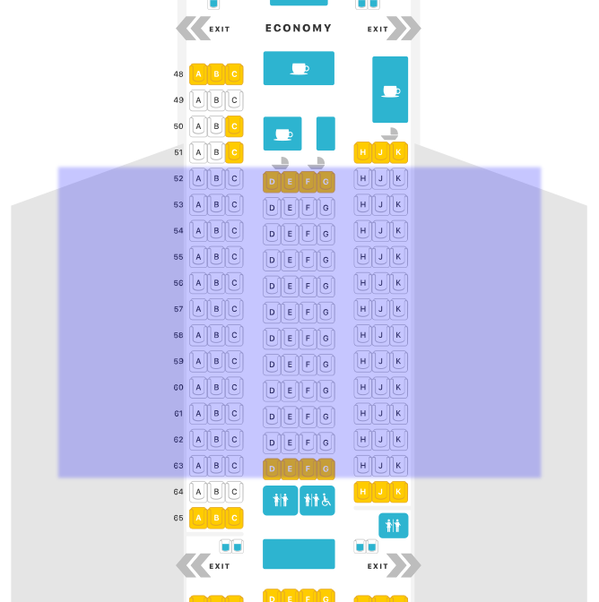
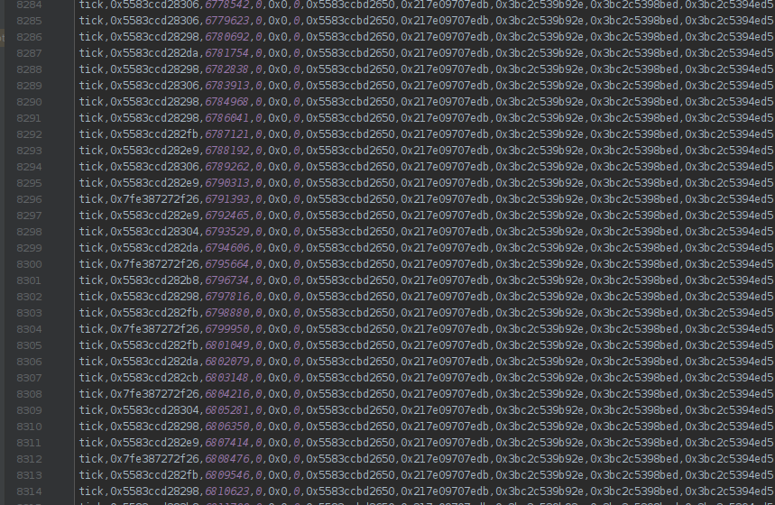
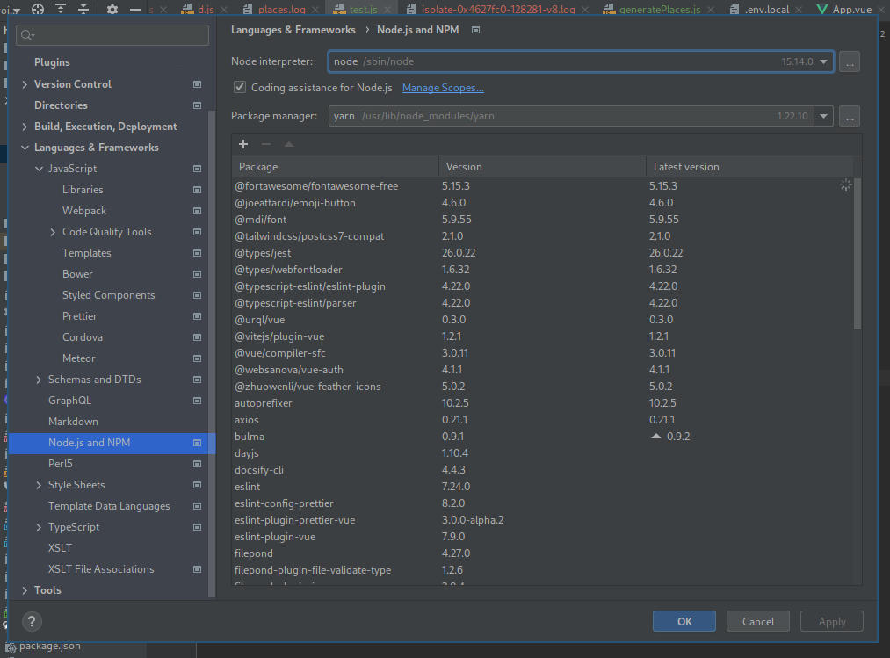
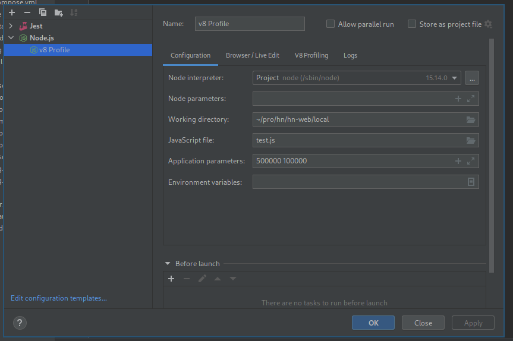
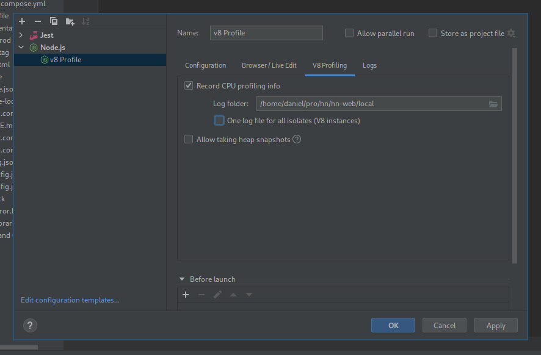
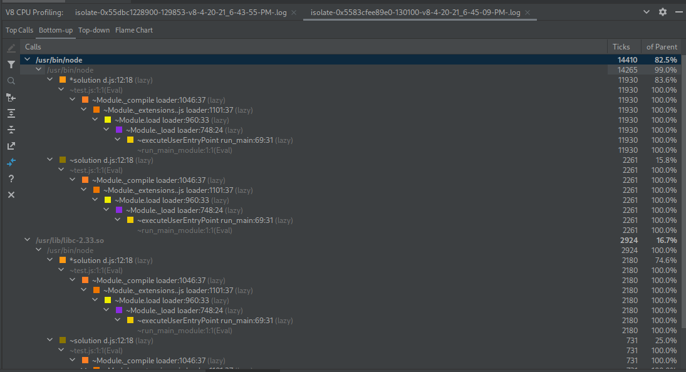
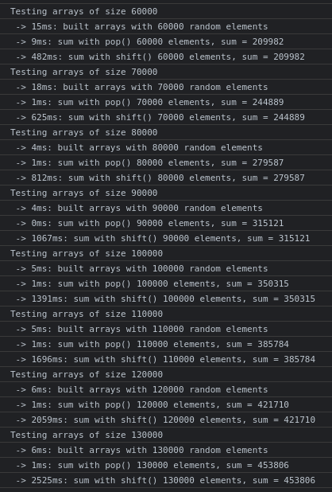
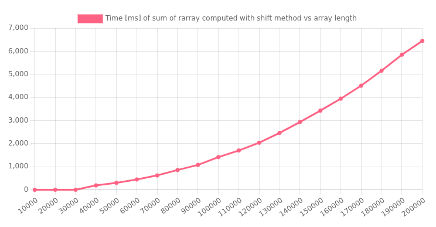
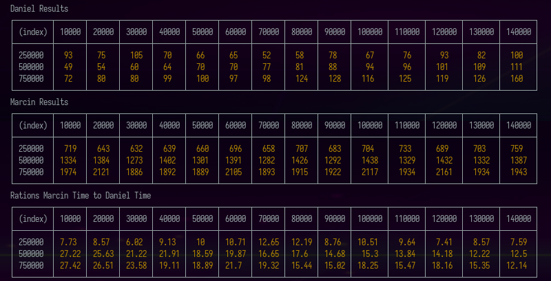

Omówimy dwa rozwiązania zadania, które stosowane było podczas pewnej rekrutacji. Jeśli potraficie pisać kod, zalecam wam samodzielne rozwiązanie po przeczytaniu treści, zajmie to około 10 do 30 minut i pozwoli Wam porównać wasze rozwiązanie z tymi prezentowanymi poniżej:

## Treść zadania

W samolocie rozmieszczone są miejsca. Tworzą one trzy zestawy zawierające kolejno 3, 4 i 3 siedzenia sąsiadujące ze sobą. Zakładamy, że wiersze liczone są od 1 a kolumny indeksowane za pomocą liter alfabetu jak w tabeli EXCEL (od A do K). Schemat samolotu przedstawia poniższy rysunek. Zakładamy, że wszystkie miejsca mają taki sam układ jak te oznaczone na niebiesko.



Zakładamy, że samolot ma długość `N` rzędów z miejscami. Znamy też aktualne zapełnienie miejsc, które zapisane jest w postaci ciągu znakowego `S` jako oddzielone spacją współrzędne numeru wiersza i kolumny, np:

```
S=1A 3C 2B 40G 5A
```

oznacza zajęcie miejsc `1A`, `3C`, `2B`, `40G` oraz `5A`.

Naszym celem jest napisanie funkcji, która zliczy ile 3 osobowych rodzin wymagających zajęcia miejsc bezpośrednio obok siebie zmieści się w samolocie.

Na przykład dla danych:

```
const S = "1A 2F 1C"
const N = 2;
```

poprawnym wynikiem będzie 4.

---

To jest najlepsze miejsce, aby wykonać to zadanie samodzielnie i porównać z prezentowanymi poniżej rozwiązaniami.

## Rozwiązanie Marcina

Pierwsze rozwiązanie wytworzył mój kolega Marcin. Ma ono krótki, czytelny kod. Rozpina dwuwymiarową tablicę wszystkich miejsc, oznacza zaznaczone wartościami `false`, na końcu przechodzi po rzędach doliczając wolne sloty w oparciu o stosowne kryteria dla każdego z nich.

```javascript
function solution(N, S) {
  const seatNames = {
    'A': 0,
    'B': 1,
    'C': 2,
    'D': 3,
    'E': 4,
    'F': 5,
    'G': 6,
    'H': 7,
    'J': 8,
    'K': 9
  }
  const freeSeats = Array.from({length: N}, () => Array.from({length: 10}, () => true))
  const reservedSeats = S.split(' ');
  reservedSeats.forEach(s => {
    try {
      freeSeats[parseInt(s.substring(0, s.length - 1)) - 1][seatNames[s[s.length - 1]]] = false;
    } catch (e) {
      console.log('Some error @ reserved seat marked: ', s)
    }
  })

  let free3seats = 0
  freeSeats.forEach(rs => {
    if (rs[0] && rs[1] && rs[2]) free3seats++;
    if ((rs[3] && rs[4] && rs[5]) || (rs[4] && rs[5] && rs[6])) free3seats++;
    if (rs[7] && rs[8] && rs[9]) free3seats++;
  })

  return free3seats
}

module.exports = {solution};
```

## Rozwiązanie Daniela

Drugie posługuje się bezpośrednio tablicą slotów, składając je w jeden wymiar. Nie stosując struktury danych o indeksowaniu analogicznym do miejsc zmuszeni jesteśmy indeks slotu wyliczać za każdym razem z rzędu oraz instrukcji warunkowych nałożonych na kolumny. Kod jest trudniejszy do czytania i wymaga kilku linii komentarzy z opisem przyjętej konwencji. Jego zaletą jest operowanie na mniejszej strukturze danych, a wadą bardziej złożone instrukcje warunkowe.

```javascript
// DOCS
// slot 1 = empty
// slot 0 = taken
// slot "r" = taken from right
// slot "l" = taken from left

function markCorner(slots, nr, side) {
  if (slots[(nr - 1) * 3 + 1] === 1) slots[(nr - 1) * 3 + 1] = side;
  else if (slots[(nr - 1) * 3 + 1] === (side === 'l' ? 'r' : 'l')) slots[(nr - 1) * 3 + 1] = 0;
}

function solution(N, S) {
  const slots = [...new Array(3 * N)].map(() => 1);
  const places = S.split(' ');
  while (places.length) {
    const place = places.shift();
    const nr = place.slice(0, -1);
    const letter = place.charAt(place.length - 1);

    if (['A', 'B', 'C'].includes(letter)) {
      slots[(nr - 1) * 3] = 0;
    }

    if (['H', 'J', 'K'].includes(letter)) {
      slots[(nr - 1) * 3 + 2] = 0;
    }

    if (['E', 'F'].includes(letter)) {
      slots[(nr - 1) * 3 + 1] = 0;
    }

    if (['D'].includes(letter)) {
      markCorner(slots, nr, 'l');
    }

    if (['G'].includes(letter)) {
      markCorner(slots, nr, 'r');
    }
  }

  return slots.reduce((p, n) => p + Boolean(n), 0);
}

module.exports = {solution};
```

## Porównanie wydajności rozwiązań

W celu porównania szybkości działania tych kodów dopiszemy generator współrzędnych z miejscami:

```
const fs = require('fs');

function letter() {
  return ['A', 'B', 'C', 'D', 'E', 'F', 'G', 'H', 'J', 'K'][Math.floor(Math.random() * 10)];
}

function row(N) {
  return Math.floor(Math.random() * N + 1);
}

function tempPath(N, M) {
  return `/tmp/.cache.generate-places-${N},${M}.log`;
}

// '1A 3C 2B 40G 5A'
function generatePlaces(N, M) {
  if (fs.existsSync(tempPath(N, M))) {
    return fs.readFileSync(tempPath(N, M)).toString();
  }

  let res = [];
  while (res.length < M) {
    const n = `${row(N)}${letter()}`;
    if (!res.includes(n)) {
      res.push(n);
    }
  }
  const out = res.join(' ');

  fs.writeFileSync(tempPath(N, M), out);

  return out;
}

module.exports = generatePlaces;
```

Linie z `fs` pozwalają nam na zapis wygenerowanej listy miejsc w cache i nie generowanie jej od nowa przy powtarzaniu testów.

Tworzymy też skrypt testujący szybkość działania obu algorytmów:

```
const d = require('./d');
const m = require('./m');
const generatePlaces = require('./generatePlaces');

if (process.argv.length !== 4) {
  throw new Error('Type `node test.js N M`');
}

const N = parseInt(process.argv[2]) || 50;
const M = parseInt(process.argv[3]) || 10;

const params = [N, generatePlaces(N, M)];

console.time('m');
const endM = m.solution(...params);
console.timeEnd('m');

console.time('d');
const endD = d.solution(...params);
console.timeEnd('d');

console.log(endM, endD);
```

Hipotetycznie załóżmy, że mamy bardzo długi samolot (pół miliona rzędów). Sprawdzimy po kolei przypadki prawie pustego lotu `1000` zajętych miejsc. Liczba występująca po `m` to czas dla rozwiązania `Marcina`, a po `d` to czas dla `Daniela`.

```
time node test.js 500000 1000
m: 1.339s
d: 151.637ms
```

Widzimy, że rozwiązanie zliczające jedynie sloty wykrywa 8.8 raza pod względem szybkości. Dla `20k` zajętych już miejsc:

```
time node test.js 500000 20000
m: 1.462s
d: 276.517ms
```

ta przewaga spada do 5.3 raza. Jeśli zajętych miejsc będzie `40k`, to wyniki będą różnić się następująco:

```
time node test.js 500000 40000
m: 1.386s
d: 606.803ms
```

Rozwiązanie Daniela wciąż będzie szybsze, ale tylko 2.2 razy. Dla `80k` zajętych miejsc sytuacja się odwraca i rozwiązanie Marcina staje się 1.62 razy szybsze.

```
time node test.js 500000 80000
m: 1.385s
d: 2.257s
```

Przy `100k` miejsc skrypt Marcina osiąga już 4.7 raza lepsze wyniki

```
time node test.js 500000 100000
m: 1.413s
d: 6.656s
```

---

## Pułapka

Gdybyśmy nie zachowali ostrożności mogli byśmy uznać, że finalnym wnioskiem były by zdania: "Algorytm Daniela sprawdza się lepiej przy pustym samolocie, a Marcina przy pełnym" oraz "Algorytm Daniela silnie zależy od ilości miejsc, a Marcina ma stabilny mniej więcej stały czas działania".

Tak wynika z testów, ale jeśli wytniemy z pomiarów kod Marcina to dla takiego kodu testującego

```
const d = require('./d');
// const m = require('./m');
const generatePlaces = require('./generatePlaces');

if (process.argv.length !== 4) {
  throw new Error('Type `node test.js N M`');
}

const N = parseInt(process.argv[2]) || 50;
const M = parseInt(process.argv[3]) || 10;

const params = [N, generatePlaces(N, M)];

// console.time('m');
// const endM = m.solution(...params);
// console.timeEnd('m');

console.time('d');
const endD = d.solution(...params);
console.timeEnd('d');

// console.log(endM, endD);
```

wynik pomiaru czasu znacznie wzrośnie:

```
time node test.js 500000 100000
d: 26.454s
node test.js 500000 100000  26.42s user 0.08s system 99% cpu 26.524 total
```

A w ten sam wyizolowany sposób testując kod Marcina dostaniemy ponownie ten sam wynik zbliżony do półtorej sekundy

```
time node test.js 500000 100000
m: 1.437s
node test.js 500000 100000  1.66s user 0.09s system 115% cpu 1.515 total
```

Do profilowania możemy użyć flagi `--porf`, spowoduje ona powstanie pliku z logami o wielkości około `4MB`.

Jego przeglądanie nie jest łatwe jeśli nie wie się czego szukać. Ten plik wygląda mniej więcej tak:



Na szczęście Webstorm ma ciekawe narzędzia do profilowania, które pod spodem robią to samo co ta flaga, ale nakładają graficzną nakładkę i wykresy, które pozwalają na odnalezienie się w logach i szybkie dotarcie do źródła problemu. Aby skonfigurować profilowanie zaznaczamy w ustawieniach `Coding assistance for Node.js`



Następnie tworzymy profil, który wystartuje nasz skrypt z odpowiednimi parametrami



a w zakładce `V8 Profiling` zaznaczamy opcję profilowania.



Po wybraniu zielonego trójkąta startującego profilowanie


zobaczymy logi uporządkowane względem procentowego udziału w czasie wykonywania.



Ten widok pozwala wyłowić najcięższe funkcje względem całkowitego czasu wykonywania. Więcej o profilowaniu możesz poczytać w dokumentacji WebStorms.

[V8 CPU and memory profiling | WebStorm

WebStorm Help

](https://www.jetbrains.com/help/webstorm/v8-cpu-and-memory-profiling.html#ws_node_cpu_profiling)

Ponowny przegląda kodu i zestawienie logów z informacją, że to ilość zajętych miejsc tak bardzo obniża wydajność skryptu wskazują, że należy szukać problemu w funkcji `shift`

```
const place = places.shift();
```

Poświęcono temu wątek na stack overflow

[Why is pop faster than shift?

Douglas Crockford, in JavaScript: The Good Parts, states that “shift is usually much slower than pop”. jsPerf confirms this. Does anyone know why this is the case? From an unsophisticated point of ...

Stack Overflowzjmiller

](https://stackoverflow.com/questions/6501160/why-is-pop-faster-than-shift)

Zmiana tej jednej linii

```
const place = places.shift();
```

na

```
const place = places.pop();
```

w algorytmie Daniela przywraca mu poprawne tępo działania nie zależnie od tego czy kod Marcina jest wykonywany, czy nie

```
time node test.js 500000 100000
m: 1.449s
d: 233.327ms
1421226 1421226
node test.js 500000 100000  1.89s user 0.13s system 114% cpu 1.768 total
```

oraz

```
time node test.js 500000 100000
d: 238.217ms
node test.js 500000 100000  0.27s user 0.04s system 101% cpu 0.311 total
```

Po delikatnej modyfikacji kodu napisanego przez `bhirt` na Slack Overflow:

```
let sum;
const tests = new Array(8).fill(null).map((e, i) => (i + 6) * 10000);

console.log(JSON.stringify(process.versions));

tests.forEach(function (count) {
  console.log('Testing arrays of size ' + count);
  let s1 = Date.now();
  let sArray = new Array(count);
  let pArray = new Array(count);
  for (let i = 0; i < count; i++) {
    const num = Math.floor(Math.random() * 6) + 1;
    sArray[i] = num;
    pArray[i] = num;
  }
  console.log(' -> ' + (Date.now() - s1) + 'ms: built arrays with ' + count + ' random elements');

  s1 = Date.now();
  sum = 0;
  while (pArray.length) {
    sum += pArray.pop();
  }
  console.log(
    ' -> ' + (Date.now() - s1) + 'ms: sum with pop() ' + count + ' elements, sum = ' + sum
  );

  s1 = Date.now();
  sum = 0;
  while (sArray.length) {
    sum += sArray.shift();
  }
  console.log(
    ' -> ' + (Date.now() - s1) + 'ms: sum with shift() ' + count + ' elements, sum = ' + sum
  );
});
```

widzimy, że najnowsza wersja `node` nie naprawiła tego problemu

```
{"node":"15.8.0","v8":"8.6.395.17-node.23","uv":"1.40.0","zlib":"1.2.11","brotli":"1.0.9","ares":"1.17.1","modules":"88","nghttp2":"1.42.0","napi":"7","llhttp":"2.1.3","openssl":"1.1.1i","cldr":"38.1","icu":"68.2","tz":"2020d","unicode":"13.0"}
Testing arrays of size 60000
 -> 12ms: built arrays with 60000 random elements
 -> 5ms: sum with pop() 60000 elements, sum = 209556
 -> 1057ms: sum with shift() 60000 elements, sum = 209556
Testing arrays of size 70000
 -> 20ms: built arrays with 70000 random elements
 -> 1ms: sum with pop() 70000 elements, sum = 244919
 -> 1476ms: sum with shift() 70000 elements, sum = 244919
Testing arrays of size 80000
 -> 5ms: built arrays with 80000 random elements
 -> 0ms: sum with pop() 80000 elements, sum = 279502
 -> 1993ms: sum with shift() 80000 elements, sum = 279502
Testing arrays of size 90000
 -> 4ms: built arrays with 90000 random elements
 -> 0ms: sum with pop() 90000 elements, sum = 313487
 -> 2601ms: sum with shift() 90000 elements, sum = 313487
Testing arrays of size 100000
 -> 4ms: built arrays with 100000 random elements
 -> 1ms: sum with pop() 100000 elements, sum = 350059
 -> 3263ms: sum with shift() 100000 elements, sum = 350059
Testing arrays of size 110000
 -> 8ms: built arrays with 110000 random elements
 -> 1ms: sum with pop() 110000 elements, sum = 384719
 -> 4154ms: sum with shift() 110000 elements, sum = 384719
Testing arrays of size 120000
 -> 7ms: built arrays with 120000 random elements
 -> 0ms: sum with pop() 120000 elements, sum = 419326
 -> 5027ms: sum with shift() 120000 elements, sum = 419326
Testing arrays of size 130000
 -> 8ms: built arrays with 130000 random elements
 -> 0ms: sum with pop() 130000 elements, sum = 454068
 -> 5702ms: sum with shift() 130000 elements, sum = 454068
```

W przeglądarce te operacje trwają dwa razy krócej ale i tak różnica między `pop` a `shift` jest ogromna i każde 50-100 elementów tablic dodaje milisekundę do czasu wykonywania `shift`.



Przerabiając ten kod do testowania po raz drugi możemy uzyskać wersję, która będzie dobrze działać w przeglądarce i pozwoli na wygenerowanie danych do narysowania wykresu:

```
var sum;
var res = [];
var tests = new Array(20).fill(null).map((e, i) => (i + 1) * 10000);

tests.forEach(function (count) {
  console.log('Testing arrays of size ' + count);
  let s1 = Date.now();
  let sArray = new Array(count);
  let pArray = new Array(count);
  for (let i = 0; i < count; i++) {
    const num = Math.floor(Math.random() * 6) + 1;
    sArray[i] = num;
    pArray[i] = num;
  }
  console.log(' -> ' + (Date.now() - s1) + 'ms: built arrays with ' + count + ' random elements');

  s1 = Date.now();
  sum = 0;
  while (pArray.length) {
    sum += pArray.pop();
  }
  console.log(
    ' -> ' + (Date.now() - s1) + 'ms: sum with pop() ' + count + ' elements, sum = ' + sum
  );

  s1 = Date.now();
  sum = 0;
  while (sArray.length) {
    sum += sArray.shift();
  }
  res.push([count, Date.now() - s1]);
  console.log(
    ' -> ' + (Date.now() - s1) + 'ms: sum with shift() ' + count + ' elements, sum = ' + sum
  );
});
```

Wykres zależności czasu od długości tablicy wygenerujemy w `chart.js`

[Getting Started | Chart.js

Open source HTML5 Charts for your website

Chart.js

](https://www.chartjs.org/docs/latest/getting-started/)

```
let res = [[10000,3],[20000,3],[30000,4],[40000,193],[50000,304],[60000,450],[70000,625],[80000,859],[90000,1081],[100000,1419],[110000,1704],[120000,2040],[130000,2466],[140000,2936],[150000,3429],[160000,3948],[170000,4509],[180000,5158],[190000,5852],[200000,6450]];

const labels = res.map(r => r[0]);
const data = {
  labels: labels,
  datasets: [{
    label: 'Time [ms] of sum of rarray computed with shift method vs array length',
    backgroundColor: 'rgb(255, 99, 132)',
    borderColor: 'rgb(255, 99, 132)',
    data: res.map(r => r[1]),
  }]
};
```



## Ponowne porównanie rozwiązań

Oryginalnie Marcin napisał lepszy kod niż Ja. Wpadka z `shift` zrujnowała cały zysk wydajnościowy z koncepcji, żeby operować na slotach, a nie poszczególnych miejscach. Jeśli jednak pozwolimy na wymianę `shift` na `pop` w moim kodzie (Daniela) to okazuje się on ostatecznie kilka do kilkunastu razy szybszy niż kod Marcina.

Za zestawienie wyników odpowiada zmodyfikowany plik `test.js`

```javascript
const d = require('./d');
const m = require('./m');
const generatePlaces = require('./generatePlaces');
const res = [];

function log(res) {
  console.log('Daniel Results');
  console.table(res.map(r => r.map(r => r.d)));
  console.log('Marcin Results');
  console.table(res.map(r => r.map(r => r.m)));
  console.log('Rations Marcin Time to Daniel Time');
  console.table(res.map(r => r.map(r => r.r)));
}

const start = new Date().getTime();

for (let N = 250000; N < 1000000; N += 250000) {
  res[N] = [];
  for (let M = 10000; M < 150000; M += 10000) {
    const params = [N, generatePlaces(N, M)];

    const sm = new Date().getTime();
    m.solution(...params);
    const em = new Date().getTime();

    const sd = new Date().getTime();
    d.solution(...params);
    const ed = new Date().getTime();
    res[N][M] = {
      d: ed - sd,
      m: em - sm,
      r: Math.round((100 * (em - sm)) / (ed - sd)) / 100
    };

    const now = new Date().getTime();
    console.log(now - start);
    log(res);
  }
}
```

Wyniki prezentują czas w milisekundach. Są to kolejno czasy Daniela, Marcina i stosunki czasów Marcina do Daniela. Kolumny pokazują ilość zajętych miejsc, a wiersze ilość rzędów w samolocie.


