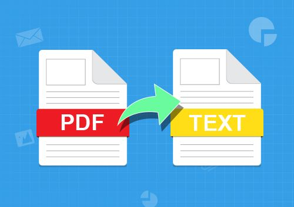
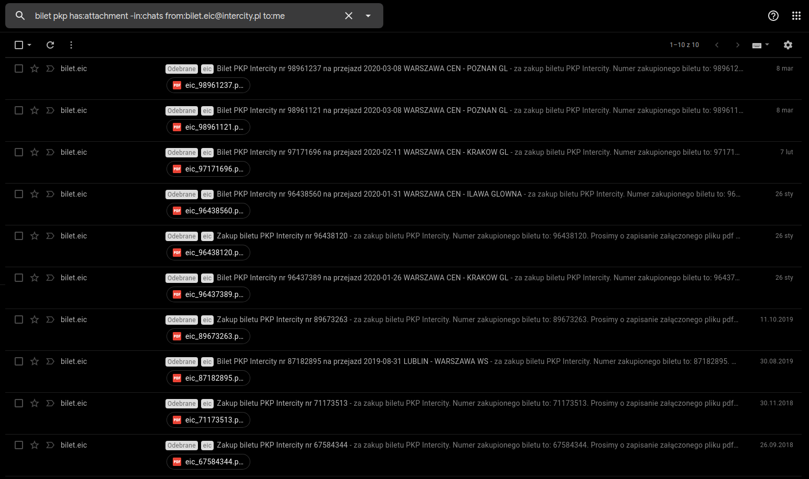
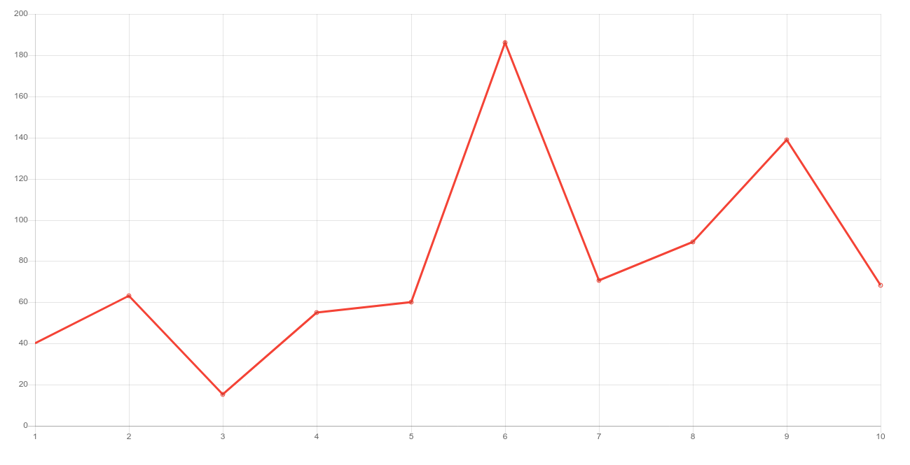

Dane są wszystkim co jest lub może być przetwarzane umysłowo lub komputerowo. Przy obróbce komputerowej niektóre formy ich zapisu są mniej lub bardziej wygodne. Na przykład PDF uznawany jest za formę wygodną dla człowieka, ale często nie doceniamy możliwości maszyn w automatyzacji procesów opartych o pliki PDF.

W tym wpisie pokarzemy jak pisząc naprawdę znikome ilości kodu można wygodnie wydobyć dane z plików PDF. Dla przykładu posłużymy się biletami kolejowymi ponieważ nie zawierają żadnych danych objętych tajemnicą, ale równie dobrze mogły to by być faktury, umowy czy pliki CV.



**Zdobycie danych**

Przy każdym zakupie biletu z adresu `bilet.eic@intercity.pl` wysyłany jest do mnie e-mail zawierający bilet. Łatwo mogę wyszukać te e-maile wybierając filtr w poczcie z której korzystam

```
bilet pkp has:attachment -in:chats from:bilet.eic@intercity.pl to:me
```

Oto widok jaki widzę po filtrowaniu:



Teraz wystarczyło pobrać pliki aby móc poddać je obróbce.

Wszystkie załączniki zapisałem na dysku twardym w katalogu ocr. Tak jak w każdym z wpisów na tym blogu dalsze operacje będą wykonywane na systemie Ubuntu.

## **Przetworzenie PDF do postaci tekstu**

Zaczniemy od ustalenia początkowej zawartości katalogu. Jest wypełniony pikamy PDF.


Dzięki narzędziu `pdftotext` z pakietu `poppler-utils` możemy wydobyć z plików PDF interesujące nas informacje w postaci czystego tekstu. Następującym poleceniem możemy zainstalować to narzędzie:

```
sudo apt-get install poppler-utils
```

Aby go użyć korzystamy ze składni

```
pdftotext {PDF-file} {text-file}
```

W naszym przypadku mamy wiele plików wejściowych i wyjściowych dlatego skorzystamy z `xargs`.

```
ls eic_*.pdf | xargs -i pdftotext "{}";
```

Polecenie to składa się z dwóch części. W pierwszej listuję wszystkie pliki zaczynające się od `eic` i kończące się na `.pdf`. Następnie używając programu `xargs` wynik przechwytywany jako strumień danych przekazuję linia po linii do polecenia `pdftotext`. Brak drugiego argumentu oznacza, że w moim przypadku powstały pliki tekstowe o takich samych nazwach jak pliki `pdf`.

Łatwo sprawdzimy czy faktycznie istnieją dzięki poleceniu `ls`


**Strukturyzacja danych**

Na początek zaczniemy od czegoś prostego. Załóżmy, że chcemy policzyć ile pieniędzy łącznie wydałem na bilety, ale nie będziemy sprawdzali tego na każdym bilecie po kolei ręcznie - od tego jest komputer. Poza tym gdy dostaniemy inny zestaw biletów ręczną robotę musieli byśmy powtarzać. Może Cię to zaskoczyć, ale aby wykonać to zadanie nie trzeba nawet edytora kodu i napisaliśmy to w jednej linii:

```
ls eic_*.txt | xargs -i cat "{}" | perl -ne 'if(/SUMA PLN: (.*) zł/){print "$1\n";}' | tr , . | paste -sd+ | bc
```

Ta linia zwróciła `786.11` czyli koszt wszystkich biletów.


Wejdziemy teraz głębiej i zobaczmy co się za tym kryje. Wyświetlimy jeden z plików tekstowych poleceniem `cat eic_67584344.txt`:

```
BILET INTERNETOWYTANIOMIASTOWY

"PKP Intercity"
Spółka Akcyjna

OF: 503

NORMAL. : 1
ULG. :
X : X

Przewoźnik: PKP IC
A-Cena bazowa: 1xNormal

¦ ¸

Od/From

27.09 05:50 Iława Gł.
*
*
*
PRZEZ: Działdowo * Nasielsk

Do/To

¦ ¸

KL./CL.

Warszawa C.
*

27.09 07:50
*
*

2
*

SUMA PLN: 39,90 zł
519836278964

Nr transakcji:

Informacje o podróży:
Stacja
Data Godzina
Iława Gł.
27.09 05:50
Warszawa C.
27.09 07:50

/Wagon K m
IC 5324
208
5

eIC67584344

Nr miejsca (o-okno ś-środek k-korytarz) Suma PLN
81 o
39,90 zł
1 m. do siedzenia; wagon bez przedziałów

d9U
Podróżny:
PTU
8%

Suma PLN Płatność: przelewem
39,90 Zapłacono i wystawiono dnia:
2018-09-26 09:01:20(52245592)

Ogółem PLN:

39,90

Niniejszy bilet internetowy nie jest fakturą VAT.
W związku z przeprowadzanymi modernizacjami sieci kolejowej, uprzejmie prosimy o
dokładne sprawdzanie rozkładu jazdy pociągów przed podróżą.

Data wydruku: 2018-09-26 09:01:57

5324

Bilet internetowy jest biletem imiennym i jest ważny:
a) wraz z dokumentem ze zdjęciem potwierdzającym tożsamość Podróżnego,
b) tylko w dniu, relacji, pociągu, wagonie i na miejsce na nim oznaczone.

Zwrotu należności za niewykorzystany bilet dokonuje się na podstawie wniosku
złożonego przez płatnika w wyznaczonych przez 'PKP Intercity' S.A. punktach, z
wyjątkiem należności zwracanych automatycznie na zasadach określonych w
Regulaminie e-IC.

Daniel Gustaw

d9U

Informacja o cenie
Opłata za przejazd:

(P24) 7219
```

Pierwsze co się nasuwa to, że plik zawiera wszystkie informacje w formie nienaruszonej. Nie ma żadnych literówek, błędów, przestawień jakie typowe są dla systemów OCR wykonujących analogiczną pracę na skanach dokumentów. Cena `39,90 zł` powtarza się tu w kilku liniach. Czasami występuje razem z `zł`, czasami nie, może się zdarzyć, że układ linii będzie inny jeśli na bilecie będzie jechało kilka osób. Szukamy najbardziej wiarygodnego wzorca. Jest nim `SUMA PLN: 39,90 zł`. Teraz chcemy wyłowić z tego pliku właśnie `39,90`. Posłuży nam do tego `perl` - język stworzony przez lingwistę Larrego Walla właśnie w celu pracy z plikami tekstowymi.

```
$ cat eic_67584344.txt | perl -ne 'if(/SUMA PLN: (.*) zł/){print "$1\n";}'
39,90
```

Polecenie to można wytłumaczyć następująco:

* weź plik `eic_67584344.txt`
* całą jego zawartość przekieruj do programu który napisaliśmy w `perl` jako wejście
* program na każdej linii tekstu wykonuje to samo polecenie
* sprawdza czy tekst pasuje do wzorca zaczynającego się od `SUMA PLN:` i kończącego na `zł`.
* jeśli tak, to wycina wartość między tymi ciągami znakowymi i ją zwraca

Problem jaki mamy to polski `,` zamiast ogólnie stosowanej na świecie `.`. Ten problem bardzo łatwo eliminujemy poleceniem `tr` które zamienia swój pierwszy argument na drugi.


Nie będziemy oczywiście powtarzać tych poleceń dla każdego pliku osobno. Zamiast tego ponownie wykorzystamy znany już `xargs`

```
$ ls eic_*.txt | xargs -i cat "{}" | perl -ne 'if(/SUMA PLN: (.*) zł/){print "$1\n";}' | tr , .
39.90
63.00
15.14
55.00
60.00
186.00
70.56
89.40
139.00
68.11
```

Pozwolił nam na przeszukanie plików tekstowych za pomocą zdefiniowanych filtrów plik po pliku. Z ciekawszych rzeczy to wykorzystane `"{}"` oznacza argument który wszedł do `xargs`.

Zostało już tylko sumowanie, ale suma kolumn z pliku tekstowego to bułka z masłem w konsoli `bash`. W przypadku jednej kolumny nie trzeba nawet uruchamiać `awk` - zaawansowanego programu do przetwarzania tekstów. Wystarczy nam `paste` - program do łączenia plików i `bc` prosty program do liczenia sum.

Za pomocą `paste` z opcją `-s` wykonamy transpozycję do jednej linii. Opcją `d` ustawimy separator. Będzie nim oczywiście znak dodawania `+`. Wynik wygląda miej więcej tak:


Ostatnia cegiełka `bc` kończy zadanie, ale to było prezentowane na samym początku:

```
$ ls eic_*.txt | xargs -i cat "{}" | perl -ne 'if(/SUMA PLN: (.*) zł/){print "$1\n";}' | tr , . | paste -sd+ | bc
786.11
```

## **Wizualizacja wyników**

Ponieważ pliki ułożone są chronologicznie wyświetlimy łatwo będzie nam zobaczyć wykres kolejnych cen. W tym celu pobieramy `chart` - paczkę napisaną w `go` służącą do tworzenia wykresów.

```
wget https://github.com/marianogappa/chart/releases/download/v3.0.0/chart_3.0.0_linux_amd64.tar.gz -O /tmp/chart.tar.gz
```

I rozpakowujemy

```
tar -xvf /tmp/chart.tar.gz --directory /usr/local/bin
```

Kolejna komenda, dodaje numery kolumn `cat -n` i rysuje wykres

```
ls eic_*.txt | xargs -i cat "{}" | perl -ne 'if(/SUMA PLN: (.*) zł/){print "$1\n";}' | tr , . | cat -n | chart line
```



Podsumowując. Nie napracowaliśmy się tutaj za bardzo ale właśnie to było celem. Pokazanie jak jedną linią kodu można posumować ceny lub wyrysować wykres z danych, które pozornie są niedostępne, bo ich format nie jest tak oczywisty jak w przypadku uporządkowanych danych zapisanych w bazie o dobrze określonej strukturze.

Jeśli jesteś przedsiębiorcą i zainteresował Cię temat automatyzacji przetwarzania dokumentów umów się ze mną na darmową konsultację korzystając z linku

[Daniel Gustaw

Welcome to my scheduling page. Please follow the instructions to add an event to my calendar.

Calendly

](https://calendly.com/gustaw-daniel)

Jeśli chcesz poszerzyć swoją wiedzę i zapoznać się z narzędziami z których korzystaliśmy linki do nich znajdziesz poniżej:

Czyszczenie danych

[https://en.wikipedia.org/wiki/Data\_cleansing](https://en.wikipedia.org/wiki/Data_cleansing)

Pdf to Text Converter

[https://www.cyberciti.biz/faq/converter-pdf-files-to-text-format-command/](https://www.cyberciti.biz/faq/converter-pdf-files-to-text-format-command/)

Przykład zastosowania xargs

[https://stackoverflow.com/questions/33141207/what-is-the-working-of-this-command-ls-xargs-i-t-cp-1](https://stackoverflow.com/questions/33141207/what-is-the-working-of-this-command-ls-xargs-i-t-cp-1)

Chart - narzędzie do rysowania wykresów

[https://marianogappa.github.io/chart/](https://marianogappa.github.io/chart/)

Paste - komenda do łączenia plików

[https://www.geeksforgeeks.org/paste-command-in-linux-with-examples/](https://www.geeksforgeeks.org/paste-command-in-linux-with-examples/)

Przykładowe onelinery w Perlu

[https://www.rexegg.com/regex-perl-one-liners.html](https://www.rexegg.com/regex-perl-one-liners.html)
