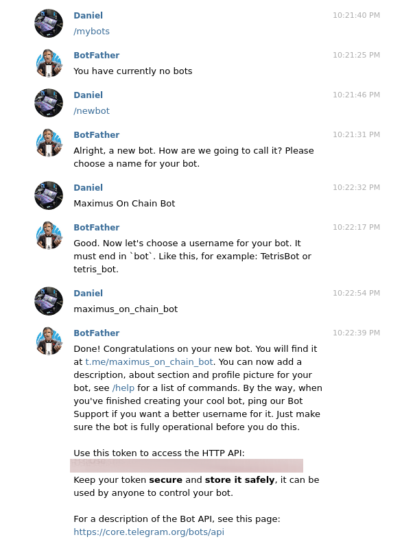
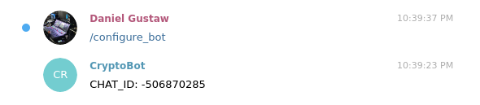
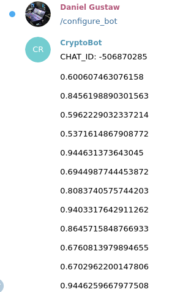

Jeden z projektów, które wypuściliśmy w tamtym miesiącu używał Telegrama do wysyłania powiadomień. Wpis pokaże Ci jak skonfigurować wysyłkę powiadomień od zera używając `typescript`.

## Przygotowanie środowiska

Zaczniemy od przygotowania plików konfiguracyjnych:

```
tsc --init
npm init -y
```

Instalujemy `telebot` - paczkę zapewniającą SDK telegrama. Jej dokumentacja znajduje się tutaj:

[mullwar/telebot

The easy way to write Telegram bots in Node.js. Contribute to mullwar/telebot development by creating an account on GitHub.

GitHubmullwar

](https://github.com/mullwar/telebot)

razem z nią instalujemy niezbędny zestaw bibliotek do `typescript`:

```
npm i telebot @types/telebot @types/node typescript ts-node
```

W pliku `tsconfig.json` nadpisujemy następujące opcje:

```
"target": "ESNEXT",
"moduleResolution": "node",
"allowSyntheticDefaultImports": true,
```

## Uzyskanie TOKENU API

Aby móc korzystać z API będziemy potrzebowali tokenu. Najprostszym sposobem jego uzyskania jest napisanie na telegramie do bota tworzącego boty. Jest to `BotFather`.

Cała konwersacja polega na tym, że podajemy komendę tworzącą bota, jego `name`, `username` i dostajemy token.



## Dołączenie tokenu do projektu

Zalecam dodanie `TELEGRAM_TOKEN` z tą wartością do pliku `.env` np

```
TELEGRAM_TOKEN=xxx
```

W `package.json` dołączamy linię

```
    "start": "ts-node index.ts",
```

wewnątrz `scripts`. Tworzymy plik `Makefile`

```
include .env
export

node_modules: package.json
	npm i

up: node_modules
	npm run start
```

dzięki niemu automatycznie importujemy `.env` i nie musimy używać flag z linii komend ani paczek takich jak `dotenv`. Nie zapomnijmy dodać `.env` do `.gitignore`.

## Kod do uzyskania ID chatu

Jeśli chcemy, żeby nasz bot odpowiadał wystarczy w pliku `index.ts` napisać kod:

```
import TeleBot from "telebot"

const bot = new TeleBot({
    token: process.env.TELEGRAM_TOKEN || '',
});

bot.on(["/configure_bot"], (msg) => {
    console.log(msg);
    bot.sendMessage(msg.chat.id, `CHAT_ID: ${msg.chat.id}`);
});

bot.start();
```

Następnie dołączyć bota do chatu i napisać do niego. Wynik będzie następujący:



Identyfikator chatu jest kluczową informacją, jeśli chcemy wysyłać do niego powiadomienia. ID chatu i Token to kluczowe informacje mówiące jaki bot i gdzie pisze. W naszym przypadku bot był ustawiony tak, żeby różne dane wysyłać na różne grupy więc musieliśmy powtórzyć to polecenie dla kliku grup i zanotować je w pliku `.env`. Do `.env` dopisujemy linię

```
GROUP_LOG_ID=-506870285
```

## Wysyłka sygnałów

Będziemy co sekundę wysyłać do kanału losową liczbę jeśli będzie większa niż 0.5. Wystarcz do tego kod

```
setInterval(() => {
    const rand = Math.random();
    if (rand > .5) {
        bot.sendMessage(parseInt(process.env.GROUP_LOG_ID || ''), `${rand}`)
    }
}, 1000)
```



To był bardzo prosty kod i bardzo prosty bot. Z takimi botami można robić praktyczne rzeczy. Np:

* Budować tekstowy interfejs do zdalnej konfiguracji systemu. Takie CLI jest tańsze niż podłączanie frontendu, formularzy i przycisków.
* Budować systemy powiadamiające o zdarzeniach. Jest to łatwiejsze niż wysyłka SMS, czy Emaili do których wymagani (albo zalecani) są zewnętrzni dostawcy. W telegramie ominęliśmy problem płatności za wiadomości, a grupy mogą mieścić setki tysięcy członków.
