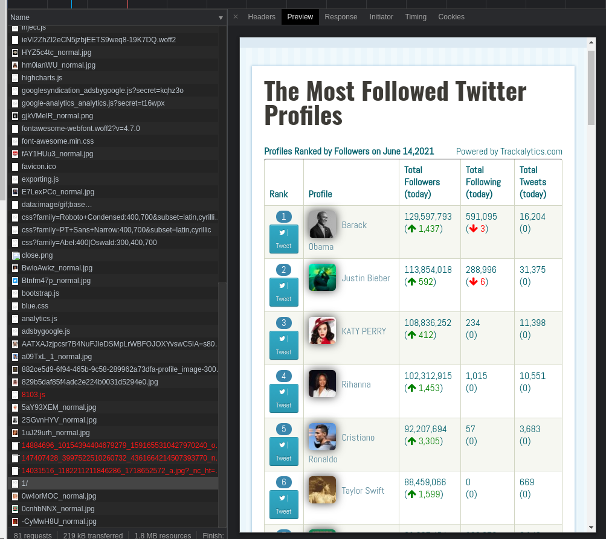
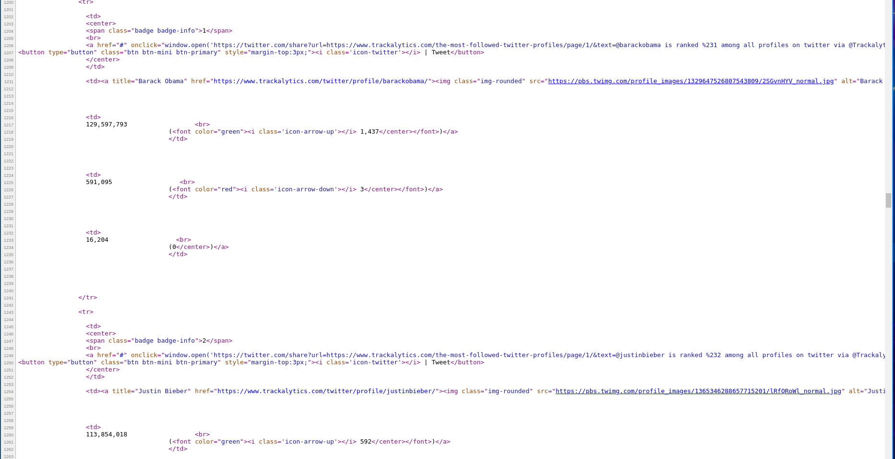
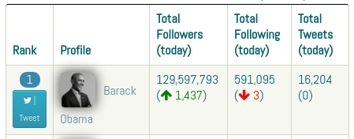
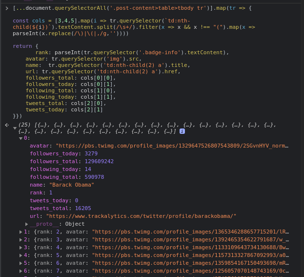
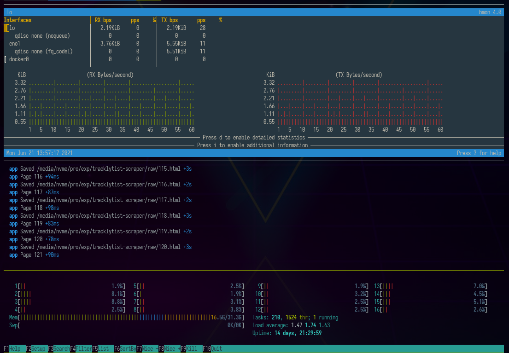

Listę najbardziej popularnych kont w serwisie Twitter możemy znaleźć na stronie Trackalytics:

[The Most Followed Twitter Profiles | Trackalytics

The Most Followed Twitter Profiles | Trackalytics

Trackalytics

](https://www.trackalytics.com/the-most-followed-twitter-profiles/page/1/)

W tym wpisie pokażę, jak pobrać te dane i posortujemy je względem ilości tweetów na ilość obserwujących. Następnie przeanalizujemy, jaką liczbę twórców mogli byśmy obserwować jednocześnie aby nie przekroczyć limitu darmowego api Twittera: 500 tys tweetów / msc.

### Analiza scrapowanej strony

Przed rozpoczęciem scrapingu należy zawsze wybrać odpowiedni wektor pozyskiwania danych. Pierwszą rzeczą, którą warto sprawdzać, jest zakładka network w przeglądarce. W naszym przypadku na stronie:

> [https://www.trackalytics.com/the-most-followed-twitter-profiles/page/1/](https://www.trackalytics.com/the-most-followed-twitter-profiles/page/1/)

Mamy request o wyrenderowaną już stronę:



więc rendering musi odbywać się na backendzie. Potwierdzimy to sprawdzając źródło strony.

```
view-source:https://www.trackalytics.com/the-most-followed-twitter-profiles/page/1/
```

Faktycznie widzimy tu dane gotowe do scrapingu:



Napiszemy więc skrypt, który pobierze ja i przetworzy za pomocą biblioteki `cheerio`.

### Przygotowanie projektu

Projekt inicjalizujemy komendami:

```bash
npm init -y && tsc --init
```

Tworzymy katalog `raw` na pobierane pliki

```bash
mkdir -p raw
```

Instalujemy typescript

```bash
npm i -D @types/node
```

Rdzeń naszego programu może wyglądać tak:

```ts
interface TwitterAccount {
    // todo implement
}

class Page {
    i: number;

    constructor(i: number) {
        this.i = i;
    }

    url() {
        return `https://www.trackalytics.com/the-most-followed-twitter-profiles/page/${this.i}/`
    }

    file() {
        return `${process.cwd()}/raw/${this.i}.html`
    }

    sync() {
        // TODO implement
        return false;
    }

    parse(): TwitterAccount[] {
        // todo implement
        return []
    }
}

const main = async () => {
    let i = 1;
    const accounts = [];
    while (new Page(i).sync()) {
        const newAccounts = new Page(i).parse()
        if (newAccounts.length === 0) break;
        accounts.push(...newAccounts);
        i++;
    }
    return accounts;
}

main().then(console.log).catch(console.error)
```

Mamy tu za zaimplementowania interfejs kont wynikający ze struktury pobieranych danych, funkcję do sprawdzania czy strona istnieje i zapisu danych oraz funkcję do parsowania.

### Model danych

Patrząc na wyświetlane dane:



Można stworzyć następujący interfejs opisujący konto Twittera

```ts
interface TwitterAccount {
    rank: number
    avatar: string
    name: string
    url: string
    followers_total: number
    followers_today: number
    following_total: number
    following_today: number
    tweets_total: number
    tweets_today: number
}
```

### Pobieranie stron

Do pobierania stron użyjemy biblioteki `axios`. Do logowania danych nada się `debug`.

```bash
npm i axios debug
npm i -D @types/debug
```

Po wykonaniu kilku importów:

```
import axios from "axios";
import * as fs from "fs";
import Debug from 'debug';

const debug = Debug('app');
```

Funkcja do synchronizacji mogła by wyglądać tak:

```ts
    async sync() {
        try {
            const fileExists = fs.existsSync(this.file())

            if (fileExists) return true;

            const {data, status} = await axios.get(this.url());

            if (status !== 200) return false;

            fs.writeFileSync(this.file(), data);
            debug(`Saved ${this.file()}`)

            return true;
        } catch (e) {
            console.error(e)
            return false;
        }
    }
```

Widzimy, że jeśli plik jest zapisany, to nie sprawdzamy dalej. Zatem nie ma ryzyka bombardowania strony docelowej nie potrzebnymi zapytaniami. To ważny aspekt scrapingu. Następnie jeśli strona zostanie poprawnie pobrana to jest zapisywana i również oznaczana jako istniejąca. Wynik negatywny dostaniemy jedynie w przypadku wystąpienia wyjątku oraz dla statusu innego niż 200.

### Przetwarzanie stron

Metoda `parse` obiektu `Page` powinna zwracać listę profili Twittera. Najprościej jest prototypować ją bezpośrednio w konsoli przeglądarki, a następnie przepisać taki selektor do cheerio. Tak właśnie zrobimy. Oto funkcja `parse` napisana w konsoli przeglądarki:

```ts
[...document.querySelectorAll('.post-content>table>tbody tr')].map(tr => {

const cols = [3,4,5].map(i => tr.querySelector(`td:nth-child(${i})`).textContent.split(/\s+/).filter(x => x && x !== "(").map(x => parseInt(x.replace(/\)|\(|,/g,''))))

return {
       rank: parseInt(tr.querySelector('.badge-info').textContent),
    avatar: tr.querySelector('img').src,
    name:  tr.querySelector('td:nth-child(2) a').title,
    url: tr.querySelector('td:nth-child(2) a').href,
    followers_total: cols[0][0],
    followers_today: cols[0][1],
    following_total: cols[1][0],
    following_today: cols[1][1],
    tweets_total: cols[2][0],
    tweets_today: cols[2][1]
}})
```



W `node js` nie mamy obiektu `document` i aby wykonywać selektory na drzewie dom musimy je zbudować z tekstu tak jak robi to przeglądarka. Z tym, że zamiast natywnie wbudowanego mechanizmu wykorzystamy do tego jedną z popularnych bibliotek. Najbardziej znane są:

* cheerio
* js dom

Zrobiłem kiedyś ich porównanie pod względem wydajności:

[Is cheerio still 8x faster than jsdom? · Issue #700 · cheeriojs/cheerio

This part of the readme has been written 3,5 years ago. ba80a89 Is it still the case (especially regarding the 4.x serie of jsdom)?

GitHub cheeriojs

](https://github.com/cheeriojs/cheerio/issues/700)

Wszystko wskazuje na to, że `cheerio` jest znacznie lepszym wyborem.

Aby przetworzyć ją do postaci akceptowalnej przez cherio musimy `document` zastąpić przez `cheerio.load(content)`, a elementy należy otaczać `cheerio(element).find` aby szukać ich potomków. Do tego do atrybutów potrzebujemy funkcji `attr` i na tablicach funkcji `toArray`. To właściwie wszystkie zmiany, ich wprowadzenie zajmuje chwilę i w wyniku ich zastosowania do selektora działającego w przeglądarce dostaniemy implementację funkcji `parse`

```ts
    parse(): TwitterAccount[] {
        const content = fs.readFileSync(this.file()).toString();
        const $ = cheerio.load(content);

        return $('.post-content>table>tbody tr').toArray().map(tr => {
            const cols = [3, 4, 5].map(i => cheerio(tr)
                .find(`td:nth-child(${i})`).text().split(/\s+/)
                .filter(x => x && x !== "(").map(
                    x => parseInt(x.replace(/\)|\(|,/g, ''))))

            return {
                rank: parseInt(cheerio(tr).find('.badge-info').text()),
                avatar: cheerio(tr).find('img').attr('src') || '',
                name: cheerio(tr).find('td:nth-child(2) a').attr('title') || '',
                url: cheerio(tr).find('td:nth-child(2) a').attr('href') || '',
                followers_total: cols[0][0],
                followers_today: cols[0][1],
                following_total: cols[1][0],
                following_today: cols[1][1],
                tweets_total: cols[2][0],
                tweets_today: cols[2][1]
            }
        })
    }
```

Dokładając do tego drobną modyfikację końcówki programu, żeby zapisywał uzyskane dane w pliku `json`

```ts
const main = async () => {
    let i = 1;
    const accounts = [];
    while (await new Page(i).sync()) {
        const newAccounts = new Page(i).parse()
        if (newAccounts.length === 0) break;
        accounts.push(...newAccounts);
        i++;
        debug(`Page ${i}`);
    }
    return accounts;
}

main().then(a => {
    fs.writeFileSync(process.cwd() + '/accounts.json', JSON.stringify(a.map(a => ({
        ...a,
        username: a.url.split('/').filter(a => a).reverse()[0]
    }))));
    console.log(a);
}).catch(console.error)
```

po zainstalowaniu paczki `cheerio`

```
npm i cheerio
```

możemy włączyć nasz program poleceniem

```
time DEBUG=app ts-node index.ts
```

Poniżej widzimy jak wygląda ono w otoczeniu programów `bmon` do monitorowania interfejsów sieciowych oraz `htop` do sprawdzania pamięci `ram` oraz zużycia procesora.



Do zapisania tego pliku w bazie danych mongo możemy użyć polecenia:

```
mongoimport --collection twitter_accounts <connection_string>  --jsonArray --drop --file ./accounts.json
```

Następnie wykonując agregację:

```json
[{
    $group: {
        _id: null,
        tweets_today: {
            $sum: '$tweets_today'
        },
        tweets_total: {
            $sum: '$tweets_total'
        },
        followers_today: {
            $sum: '$followers_today'
        },
        followers_total: {
            $sum: '$followers_total'
        },
        count: {
            $sum: 1
        }
    }
}]
```

możemy dowiedzieć się, że 16k najpopularniejszych kont na twitterze wytworzyło 0.6 miliarda tweetów, z czego 177 tysięcy dzisiaj.

```
tweets_today:177779
tweets_total:613509174
followers_today:9577284
followers_total:20159062136
count:16349
```

Łączna liczba followersów to 20 mld (oczywiście są w tym liczne duplikaty), a dzisiaj pozyskani followersi tych kont to 10 mln.

Darmowe api twittera pozwala na nasłuch w czasie rzeczywistym do 500 tys tweetów. Oznacza to, że dziennie można zbierać średnio 16 tysięcy.

Załóżmy, że naszym zadaniem jest obserwacja tych kont, które najmniejszą liczbą wpisów robią największe zasięgi. W ich odnalezieniu pomoże nam kolejna agregacja:

```json
[{$match: {
  tweets_total: {$gt: 0}
}}, {$addFields: {
  influence_by_tweet: {$divide: ['$followers_total','$tweets_total']}
}}, {$sort: {
  influence_by_tweet: -1
}}, {$match: {
  influence_by_tweet: {$gt: 100}
}}, {$group: {
        _id: null,
        tweets_today: {
            $sum: '$tweets_today'
        },
        tweets_total: {
            $sum: '$tweets_total'
        },
        followers_today: {
            $sum: '$followers_today'
        },
        followers_total: {
            $sum: '$followers_total'
        },
        count: {
            $sum: 1
        }
    }}]
```

Dzięki niej możemy wybrać 3798 kont które dzienne postują jedynie 17161 tweetów ale mają zasięg do 14 mld użytkowników łącznie a dzisiaj pozyskali 8 mln.

```
tweets_today:17161
tweets_total:32346484
followers_today:8197454
followers_total:14860523601
count:3798
```

Oznacza to, że ilość obserwowanych kont spadła do 23%, ilość tweetów dziennie do 9%, ale ilość wszystkich followerów utrzymała się na poziomie 73% wcześniejszej wartości (oczywiście te obliczenia nie uwzględniają duplikacji), a ilość pozyskiwanych dzisiaj followerów przez te wybrane konta to 85% z pierwotnej wartości.

Podsumowując. Wybraliśmy tylko część kont, które pisząc 9% tweetów względem całej grupy najpopularniejszych kont każdego dnia pozwalają uzyskać 85% z interesującego nas zasięgu.

Naszym kryterium odcięcia jest uzyskiwanie przynajmniej 100 followersów na jednym tweecie. Powinniśmy się spodziewać około 17000/24/60 = 11 tweetów na minutę.

Zgodnie z tradycją tego bloga na końcu podaję link do zescrapowanych danych:

[https://preciselab.fra1.digitaloceanspaces.com/blog/scraping/accounts.json](https://preciselab.fra1.digitaloceanspaces.com/blog/scraping/accounts.json)
